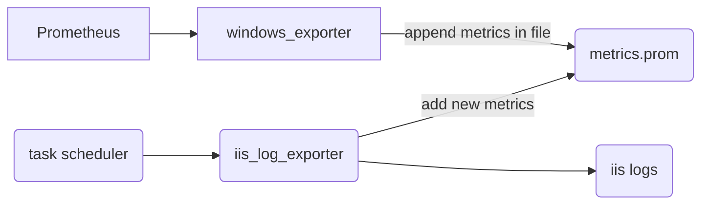

**saving your time**: *Through the log file I want RED metrics from my IIS*

If you're from the new generation and have never worked with IIS, let me introduce you to this **legendary web server**. It’s a secure, easy-to-manage, modular, and extensible platform for hosting websites, services, and applications (by Microsoft). That said… IIS isn’t exactly the hottest thing around these days and there are reasons for that 💥. But, as the old saying goes: **you don’t have to like it, but you should at least learn to live with it**!! 😆

 

My journey began when I was tasked with understanding the behavior of an IIS server, making it observable, and setting up alarms for potential issues. The first step was to install [windows_exporter](https://github.com/prometheus-community/windows_exporter), which includes the [IIS collector](https://github.com/prometheus-community/windows_exporter/blob/master/docs/collector.iis.md). While it provided many valuable metrics about IIS, it wasn’t exactly what I needed. What I was really looking for were **RED metrics**, more focused on HTTP responses from IIS. I researched some repositories but couldn’t find anything satisfactory. 

Below is the conventional solution I was already using 👇

I spent some time exploring IIS and realized that the only data source that truly met my needs was the **logs**. Although it wasn’t the most elegant solution, using them as a data source solved my problem and, of course, created other challenges.  First, I developed a Python script that parsed log files and transformed them into metrics exposed in HTTP server format, following the traditional model. When I tried to adapt the solution for Windows, I didn't necessarily want to have Python installed on the machine, and when using PyInstaller, I faced many frustrations.

I then decided to rewrite the code in Golang(❤️GOOS=windows GOARCH=amd64 go build -o ..), following the same logic. Upon completion, I decided to deliver the solution in two ways: one approach using Golang exposing as a server, but I would also make use of the textfile collector from Windows Exporter. In this solution, I basically extend the metrics I'm already capturing and can append metrics in Prometheus format to a text file. And who would generate this file ?? The Golang solution? No, I decided to create a native Windows solution using PowerShell. It follows the same logic and executes via Task Scheduler, keeping the file always updated. The metrics appear in the Windows Exporter that I was already using, and everything else continues as it was. 

The log files contained the **request path, the method used, the status code, and the response time**. These were exactly the pieces of information I needed. Using this data, I identified key metrics. Below is the first result I obtained with the metrics being used in Grafana.

First the Golang server solution, remembering that it is 100% separate from the Windows Exporter and basically works by reading the metrics and exposing them on an HTTP server for Prometheus to scrape.

As follows is the solution using native Windows components such as Task Scheduler, PowerShell to generate the metrics file, and Windows Exporter, which is already a well-known exporter in the Windows community. This time using the strategy of utilizing a file with metrics by appending metrics to the Windows Exporter.

 

I would like to comment on some implementation details. First, I didn't want to read the entire file every time, so I created a control mechanism using a file offset. This way I know which line I stopped at and from which file. This approach may cause inconsistencies because a human could modify the log file, but it was the best solution I could think of at the moment.

Another thing was that I implemented the logic to monitor by **Site** folder. This means that in the PowerShell solution, if I have 3 sites, I would create 3 tasks to monitor and generate metrics from the day's file. That's another detail: the system always analyzes the current day's file based on the server date.

**TIP**: If you want to continue using the windows_exporter, simply enable the textfile collector and specify the location where the metrics file will be, based on the PowerShell configuration below. If you want a new exporter, you can use the Golang version with a binary compiled for Windows. Using the windows_exporter metrics with the iis_log_exporter can provide a better understanding of IIS behavior and its transactions.

 

Pull requests are welcome in the exporter's repository !! 🫶🏻 bye-bye

<!-- 
https://www.sysgauge.com/ 
-->

**repository**: [https://github.com/apolzek/iis_log_exporter](https://github.com/apolzek/iis_log_exporter)
