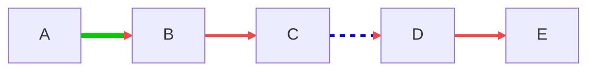

You are an **SRE** and you like having a holistic view of the product. Or maybe you are a **Platform Engineer** and want to understand every part of the system and how data flows through it. The problem is that the team does not have this view. Most of the knowledge lives in the heads of the most senior people. The decision-making context stayed with them. What you are left with is an outdated inventory and, if you are lucky, a few partially documented flows :**(**

That is when you roll up your sleeves and start doing reverse engineering of the product or platform. Time to "**Give it everything you’ve got**"

In practice, you start somewhere. You map connections, figure out which server talks to which one, where the databases are, how read and write flows work. What runs on Kubernetes, what is still on VM or Bare metal. A hybrid environment, with cloud mixed in. Even with sophisticated tools, the environment is complex. At some point, you have to go all the way down to the network packet level and run tcpdump without mercy.

After a long journey, you finally get an updated architecture diagram. *Servers, services, ports, external components*, everything in one place. A map that actually makes sense.

So, what do you do after that?

At this point, you understand the end-to-end flows. Just like a doctor blinks and "sees" human anatomy, you blink and see the **entire system**. As Uncle Ben said, *"ßwith great power comes great responsibility"*. Your role now is to help less senior people reach the same level of understanding. The people who support the system also need this view, so they can break out of the endless loop of repetitive on-call actions.

This is where you start thinking about how to make this knowledge fluid, accessible, and evolvable. And this is exactly where the workflow I have been enjoying comes in.

[WARN] Nothing I am proposing here is new. All of this already exists and works well. If there is any merit here, it is probably just about connecting the dots. "*Connect the dots*," as Steve Jobs once said.

The idea is simple: once you finish the architecture drawing, translate it into Mermaid, following some standards. You can define your own, but here are the steps I usually follow. From a napkin sketch to Mermaid.

1. **Add all components, organized into groups and subgroups**. VMs are not Kubernetes, so they should be **separate groups**. Each has its own characteristics, and that should be explicit.

2. **Add the arrows connecting components**, but always think in terms of flows. *Read vs write flows, primary vs secondary, user vs system*. Mermaid supports *styling*, so take advantage of that. Use different arrow styles, annotations on components, or notes directly on the arrows. Something like a `#cash-in` tag already adds useful context.

3. Once you define a visual standard, document it. **Create a separate Mermaid diagram that acts as a legend**. This is the "*how to work with this diagram*" guide. Everyone on the team should *follow it*. You do not want to be the owner of this diagram. Trust me.

4. With the flow documented, it is time to work on top of it. **Create a page for ADRs** (*Architecture Decision Records*). For each proposed change, document the change itself, the context, the options (P1, P2, P3), what is expected from each, and whether it was accepted or not. If it was accepted, state which one. Depending on the company, this will turn into a GMUD or an RFC, the formal change document.

5. When you schedule a meeting to discuss the change, if it makes sense, open the **Mermaid diagram in Excalidraw**. It supports Mermaid natively. Import the diagram without worrying about styles. This is where the team *discusses solutions, scribbles, connects and disconnects arrows, and explores possibilities freely*.

6. If the change is approved, **execute the GMUD or RFC**. Do it with a clear plan: *post-execution tests, a rollback plan, notification plan, documented monitoring, and properly tuned alerts*. No production heroics.

7. If everything goes well, update the status of the GMUD, RFC, and the ADR to “accepted,” clearly stating which solution was chosen, especially if there were multiple options.

8. **Update the official Mermaid diagram** with all the changes that came out of the Excalidraw session. Add context and notify the team and stakeholders about the change(post change).

After all that, make some coffee and go listen to good music. You earned it.

