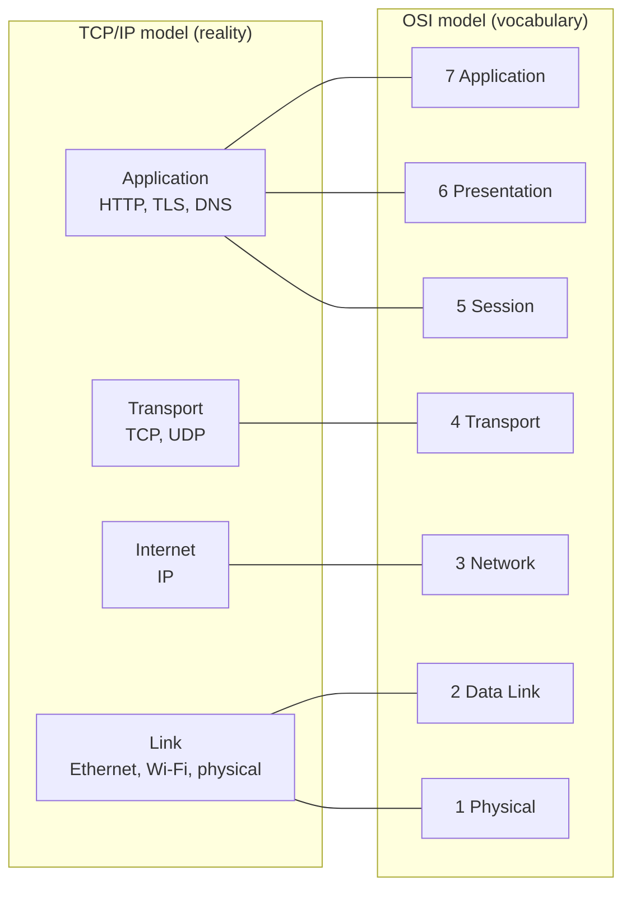
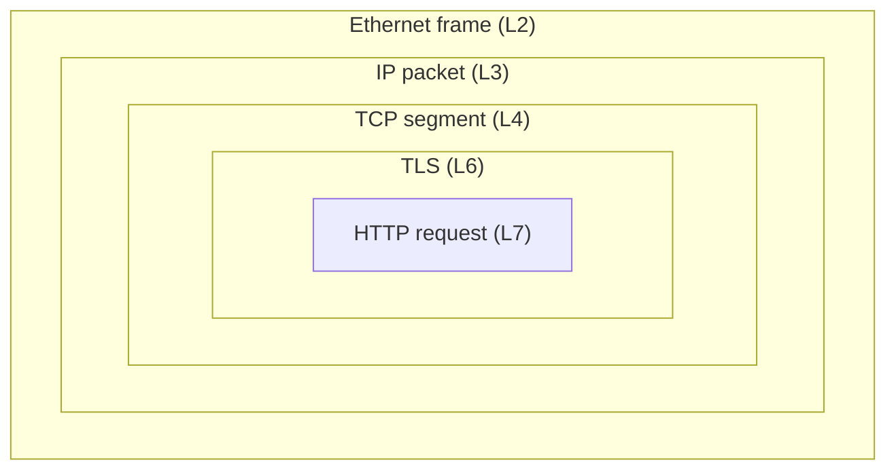
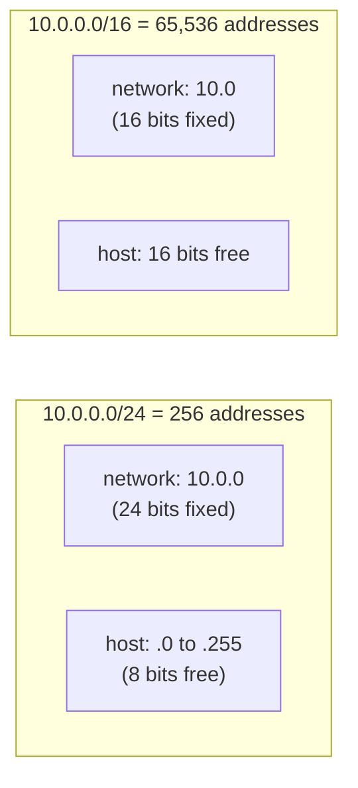
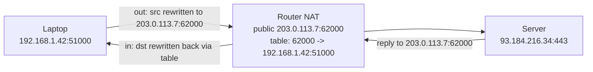
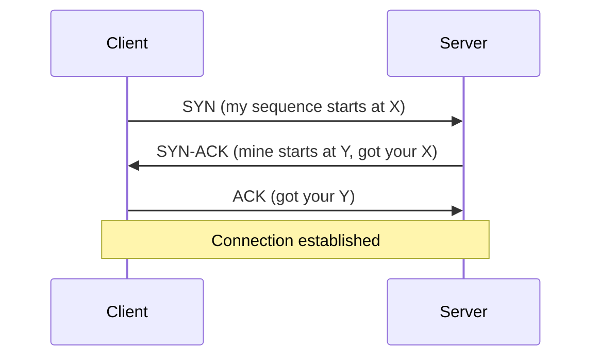
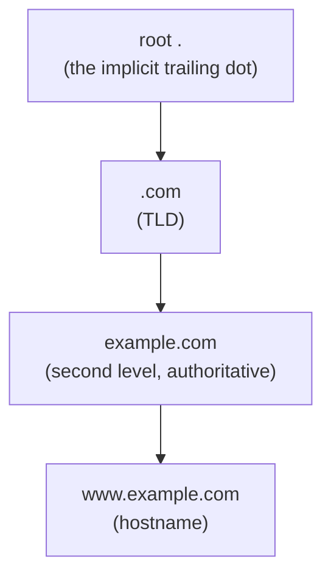
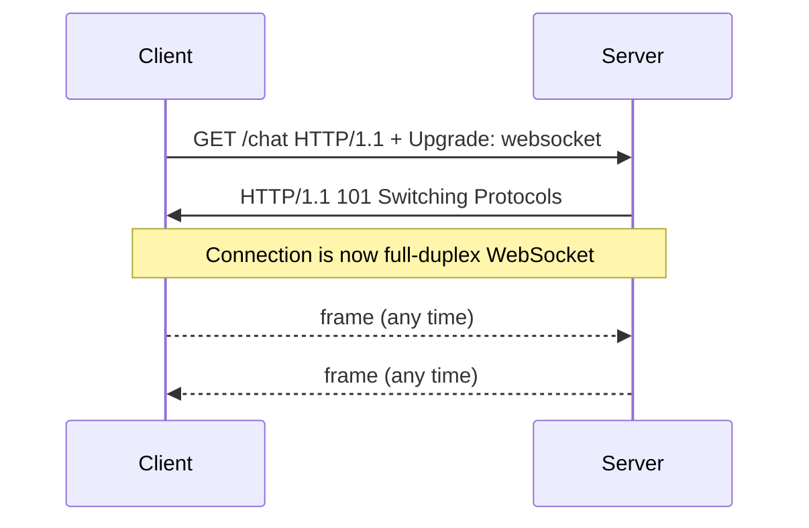
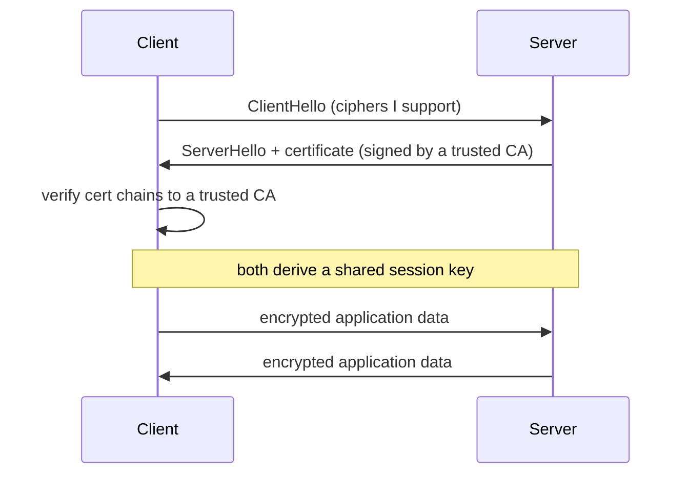
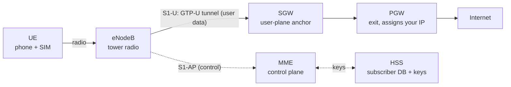

This is the article I wish someone had handed me when I needed to *refresh* networking in
a weekend. Not a textbook, not a 600-page tome, but a guided climb that starts at the
physics and ends with you typing a URL into a browser, understanding every layer the bytes
pass through on the way out.

The order is deliberately bottom-up and chronological: we start with raw signals on a wire,
build up to frames and packets, get an address, escape the home network through the
provider's NAT, ride TCP or UDP, resolve a name through DNS, speak HTTP, wrap it in TLS, and
finally watch the whole thing happen end to end from a browser. Along the way we stop at the
tools you actually use to debug each layer.

I lean on one recurring trick: **suppose** something concrete, then trace it through the
machine. Networking makes far more sense when you stop memorizing acronyms and start
following a single byte from copper to code.

> A note on altitude: this piece slides up and down constantly. One section is about voltage
> and antennas, the next is about GraphQL queries. That is the point. Modern networking *is*
> a stack of abstractions, and you only understand it by moving through all of them.

## Table of Contents

- [How the internet evolved (and the RFCs that mark it)](#how-the-internet-evolved-and-the-rfcs-that-mark-it)
- [The people who built the internet](#the-people-who-built-the-internet)
- [The mental model: layers of abstraction](#the-mental-model-layers-of-abstraction)
- [Signals: the analog truth under every digital network](#signals-the-analog-truth-under-every-digital-network)
- [The physical layer: media, cables, and speed](#the-physical-layer-media-cables-and-speed)
- [Wireless, antennas, and the air](#wireless-antennas-and-the-air)
- [Network cards and drivers](#network-cards-and-drivers)
- [Frames, packets, and MTU](#frames-packets-and-mtu)
- [Addresses: MAC, IP, ARP, and DHCP](#addresses-mac-ip-arp-and-dhcp)
- [NAT, CGNAT, and firewalls: the provider's world](#nat-cgnat-and-firewalls-the-providers-world)
- [The transport layer: TCP vs UDP (and QUIC)](#the-transport-layer-tcp-vs-udp-and-quic)
- [Latency, response time, and throughput](#latency-response-time-and-throughput)
- [DNS: the internet's directory](#dns-the-internets-directory)
- [The application layer: the protocols you actually use](#the-application-layer-the-protocols-you-actually-use)
- [Network security](#network-security)
- [Network in the cloud: AWS VPC abstractions](#network-in-the-cloud-aws-vpc-abstractions)
- [Mobile data: how 4G actually works (and the Brazil picture)](#mobile-data-how-4g-actually-works-and-the-brazil-picture)
- [The toolbox: modern Linux networking commands](#the-toolbox-modern-linux-networking-commands)
- [Putting it all together: one URL from the browser](#putting-it-all-together-one-url-from-the-browser)
- [Going deeper: certifications and a study path](#going-deeper-certifications-and-a-study-path)

## How the internet evolved (and the RFCs that mark it)

Before climbing the stack, it helps to know how it got built, because almost every "why is it
like this?" has a historical answer. The internet was not designed in one go, it accreted over
fifty years, and each layer of this article corresponds to a moment someone solved a concrete
problem.

The specifications themselves are public documents called **RFCs ("Request for Comments")**,
published by the IETF since 1969. The name is humble on purpose: they began as open invitations
to comment, and that culture of rough consensus and running code is how the internet is still
standardized today. Reading the right RFC is the ultimate ground truth.

The short version of how we got here:

- **1960s, packet switching.** The founding idea: instead of a dedicated circuit per call (the
  telephone model), chop data into packets that find their own way and share the links. ARPANET
  carried its first message in 1969.
- **1974 to 1983, TCP/IP.** Vint Cerf and Bob Kahn designed a protocol to connect *different*
  networks together (an "inter-net"). It was split into **IP** (RFC 791, addressing and routing)
  and **TCP** (RFC 793, reliability). On 1 January 1983, ARPANET switched to TCP/IP in a single
  "flag day," the moment most people mark as the birth of the internet.
- **1983 to 1987, DNS.** As hosts multiplied, a single shared `HOSTS.TXT` file stopped scaling.
  Paul Mockapetris designed **DNS** (RFC 1034 and 1035) to distribute name lookups, the system
  we still use.
- **1989 to 1991, the Web.** Tim Berners-Lee invented HTTP, HTML, and the URL at CERN, turning
  the internet from a specialist tool into something anyone could browse.
- **1990s, scaling and securing.** Explosive growth forced two fixes: **CIDR** (RFC 1519, 1993)
  to stop wasting addresses, and **NAT** with private ranges (RFC 1918) to stretch IPv4 further.
  Netscape created SSL to encrypt commerce, which became **TLS**.
- **1998 onward, the long IPv4 endgame.** **IPv6** (RFC 8200) was standardized to fix address
  exhaustion for good, while **CGNAT** (RFC 6598) bought the IPv4 world more time.
- **2008 to today, the modern web.** **TLS 1.3** (RFC 8446, 2018) streamlined encryption,
  **HTTP/2** (2015) multiplexed it, and **QUIC** (RFC 9000) plus **HTTP/3** (RFC 9114) rebuilt
  transport on UDP.

You rarely read an RFC end to end, but knowing which one defines what is a superpower. The
greatest hits, most of which we touch later:

| RFC | Defines | Why it matters |
|-----|---------|----------------|
| **791 / 8200** | IPv4 / IPv6 | addressing and routing |
| **793 / 9293** | TCP | reliable transport (9293 is the modern consolidation) |
| **768** | UDP | unreliable transport |
| **1519** | CIDR | classless addressing and route aggregation |
| **1918** | private IP ranges | the `192.168.x.x` and `10.x.x.x` behind NAT |
| **6598** | shared address space | the `100.64.0.0/10` range used by CGNAT |
| **8446** | TLS 1.3 | the current encryption standard |
| **9000** | QUIC | the UDP-based transport under HTTP/3 |
| **9110 / 9112** | HTTP semantics / HTTP/1.1 | what methods and status codes mean |
| **9113 / 9114** | HTTP/2 / HTTP/3 | binary framing, multiplexing, HTTP over QUIC |
| **1034 / 1035** | DNS | turning names into addresses |
| **6455** | WebSocket | the HTTP upgrade to a full-duplex connection |
| **4271** | BGP | routing between providers |

## The people who built the internet

The internet has no single inventor. It is the work of many people across protocols, physical
media, and the foundational science underneath. A few worth knowing, grouped by what they gave
us:

**Protocols and architecture**

- **Vint Cerf and Bob Kahn**, designers of TCP/IP, often called the fathers of the internet.
- **Jon Postel**, who edited the RFCs and ran the address and number assignments for decades; the
  steady hand behind the standards.
- **Paul Mockapetris**, who invented DNS.
- **Tim Berners-Lee**, who invented the World Wide Web (HTTP, HTML, URL).
- **Radia Perlman**, whose Spanning Tree Protocol made large switched networks possible; called
  the mother of the internet.
- **Van Jacobson**, whose TCP congestion control rescued the internet from congestion collapse
  in the late 1980s, and who also gave us `traceroute` and `tcpdump`.
- **Paul Baran and Donald Davies**, who independently invented packet switching, the core idea.
- **Leonard Kleinrock**, an early theorist of packet networks whose lab sent the first ARPANET
  message.

**Physical media and access**

- **Robert Metcalfe**, co-inventor of Ethernet, the dominant wired LAN technology.
- **Charles Kao**, whose work on optical fiber (a Nobel Prize) made the long-haul backbone
  possible; the reason intercontinental links are glass.
- **Hedy Lamarr (with George Antheil)**, who patented frequency-hopping spread spectrum, an idea
  underpinning modern wireless.

**Security and the math underneath**

- **Whitfield Diffie and Martin Hellman**, who introduced public-key cryptography, the basis of
  the TLS handshake.
- **Taher Elgamal**, often called the father of SSL, the encryption that became TLS.
- **Claude Shannon**, whose information theory set the hard limits on how much data any channel
  can carry; the math floor under every layer in this article.

> The pattern worth noticing: the internet is not one invention but a *stack* of them, each by
> different people solving the problem in front of them. Shannon's limits made Kao's fiber worth
> building, which carried Cerf and Kahn's packets, which Berners-Lee turned into the Web, which
> Diffie, Hellman, and Elgamal made safe to shop on. The rest of this article is that stack,
> from the bottom up.

## The mental model: layers of abstraction

Here is the single most useful idea in all of networking: **each layer talks to its peer on
the other machine as if the layers below did not exist.**

Your browser thinks it is talking directly to a web server. It is not. It hands bytes to the
operating system's TCP stack, which hands them to the IP layer, which hands them to a network
card, which turns them into electrical pulses on a wire. On the other end the same stack is
climbed back up in reverse. The *illusion* that HTTP talks to HTTP is what lets us build
anything at all.

You will see two models. Know what each is for.

**The OSI model (7 layers)** is the *teaching* model. Nobody implements it literally, but its
vocabulary is everywhere. When someone says "that is a layer 7 problem" or "a layer 4 load
balancer," they mean OSI.

| # | OSI Layer | What lives here | Example |
|---|-----------|-----------------|---------|
| 7 | Application | what the app speaks | HTTP, gRPC, DNS, SSH |
| 6 | Presentation | encoding, encryption | TLS, UTF-8, JPEG |
| 5 | Session | connection state | (mostly folded into others) |
| 4 | Transport | end-to-end delivery | TCP, UDP, QUIC |
| 3 | Network | routing between networks | IP, ICMP |
| 2 | Data Link | local link framing | Ethernet, Wi-Fi (802.11) |
| 1 | Physical | bits on the medium | copper, fiber, radio |

**The TCP/IP model (4 layers)** is what the internet *actually* runs on. It collapses OSI's
top three into one Application layer and the bottom two into Link:



Rule of thumb: **use TCP/IP to reason about reality, use OSI's layer numbers to talk to other
engineers.** When a colleague says "L4 vs L7 load balancing," L4 means "routes by IP and port
without reading the payload" and L7 means "reads the HTTP request and routes by URL or host."

Every layer wraps the layer above it in its own header. Your HTTP request does not *become* a
packet, it gets nested inside one, like Russian dolls:



Going *down* the stack on the sender, each layer adds its header (encapsulation). Going *up*
on the receiver, each layer strips its own header (decapsulation). The web server's TCP code
never sees the Ethernet header, the link layer already removed it. This is also why "packet"
is genuinely ambiguous: at L2 it is a *frame*, at L3 a *packet*, at L4 a *segment* (TCP) or a
*datagram* (UDP). Same bytes, different name depending on which doll you are looking at.

## Signals: the analog truth under every digital network

We say networks are "digital," but the physical world is stubbornly analog. A wire carries a
continuously varying voltage. Fiber carries a continuously varying light intensity. Air
carries continuously varying electromagnetic waves. There are no actual 1s and 0s out there,
only physics. The digital abstraction is something we *impose* on top.

**Analog vs digital.** An analog signal is a continuous waveform with infinitely many possible
values (think of a sine wave). A digital signal is a sequence of discrete symbols, in the
simplest case just two: high and low, 1 and 0. The whole job of the physical layer is to carry
discrete symbols reliably over a medium that is fundamentally continuous.

**Conversion: ADC and DAC.** Whenever the digital world meets the analog world, a converter
sits between them. An **ADC** (Analog to Digital Converter) samples a continuous signal at
regular intervals and rounds each sample to the nearest digital value (quantization). A
**DAC** does the reverse. The Nyquist theorem sets the rule: to faithfully capture a signal,
you must sample at least twice its highest frequency. This is why CD audio samples at 44.1 kHz
to capture sound up to ~20 kHz, and it is the same math that governs how much data a radio
channel of a given width can carry.

**Modulation: putting bits on a wave.** You cannot just shove square 1s and 0s onto a radio or
a long copper run, the medium will not allow it cleanly. Instead you take a smooth *carrier
wave* and vary one of its properties to encode bits:

- vary the **amplitude** (height) -> ASK
- vary the **frequency** -> FSK
- vary the **phase** (timing) -> PSK
- vary amplitude *and* phase together -> **QAM**, which is how modern Wi-Fi and cellular pack
  many bits into each symbol. 256-QAM encodes 8 bits per symbol, 1024-QAM encodes 10. More
  bits per symbol means more speed, but it needs a cleaner signal, which is exactly why your
  Wi-Fi rate drops as you walk away from the router: it falls back to a simpler, more robust
  modulation.

> **Suppose** your phone reports a great signal but a low data rate. The radio is healthy
> enough to *hear* the access point, but not cleanly enough to use the densest modulation, so
> it negotiates down from 1024-QAM to something sturdier. Signal strength and data rate are
> related but not the same thing.

On copper, the equivalent idea is a *line code*. Gigabit Ethernet does not send raw square
waves either, it uses multi-level encoding (PAM) across the twisted pairs. The takeaway: every
"digital" link is really clever analog signaling underneath, and the cleaner the medium, the
more aggressively you can encode.

## The physical layer: media, cables, and speed

Strip away every abstraction and you are left with one job: get a 1 or a 0 from here to there
using some physical phenomenon. Three media matter.

- **Copper (electrical):** voltage changes pushed down a metal wire. Cheap and easy, but the
  signal weakens with distance and picks up electromagnetic interference. This is twisted-pair
  Ethernet, the RJ45 cable on your desk.
- **Fiber (light):** pulses of light bounced down a glass strand. Immune to electrical
  interference, enormous bandwidth, travels kilometers without a repeater. Every undersea
  cable and ISP backbone is fiber.
- **Air (radio):** electromagnetic waves at a chosen frequency. No cable needed, but the
  medium is shared with everyone nearby, blocked by walls, and fundamentally a broadcast.

Fiber wins long distances because light in glass loses very little energy per kilometer, while
electrical signals in copper attenuate fast and the wire acts like an antenna for noise. That
is physics, not a software problem, and it is why the backbone is glass.

**Ethernet cable categories.** When someone says "Cat6 cable," the category bounds how fast and
how far you can push signals through twisted copper before noise wins. Higher category means
tighter twists, better shielding, higher frequency, more speed.

| Category | Max speed | Bandwidth | Run | Notes |
|----------|-----------|-----------|-----|-------|
| Cat5e | 1 Gbps | 100 MHz | 100 m | the old reliable, still everywhere |
| Cat6 | 1 Gbps (10 Gbps under ~55 m) | 250 MHz | 100 m / 55 m at 10G | sweet spot for offices |
| Cat6a | 10 Gbps | 500 MHz | 100 m | 10 Gbps at full distance |
| Cat7 | 10 Gbps | 600 MHz | 100 m | heavily shielded, niche |
| Cat8 | 25 to 40 Gbps | 2000 MHz | 30 m | data-center short runs only |

The pattern to internalize: **speed and distance trade against each other, bounded by the
physics of the medium.** Cat6 can do 10 Gbps, but only over a shorter run, because at higher
frequencies the signal degrades faster. There is no free lunch in copper. Once you need both
speed and distance, you stop fighting and switch to fiber.

## Wireless, antennas, and the air

Wi-Fi is governed by the IEEE **802.11** family. The naming finally got sane:

| Marketing name | Standard | Bands | Realistic throughput |
|----------------|----------|-------|----------------------|
| Wi-Fi 4 | 802.11n | 2.4 / 5 GHz | ~150 to 600 Mbps |
| Wi-Fi 5 | 802.11ac | 5 GHz | hundreds of Mbps to ~1 Gbps |
| Wi-Fi 6 / 6E | 802.11ax | 2.4 / 5 / 6 GHz | multi-Gbps, better in crowds |
| Wi-Fi 7 | 802.11be | 2.4 / 5 / 6 GHz | multi-Gbps, very low latency |

The crucial mental model is the **frequency trade-off**:

- **2.4 GHz**, lower frequency, longer waves: travels far, punches through walls, but slower
  and horribly congested (microwaves, Bluetooth, your neighbors all share it).
- **5 / 6 GHz**, higher frequency, shorter waves: much faster, far less crowded, but short
  range and easily blocked by walls.

**Antennas: analog by nature, "digital" by marketing.** An antenna is a purely analog device.
It converts an electrical signal into an electromagnetic wave (transmit) and a wave back into
an electrical signal (receive). There is no such thing as a fundamentally "digital antenna" in
the physics sense. When a TV antenna is sold as "digital," it just means it receives a
broadcast that is *digitally modulated* (ATSC, DVB) rather than the old analog TV signal. The
metal does the same job either way, the difference is in how the bits are encoded onto the
wave and decoded by the receiver's chip.

What *is* genuinely modern about antennas is using *many* of them at once:

- **MIMO** (Multiple Input, Multiple Output) uses several antennas to send multiple data
  streams in parallel over the same channel, multiplying throughput.
- **Beamforming** shapes the combined signal from those antennas to aim energy toward a
  specific device instead of radiating in all directions, improving range and speed.

> **Suppose** your phone shows "Wi-Fi 6, 1200 Mbps" but your download crawls. That number is
> the *physical-layer* maximum under perfect conditions. Reality subtracts distance, walls,
> interference, the fact that Wi-Fi is half-duplex (only one device talks at a time on a
> channel), and the airtime you share with everyone else. The advertised link speed is a
> promise about the medium, your real throughput is what survives after every layer above
> takes its cut.

## Network cards and drivers

A network card (NIC) is useless to the operating system until a **driver** teaches the kernel
how to talk to that specific hardware. The driver is the translation layer between the generic
network stack ("send this frame") and the particular registers and DMA rings of one chip.

There are two pieces of low-level software involved:

- **Firmware**, code that runs *on the NIC itself*, often loaded by the driver at boot. Wi-Fi
  cards especially need firmware blobs (this is why a fresh Linux install sometimes has no
  Wi-Fi until you install the firmware package).
- **The kernel driver**, code in the OS. On Linux you will meet names like `e1000e`, `igb`,
  and `ixgbe` (Intel wired), `r8169` (Realtek), and `iwlwifi` (Intel Wi-Fi).

You can see exactly which driver is bound to a device:

```bash
lspci -k | grep -A3 -i ethernet      # which kernel driver is in use
ethtool -i eth0                      # driver and firmware version for an interface
ethtool eth0                         # negotiated speed, duplex, link status
```

Modern NICs also push work *off* the CPU through **offloading**, all managed by the driver:
checksum offload, segmentation offload (TSO/GSO), and receive coalescing (GRO). When you
benchmark a fast link and the CPU is not pegged, offloading is why. At the extreme end,
high-performance systems bypass the kernel stack entirely with **DPDK** or hook into the driver
with **XDP/eBPF** to process packets at line rate. The lesson: even the "wire" has a software
contract, and a missing or buggy driver looks exactly like a broken cable.

## Frames, packets, and MTU

Once you have a working link, there is a limit on how much you can send in a single chunk. That
limit is the **MTU** (Maximum Transmission Unit): the largest L3 payload that fits in one L2
frame. On standard Ethernet the MTU is **1500 bytes**. **Jumbo frames** raise it to ~9000
bytes, common inside data centers to reduce per-packet overhead.

Related and constantly confused: the **MSS** (Maximum Segment Size) is how much *application*
data fits in one TCP segment. On a 1500-byte MTU link, MSS is typically 1460 (1500 minus 20
bytes of IP header minus 20 bytes of TCP header).

What happens when a packet is too big for the next link?

- **IPv4** routers can **fragment** it into smaller pieces and the receiver reassembles them.
  Fragmentation is bad for performance, and if any fragment is lost the whole packet is lost.
- **IPv6** forbids in-network fragmentation. The sending host must size packets correctly.
- **Path MTU Discovery (PMTUD)** finds the smallest MTU along the entire path. The sender marks
  packets "do not fragment," and if a router cannot forward one it replies with an ICMP
  "fragmentation needed" message telling the sender to use a smaller size.

Here is where it bites in practice. **Suppose** you set up a VPN or a tunnel. Every packet now
carries extra encapsulation headers, so the *effective* MTU inside the tunnel drops below 1500.
If something on the path blocks the ICMP messages PMTUD relies on (many overzealous firewalls
do), the sender never learns it must shrink its packets. Small requests work, large responses
silently vanish, and you get the classic symptom: SSH connects fine but hangs the moment output
gets long, web pages load their headers but stall on big bodies. This "PMTUD blackhole" is one
of the most baffling bugs in networking until you know to look for it. The fix is usually
**MSS clamping**, forcing a smaller MSS so packets never exceed the tunnel MTU.

## Addresses: MAC, IP, ARP, and DHCP

Two kinds of address, two completely different jobs. Confusing them is the classic beginner
mistake.

- **MAC address** (L2, e.g. `a4:83:e7:1f:22:0b`) is burned into the network card at the
  factory. It identifies *a specific piece of hardware* and only matters on the **local link**.
  It does not travel across the internet.
- **IP address** (L3, e.g. `192.168.1.42` or `2606:4700::1`) is *assigned* and identifies
  *where you are in the network topology*. It is what makes global routing possible, hop by hop
  across the world.

The analogy that sticks: **MAC is your name, IP is your mailing address.** Your name never
changes but is useless for delivery across cities. Your address changes when you move but is
exactly how the postal system finds you.

**CIDR: how addresses are grouped.** An IP address rarely travels alone; it belongs to a
*block*. **CIDR (Classless Inter-Domain Routing)** is the notation for those blocks, and it is
everywhere once you start looking (it is exactly what you typed when you created the
[AWS VPC](#network-in-the-cloud-aws-vpc-abstractions) earlier). The notation is an address
followed by a slash and a number: `192.168.1.0/24`. That number, the **prefix length**, says how
many leading bits are fixed as the *network* part; the remaining bits are free for *hosts*.



The smaller the prefix, the bigger the block: a `/24` fixes 24 bits and leaves 8 for hosts (256
addresses), a `/16` leaves 16 bits (65,536 addresses), and a `/8` is enormous. The math is
simply 2 to the power of the free bits. A `/32` is a single host. CIDR (RFC 1519, 1993) replaced
the old rigid "class A/B/C" system, which only allowed blocks of three fixed sizes and wasted
addresses on a massive scale. Its second gift is **route aggregation**: a router can advertise
one `/16` instead of 256 separate `/24` routes, which is what keeps the global routing table
from exploding. This is also the language you use to write firewall rules, subnet a VPC, and
read the [RFC 1918 private ranges](#nat-cgnat-and-firewalls-the-providers-world) like
`10.0.0.0/8`.

So how do these get connected? Two protocols do the wiring:

- **ARP** (Address Resolution Protocol) answers "I want to reach this IP on my local network,
  which MAC do I hand the frame to?" Your machine broadcasts "who has 192.168.1.1?" and the
  router replies with its MAC. This is local-only, and as we will see later, it is also a
  classic attack surface.
- **DHCP** (Dynamic Host Configuration Protocol) is how you *get* an IP in the first place.
  When you join a network, your device runs the **DORA** exchange: **D**iscover (broadcast "is
  there a DHCP server?"), **O**ffer (server proposes an address), **R**equest (you ask for it),
  **A**ck (server confirms, and hands you your IP, subnet mask, default gateway, and DNS
  servers). All of this happens before you can send a single useful packet.

A word on IPv4 vs IPv6. IPv4 has ~4.3 billion addresses (32 bits) and the world ran out years
ago. IPv6 (128 bits) has effectively unlimited addresses. We survived the shortage this long
because of one set of hacks built around private addressing and translation, which is the next
section.

## NAT, CGNAT, and firewalls: the provider's world

**NAT (Network Address Translation)** is why your laptop, phone, TV, and smart fridge can all
be online while your home has exactly *one* public IP from your ISP.

Inside your house everything gets a **private IP** (`192.168.x.x`, `10.x.x.x`, or
`172.16-31.x.x`, reserved per RFC 1918 and not globally routable). Your router holds the one
public IP. When a private device reaches out, the router **rewrites** the packet's source
address and port, remembers the mapping, and sends it out under its public IP. Replies come
back to the router, which looks up the table and rewrites the destination back to the right
device.



Because two devices might both pick source port 51000, NAT maps each to a *different* external
port. That port rewriting is why it is often called **PAT** (Port Address Translation) or "NAT
overload." It is the mechanism that multiplexes hundreds of devices through one address.

**CGNAT (Carrier-Grade NAT).** Here is the part most refreshers skip. With IPv4 fully
exhausted, ISPs cannot give every customer even a single public IPv4 address anymore. So they
run *another* layer of NAT inside their own network. Your home router NATs your devices behind
its "public" IP, but that IP is itself a private one from the shared range `100.64.0.0/10`
(RFC 6598), which the ISP then NATs again behind a pool of real public addresses shared across
thousands of subscribers. You are behind **double NAT**.

The consequences are real and worth knowing:

- **Inbound connections are impossible.** Port forwarding on your home router does nothing,
  because the ISP's CGNAT in front of you has no rule pointing to you. Self-hosting a server at
  home over IPv4 simply does not work on a CGNAT line.
- **Peer-to-peer is hard.** Game consoles report "strict NAT," and video-call apps must lean on
  **STUN/TURN** servers and **NAT hole punching** to connect two devices that are each hidden
  behind their own translators.
- **Many users share one public IP**, which complicates geolocation and abuse attribution (one
  IP getting banned can affect a whole neighborhood).

This is one of the strongest practical arguments for IPv6: with enough addresses, every device
can have a real, routable one, and the layers of translation collapse.

**Firewalls.** A firewall decides which packets are allowed to pass. The important distinctions:

- **Stateless** filtering looks at each packet in isolation (allow TCP to port 443). Simple and
  fast, but blind to context.
- **Stateful** filtering tracks whole connections in a **connection-tracking** table. It can
  say "allow replies to connections *I* started, but drop unsolicited inbound." This is what
  makes a NAT box act as an accidental firewall: there is simply no table entry for an
  uninvited inbound packet, so it is dropped.
- **L7 / application firewalls and WAFs** read the actual payload. A Web Application Firewall
  inspects HTTP requests and can block SQL injection or path traversal patterns that a
  port-based rule would never catch.

On Linux this lives in the kernel's netfilter framework, configured with **nftables** (modern)
or **iptables** (legacy), with `conntrack` exposing the state table.

## The transport layer: TCP vs UDP (and QUIC)

IP gets a packet *to* a host. But which program on that host, and what if the packet is lost?
That is the transport layer. The two classic choices embody opposite philosophies.

**TCP (Transmission Control Protocol)** gives you a *connection*: an ordered, reliable,
bidirectional stream of bytes. The exact bytes you write come out the other end, in order, or
you get an error. It achieves this with:

- **The three-way handshake** before any data flows:



- **Sequence numbers and acknowledgments**, so the sender knows exactly what to retransmit if
  something is lost.
- **Flow control** (do not overwhelm a slow receiver) and **congestion control** (do not
  overwhelm the network). TCP actively slows itself when it detects loss.

The cost: the handshake is a full round trip *before* the first byte of data, and ordered
delivery means one lost packet stalls everything queued behind it (**head-of-line blocking**).
Use TCP when correctness matters more than latency: web pages, APIs, file transfers, SSH,
databases.

**UDP (User Datagram Protocol)** is almost nothing: here is a datagram, here is the destination
port, good luck. No handshake, no ordering, no retransmission, no congestion control. Packets
may arrive out of order, duplicated, or not at all, and UDP will not tell you.

Why want this? Because sometimes late data is worse than no data.

> **Suppose** you are on a video call and a packet carrying 20 ms of audio is lost. With TCP the
> stream would stop and *wait* to retransmit it, so you hear a freeze then a catch-up. With UDP
> the app simply skips it, you hear a tiny glitch, and the conversation stays real-time. For
> live media, freshness beats completeness.

UDP underpins DNS (one tiny query, one tiny answer, why pay for a handshake), real-time gaming,
voice and video, and QUIC.

| | TCP | UDP |
|---|-----|-----|
| Connection | yes (handshake) | no |
| Reliable / ordered | yes | no |
| Overhead | higher | minimal |
| Congestion control | built in | you build it yourself |
| Use when | correctness matters | freshness matters |
| Examples | HTTP, SSH, databases | DNS, VoIP, games, QUIC |

**QUIC (RFC 9000)** is the modern plot twist. For decades it was "TCP for reliable, UDP for
fast." Then the question became: what if we got TCP's reliability but built it on UDP so we
could fix TCP's flaws? QUIC runs over UDP and reimplements reliability, ordering, and
congestion control in user space, plus it bakes TLS 1.3 encryption directly into the transport.
The payoffs: a faster handshake (transport and encryption set up together, often in one round
trip or zero on a return visit), independent streams so one lost packet only stalls *its* stream
instead of all of them, and connection migration so switching from Wi-Fi to cellular does not
drop the connection. QUIC is the transport under HTTP/3.

## Latency, response time, and throughput

These three get used interchangeably and they are not the same. Getting them straight is what
separates "the internet is slow" from a real diagnosis.

**Latency** is how long a packet takes to travel, usually measured as **round-trip time (RTT)**,
the there-and-back time that `ping` reports. It is built from four parts:

- **Propagation delay:** distance divided by signal speed. This is a hard floor set by physics.
  Light through fiber to a server on another continent simply takes time, no amount of bandwidth
  removes it.
- **Transmission delay:** packet size divided by link bandwidth, the time to clock the bits onto
  the wire.
- **Processing delay:** time routers spend examining and forwarding.
- **Queuing delay:** time spent waiting in buffers when a link is congested. This is the one
  that explodes under load.

**Throughput (or bandwidth)** is how much data moves per second. Bandwidth is the *capacity* of
the pipe, throughput is what you actually achieve. A fat pipe with high latency is still slow to
*start*, and TCP's congestion control needs several round trips to ramp up to full speed, so a
high-RTT link underperforms its bandwidth on short transfers.

**Response time** is the user-facing number: total time from sending a request to receiving the
complete response. It includes network latency *plus* the server's processing time *plus* the
time to transfer the payload.

> **Suppose** an API call takes 800 ms and you blame "the network." Break it down: maybe 40 ms is
> RTT, 700 ms is the server running a slow database query, and 60 ms is transferring the
> response. The latency is fine. The *response time* is bad because of server processing.
> Conversely, a satellite link can have huge bandwidth and still feel terrible because its
> propagation delay (up to a satellite and back) gives it 600 ms of latency no matter what.

One more term: **jitter** is the *variation* in latency between packets. Steady 100 ms is fine
for a download and tolerable for a call. Latency that swings between 20 ms and 300 ms wrecks
real-time audio even if the average looks fine, because the playback buffer cannot keep up. This
is why VoIP quality depends on jitter, not just average latency.

## DNS: the internet's directory

Computers route to IP addresses, humans remember names. **DNS (Domain Name System)** is the
distributed database that translates `example.com` into `93.184.216.34`. It is one of the most
important and most attacked systems on the internet, so it earns its own section.

DNS is **hierarchical**, read right to left:



A lookup walks that hierarchy. **Suppose** you resolve `www.example.com` with an empty cache:

1. Your machine asks its configured **recursive resolver** (your ISP's, or `1.1.1.1`,
   `8.8.8.8`). The resolver does the legwork.
2. The resolver asks a **root server**: "where is `.com`?" The root replies with the TLD
   servers for `.com`.
3. The resolver asks a **`.com` TLD server**: "where is `example.com`?" It replies with the
   **authoritative** name servers for that domain.
4. The resolver asks the **authoritative server**: "what is the A record for
   `www.example.com`?" It replies `93.184.216.34`.
5. The resolver caches the answer (honoring its **TTL**) and hands it back to you.

The first query is a recursive request from you to the resolver, then iterative queries from the
resolver out to the hierarchy. The next time anyone on that resolver asks, the cached answer
returns instantly until the TTL expires. Caching is what keeps the root servers from melting.

The record types you meet most:

| Record | Maps | Purpose |
|--------|------|---------|
| A | name -> IPv4 | the classic lookup |
| AAAA | name -> IPv6 | the IPv6 lookup |
| CNAME | name -> another name | aliasing |
| MX | domain -> mail server | email routing |
| TXT | name -> arbitrary text | SPF, DKIM, domain verification |
| NS | domain -> name servers | delegation |
| SOA | domain -> zone metadata | authority and serial |
| PTR | IP -> name | reverse DNS |
| SRV | service -> host and port | service discovery |
| CAA | domain -> allowed CAs | which authorities may issue certs |

DNS normally rides **UDP port 53** (small, fast, fire-and-forget). It falls back to **TCP port
53** when a response is too large to fit, and for zone transfers between servers (AXFR). Two
modern privacy upgrades wrap DNS in encryption: **DoH (DNS over HTTPS)** and **DoT (DNS over
TLS)**, both of which hide your lookups from anyone watching the network. **DNSSEC** adds
cryptographic signatures so a resolver can verify an answer was not forged (more on why that
matters in the security section).

On Linux the relevant files and tools are `/etc/resolv.conf` (which resolver to use),
`/etc/hosts` (static overrides checked first), `/etc/nsswitch.conf` (resolution order), and
`systemd-resolved` with `resolvectl status`. To query directly:

```bash
dig www.example.com            # full answer with timing and the resolver used
dig +short example.com         # just the IP
dig MX example.com             # mail servers
dig +trace example.com         # walk the hierarchy from the root yourself
host example.com               # quick and simple
```

## The application layer: the protocols you actually use

This is where your code usually lives. We will start with HTTP and its relatives, then the
real-time and event styles (WebSocket, Webhook), then GraphQL, then a tour of the other
essential protocols and their ports.

### HTTP/1.1, HTTP/2, HTTP/3

HTTP is a request/response protocol: a client sends a request (method, URL, headers, optional
body), the server returns a response (status code, headers, body).

- **HTTP/1.1**: text-based, one request at a time per connection. To load a page with 50
  resources, browsers open several parallel connections. Human-readable, simple, inefficient.
  Over TCP.
- **HTTP/2**: binary framing, **multiplexing** many requests over a single TCP connection,
  header compression, server push. A big win, but it still suffers TCP head-of-line blocking:
  one lost TCP packet stalls *all* the multiplexed streams, because TCP must deliver in order.
  Over TCP.
- **HTTP/3**: the same multiplexing, but over **QUIC (UDP)**, so independent streams mean a lost
  packet stalls only its own stream. Over UDP.

> The whole evolution of HTTP since 2015 is essentially a war against head-of-line blocking.
> HTTP/2 multiplexed requests but TCP still serialized packets. HTTP/3 moved to QUIC so one lost
> packet stops being everyone's problem.

### REST, RPC, and gRPC

**RPC (Remote Procedure Call)** is a *paradigm*: make calling a function on another machine look
like a local call. You write `user = getUser(42)` and the framework hides the serialization, the
network trip, and the remote execution.

**REST** is the opposite philosophy: instead of calling functions, you manipulate *resources*
with HTTP verbs on URLs (`GET /users/42`, `POST /users`, `DELETE /users/42`). Resource-centric,
usually JSON, trivially debuggable with `curl`. It is the default for public web APIs because
every language and browser already speaks HTTP and JSON.

**gRPC** is Google's high-performance RPC framework. The pieces that make it tick: you define
your service in a **Protocol Buffers** (`.proto`) file, a compiler generates type-safe client
and server code, messages serialize to a compact *binary* format, and it runs over **HTTP/2**
so it gets multiplexing and bidirectional streaming for free.

```protobuf
service UserService {
  rpc GetUser (GetUserRequest) returns (User);
  rpc WatchUsers (WatchRequest) returns (stream User);   // server streaming
}

message GetUserRequest { int32 id = 1; }
message User { int32 id = 1; string name = 2; string email = 3; }
```

> **Suppose** you are building microservices that call each other thousands of times per second.
> REST and JSON mean parsing text and loose contracts. gRPC gives you a binary wire format, a
> compile-time contract, and HTTP/2 streaming, which is why gRPC dominates *internal*
> service-to-service traffic, while REST still rules *public* APIs you can debug by eye.

### WebSocket: a persistent two-way pipe

Plain HTTP is request/response: the client always asks first. That is wrong for chat, live
dashboards, multiplayer, and notifications, where the *server* needs to push at any moment.
**WebSocket** solves it. The client starts with a normal HTTP request carrying an upgrade
header, the server agrees with status `101 Switching Protocols`, and from that point the same
TCP connection becomes a **full-duplex** channel where either side sends messages whenever it
wants.



Use WebSocket when you need low-latency, ongoing, two-way communication over a long-lived
connection: a trading ticker, a collaborative editor, a game lobby.

### Webhook: "do not call us, we will call you"

A **webhook** is the inverse of polling. Instead of your app repeatedly asking an API "anything
new yet?", you register a URL with the provider, and *they* send an HTTP `POST` to your URL the
moment an event happens. GitHub posts to your endpoint when someone pushes, Stripe posts when a
payment succeeds.

> **Suppose** you want to react to payments. Polling Stripe every few seconds is wasteful and
> laggy. With a webhook, Stripe calls `POST https://yourapp.com/webhooks/stripe` with the event
> the instant it occurs. Note the catch that ties back to earlier: your endpoint must be
> *publicly reachable*, which is exactly why a server behind CGNAT or a home NAT cannot receive
> webhooks without a tunnel or a public host. Because anyone could POST to that URL, providers
> sign each request (an HMAC in a header) so you can verify it genuinely came from them.

### GraphQL: ask for exactly what you want

REST gives you fixed endpoints that return fixed shapes, which leads to **over-fetching**
(getting fields you do not need) and **under-fetching** (needing three calls to assemble one
screen). **GraphQL** flips this: a single endpoint, and the *client* sends a query describing
precisely the fields it wants. The server returns exactly that shape, no more.

```graphql
query {
  user(id: 42) {
    name
    email
    posts(last: 3) { title }
  }
}
```

That one request returns the user's name, email, and the titles of their last three posts, in
one round trip, with nothing extra. GraphQL has **queries** (read), **mutations** (write), and
**subscriptions** (live updates, usually delivered over WebSocket). The trade-off: the
flexibility moves complexity to the server, and caching is harder than with REST's stable URLs.

Quick decision guide:

| Want | Reach for |
|------|-----------|
| A public API for arbitrary clients and browsers | REST + JSON |
| Fast, typed, internal service-to-service calls | gRPC |
| Server pushing to the client in real time | WebSocket |
| React to an external event without polling | Webhook |
| Let clients select exactly the fields they need | GraphQL |

### The other essential protocols (and their ports)

Networking is more than the web. These are the protocols you constantly run into, with the
port and transport worth memorizing:

| Protocol | Port | Transport | What it does |
|----------|------|-----------|--------------|
| **SSH** | 22 | TCP | encrypted remote shell, key-based auth, and tunneling. The Swiss-army knife of remote work: it also forwards ports, letting you reach a service on a remote private network through an encrypted channel. |
| **DNS** | 53 | UDP (TCP fallback) | name resolution, covered above |
| **DHCP** | 67/68 | UDP | hands out IP addresses (the DORA exchange) |
| **NTP** | 123 | UDP | clock synchronization. Underrated and critical: TLS certificate validation, log correlation, and Kerberos all break if clocks drift. NTP organizes time sources into *strata*, stratum 0 being atomic clocks and GPS, each layer syncing from the one above. |
| **HTTP / HTTPS** | 80 / 443 | TCP | the web |
| **SMTP** | 25 / 587 | TCP | sending email |
| **IMAP / POP3** | 993 / 995 | TCP | retrieving email (encrypted ports) |
| **SNMP** | 161 | UDP | polling devices for monitoring metrics |
| **BGP** | 179 | TCP | the routing protocol *between* ISPs that holds the global internet together |
| **ICMP** | none | n/a | control and diagnostics; `ping` and `traceroute` ride on it |

## Network security

Every layer we have built up is also an attack surface. Here is the security view, working from
the cryptography that protects a connection up through the attacks that target each layer.

### TLS, HTTPS, and mTLS

**TLS (Transport Layer Security**, successor to SSL) sits between TCP and the application and
provides three things: **encryption** (nobody on the path can read your data), **integrity**
(nobody can tamper with it undetected), and **authentication** (you can verify who you are
talking to, via certificates signed by a trusted **Certificate Authority**).

**HTTPS** is simply HTTP carried inside a TLS tunnel. That is the whole definition:
`HTTPS = HTTP + TLS`. Same HTTP requests you already know, wrapped so the coffee-shop Wi-Fi
cannot read your password.

The handshake in plain terms:



The asymmetry to notice: in normal TLS, **only the server proves its identity.** The client
checks the server's certificate (a bad cert is what triggers a browser warning), but the server
does not know who the client is until a password or token arrives *inside* the encrypted
channel.

**mTLS (mutual TLS)** closes that gap: **both sides present certificates.** The connection
itself proves identity in both directions before any application data flows, no passwords
needed. This is why service meshes (Istio, Linkerd) use mTLS everywhere, and it is the backbone
of "zero trust" networking: authentication baked into the transport so application code does not
have to think about it.

### Man-in-the-middle and the LAN attacks

A **man-in-the-middle (MITM)** attack puts the attacker silently between you and your
destination, reading or altering traffic. The lower layers offer several ways in:

- **ARP spoofing.** Recall that ARP trusts whoever answers "who has this IP?" An attacker on
  your LAN can answer falsely, claiming the gateway's IP maps to *their* MAC, so your traffic
  flows through them first. There is no built-in authentication in ARP, which is the root flaw.
- **Rogue access point / evil twin.** A fake Wi-Fi AP broadcasting a familiar name ("Airport
  Free WiFi") gets victims to associate, and now the attacker is the network.
- **DHCP spoofing.** A rogue DHCP server hands you a malicious gateway or DNS server, routing
  you through the attacker from the moment you join.

The defense against all of these is the same: assume the network is hostile and rely on
end-to-end cryptography. Properly validated **TLS defeats MITM**, because the attacker cannot
present a valid certificate for the real domain. The warning page when a cert does not validate
is TLS doing exactly its job.

### Attacks on DNS

DNS is a prime target because if you control name resolution, you control where traffic goes.

- **DNS spoofing / cache poisoning.** An attacker tricks a resolver into caching a forged
  answer, so `yourbank.com` resolves to *their* server. The classic Kaminsky attack exploited
  predictable query fields to race a forged reply ahead of the real one. The defense is
  **DNSSEC**, which signs records so a resolver can detect forgery.
- **DNS hijacking.** Changing the resolver a victim uses (via malware or a compromised router)
  so all lookups go through an attacker-controlled server.
- **Eavesdropping.** Plain DNS is unencrypted, so anyone on the path sees every site you look
  up. **DoH** and **DoT** encrypt the queries.

### Downgrade attacks and HSTS

Even with HTTPS available, an attacker who controls the path can try **TLS stripping**:
intercept the initial plain-HTTP request before it upgrades and keep the victim on unencrypted
HTTP while the attacker talks HTTPS to the real server. The defense is **HSTS (HTTP Strict
Transport Security)**, a header (and a preloaded browser list) that tells the browser "never use
plain HTTP for this domain again," removing the window the attacker needs.

### Reflection and amplification (DDoS)

Remember that DNS and NTP run over connectionless UDP, where the source address is trivially
forged. An attacker sends a small query with the *victim's* address as the source, and the
server dutifully sends a much larger reply to the victim. Multiply across thousands of open
servers and you have an **amplification DDoS** that buries the target in traffic it never asked
for. This is a direct, practical consequence of UDP having no handshake to prove who is asking,
and it is why open DNS/NTP resolvers are considered a liability.

> The throughline of network security: **never trust the network, trust cryptography.** Every
> lower layer (ARP, DHCP, DNS, plain UDP) was designed in a friendlier era and authenticates
> nothing. TLS, mTLS, DNSSEC, and HSTS are the retrofitted guarantees that let us build safely
> on top of an inherently untrustworthy substrate.

## Network in the cloud: AWS VPC abstractions

Everything so far is general networking. Now watch a cloud provider rebuild all of it in
software. AWS is the clearest example: a VPC is not new networking, it is the exact same
concepts (CIDRs, routing tables, NAT, DHCP, stateful and stateless firewalls, VPN tunnels)
exposed as API objects you create instead of hardware you rack. Once you see the mapping, the
whole VPC console stops being intimidating. Each item below is named, then tied back to the
fundamental it implements.

**VPC (Virtual Private Cloud).** Your own isolated layer-3 network inside AWS. You give it a
private CIDR block, almost always from RFC 1918 space (for example `10.0.0.0/16`). Everything
else plugs into this. Think of it as "a building's private network," logically separated from
every other tenant.

**Subnets.** Subdivisions of the VPC's CIDR (`10.0.1.0/24`, `10.0.2.0/24`, ...), each pinned to
a single Availability Zone. The famous "public vs private subnet" distinction is *not* a flag
on the subnet, it is purely about routing: a subnet is "public" only because its route table
sends internet-bound traffic to an Internet Gateway. Same subnet object, different route.

**Route Tables.** The layer-3 routing decisions from the [addressing section](#addresses-mac-ip-arp-and-dhcp),
as data. Each is a list of "destination CIDR -> target," attached to one or more subnets. A
route like `0.0.0.0/0 -> igw-...` is what literally makes a subnet public. Local traffic within
the VPC CIDR always routes internally and cannot be removed.

**Internet Gateway (IGW).** The VPC's door to the public internet, horizontally scaled and
managed for you. It performs the IPv4 translation between an instance's public address and its
private one, and allows both inbound and outbound for resources that have a public IP. No IGW
on the route table means no internet, full stop.

**Egress-only Internet Gateway.** The IPv6 counterpart, and a neat callback to the NAT
discussion. IPv6 has no NAT, so to get the "can reach out, cannot be reached" behavior that
private IPv4 hosts enjoy by accident, AWS gives you a separate gateway that allows *outbound*
IPv6 only, statefully blocking unsolicited inbound. It exists precisely because IPv6 abundance
removed the NAT that used to provide that shielding for free.

**DHCP option sets.** A direct cloud version of the [DHCP](#addresses-mac-ip-arp-and-dhcp)
section. This object defines what the VPC's built-in DHCP hands to instances at boot: the DNS
servers (domain name servers), the search domain, and the NTP servers. Change the option set
and every instance picks up new resolvers or time sources through normal DORA.

**Elastic IPs (EIP).** A static, public IPv4 address that *you* own and can remap between
instances or NAT Gateways. Because IPv4 is exhausted (the same scarcity that gave us CGNAT),
AWS now charges for allocated EIPs, idle or not. They matter when you need a fixed public
address that survives instance replacement.

**NAT Gateways.** This is your home router's NAT, [covered earlier](#nat-cgnat-and-firewalls-the-providers-world),
rebuilt as a managed service. Instances in a *private* subnet have no public IP, so they cannot
reach the internet directly. A NAT Gateway (which sits in a public subnet and owns an Elastic
IP) lets them make *outbound* connections (package updates, API calls) while blocking all
unsolicited inbound. Exactly source-port rewriting at cloud scale.

**VPC Endpoints.** Private on-ramps to AWS services so traffic never touches the public
internet. Two flavors: a **Gateway Endpoint** (for S3 and DynamoDB) adds a route in your route
table; an **Interface Endpoint** drops a real network interface with a private IP into your
subnet (powered by PrivateLink), so calling the service looks like calling something on your
own LAN. Lower latency, no IGW required, and the traffic stays inside AWS.

**Instance Connect Endpoints.** A callback to the [SSH](#the-application-layer-the-protocols-you-actually-use)
discussion. This lets you SSH (or RDP) to an instance sitting in a private subnet *without* a
public IP and *without* running a bastion host. AWS tunnels the SSH session in through the
endpoint, so you keep the instance fully private while still getting a shell.

**Endpoint Services.** The provider side of PrivateLink. If a VPC Endpoint is how you *consume*
a service privately, an Endpoint Service is how you *publish* your own service (fronted by a
load balancer) so that other VPCs, even in other accounts, can reach it over private interface
endpoints instead of the internet.

**VPC Peering Connections.** A private one-to-one link between two VPCs, so resources route to
each other using private IPs as if on one network. Two gotchas worth remembering: peering is
**non-transitive** (if A peers with B and B with C, A still cannot reach C), and the two VPC
CIDRs must not overlap, because routing cannot disambiguate duplicate address ranges.

**Network ACLs (NACLs).** The **stateless** firewall from the
[firewall section](#nat-cgnat-and-firewalls-the-providers-world), applied at the *subnet*
boundary. Because it is stateless, return traffic is not automatically allowed: if you permit an
inbound request you must *also* explicitly permit the outbound reply (typically on the ephemeral
port range). Rules are numbered and evaluated in order, and unlike security groups, NACLs
support explicit **deny**.

**Security Groups.** The **stateful** firewall, applied at the *instance* (network interface)
level. You write allow rules only, and because it is stateful, a reply to an allowed connection
is automatically permitted without a matching outbound rule. This is the everyday control: "this
group accepts 443 from anywhere and 22 only from the office." NACL is the coarse subnet guard,
the security group is the precise per-instance guard, and traffic must satisfy both.

**Customer Gateways, Virtual Private Gateways, and Site-to-Site VPN.** These three build the
encrypted tunnel between your on-premises network and your VPC, a direct application of the
[VPN and MTU](#frames-packets-and-mtu) material:

- A **Customer Gateway** is the AWS object that *describes your side*: the public IP and routing
  details of your physical on-prem router or firewall.
- A **Virtual Private Gateway (VGW)** is the *AWS side*, attached to your VPC as the tunnel
  endpoint.
- A **Site-to-Site VPN Connection** is the actual IPsec tunnel (a redundant pair, in fact)
  between those two. Remember the MTU lesson here: the IPsec encapsulation shrinks the effective
  MTU, so MSS clamping over a VPN is a common and necessary fix.

**Running Instances.** Finally, the EC2 virtual machines themselves. Each gets an **elastic
network interface (ENI)** with a private IP from its subnet, optionally a public IP or Elastic
IP, and a set of security groups. From the instance's point of view it is just a Linux box with
a NIC; every command in the next section works exactly the same inside it.

> **Suppose** you launch a web app: a public subnet holds the load balancer and a NAT Gateway,
> a private subnet holds your instances. Route tables send the public subnet to an Internet
> Gateway and the private subnet's outbound through the NAT Gateway. A security group lets the
> instances accept 443 only from the load balancer, a NACL provides a coarse subnet backstop,
> the instances reach S3 through a Gateway Endpoint without ever touching the internet, and you
> debug them over an Instance Connect Endpoint. Every one of those pieces is a concept from the
> earlier sections, just rendered as an API call. That is the whole trick of cloud networking:
> it is not new physics, it is the same networking you already understand, defined in software.

## Mobile data: how 4G actually works (and the Brazil picture)

When you open an app on the train, you are using the most elaborate access network humans have
built. But here is the reassuring part: once your traffic leaves the carrier's core, it is
plain IP, TCP/UDP, DNS, TLS, and HTTP, exactly the stack in the rest of this article. The
cellular network is essentially a very sophisticated way of getting you an IP address over
radio and tunneling your packets to the internet. Let us walk it from the antenna inward.

### The radio: cells, bands, and modulation

A "cellular" network divides territory into **cells**, each served by a base station (the
tower). Adjacent cells use different frequencies so they do not interfere, and the same
frequencies are *reused* far enough apart. As you move, you **hand over** from one cell to the
next without dropping the connection.

The air interface is the [signals and modulation](#signals-the-analog-truth-under-every-digital-network)
section made concrete. LTE (the technology behind 4G) uses **OFDMA** on the downlink and
**SC-FDMA** on the uplink: the channel is split into many narrow subcarriers, and bits ride on
them using **QAM** (up to 256-QAM in LTE-Advanced when the signal is clean, dropping to sturdier
modulation as you move away from the tower). It leans on the same modern radio tricks as Wi-Fi:
**MIMO** (multiple antennas, multiple parallel streams) and **carrier aggregation** (bonding
several frequency bands together for more total bandwidth).

Two ways to separate the "you talk" and "tower talks" directions: **FDD** uses two separate
frequencies at once, **TDD** uses one frequency split into time slots. Brazil uses both,
depending on the band.

### The Brazil picture: bands and operators

4G LTE has been live in Brazil since 2013, regulated and auctioned by **ANATEL**. The mobile
market consolidated to three carriers (**Vivo, Claro, TIM**) after Oi's mobile operation was
split among them. The bands in use map cleanly onto the frequency trade-off from the wireless
section, low frequency for reach, high frequency for capacity:

| Band | Frequency | Role in Brazil |
|------|-----------|----------------|
| Band 28 | 700 MHz | the coverage band: long range, excellent indoor and rural reach. Freed up by the analog TV switch-off (the "digital dividend") |
| Band 3 | 1800 MHz | a balance of coverage and capacity, widely deployed |
| Band 7 | 2600 MHz (FDD) | the capacity band in dense cities |
| Band 38 | 2600 MHz (TDD) | additional capacity in the same 2600 range |

> **Suppose** you are downtown in Sao Paulo versus in the interior. In the city your phone leans
> on 2600 MHz: tons of capacity, short range, lots of towers. Out in the interior it falls back
> to 700 MHz: one tower covers a large area and the signal penetrates buildings, at the cost of
> sharing less bandwidth among more people. Same phone, same physics from earlier, just a
> different point on the speed-versus-distance curve.

### The network behind the tower: EPC

Your phone is the **UE** (User Equipment): the device plus its **SIM card**. The SIM is not just
an ID, it holds your **IMSI** (subscriber identity) and a secret key that never leaves the card,
used to cryptographically authenticate you to the network (a challenge-response scheme called
AKA). This is why cloning a line is hard: the key is locked in the SIM.

The tower's radio is the **eNodeB**. Behind it sits the all-IP core that 4G introduced, the
**EPC (Evolved Packet Core)**, a handful of cooperating nodes:

- **MME (Mobility Management Entity)**: the control-plane brain. It handles authentication,
  tracks which cell you are in, manages handovers, and pages your phone when data arrives.
- **HSS (Home Subscriber Server)**: the subscriber database holding your profile and the keys
  the MME checks against.
- **SGW (Serving Gateway)**: a user-plane anchor that forwards your data and holds it steady as
  you move between towers.
- **PGW (PDN Gateway)**: the exit door to the internet. It *assigns your phone its IP address*,
  enforces policy and billing, and is where your traffic finally becomes ordinary internet
  traffic.



### Attaching, tunneling, and the CGNAT punchline

When your phone powers on it **attaches**: it sets up a radio link to the eNodeB, the MME
authenticates it against the HSS using the SIM key, and an **EPS bearer** is established. That
bearer is a QoS pipe; the *default* bearer carries your normal data, and *dedicated* bearers
with guaranteed quality can be set up for things like **VoLTE** (voice carried as IP packets
over the same network, replacing the old circuit-switched call). At the end of attach, the PGW
hands your phone an **IP address**.

The clever part is how your packets travel inside the carrier. Between the eNodeB and the
gateways, your data is wrapped in **GTP-U** (GPRS Tunneling Protocol), a tunnel riding over the
operator's own IP backbone. This is the cellular answer to mobility: as you move from tower to
tower at highway speed, the *tunnel endpoint* moves but your assigned IP address stays the same,
so your TCP connections survive. It is the same idea as QUIC's connection migration, solved one
layer lower.

Here is the punchline that ties straight back to [CGNAT](#nat-cgnat-and-firewalls-the-providers-world):
the IP the PGW gives you is almost always a **private address behind carrier-grade NAT**.
Mobile networks were CGNAT-heavy long before home broadband, simply because there were never
enough IPv4 addresses for hundreds of millions of phones. This is exactly why you cannot host a
server reachable from the internet on a 4G connection, why peer-to-peer apps struggle on mobile,
and why carriers have pushed hard toward IPv6, where every phone can finally have a real address.

### Where it all rejoins the article

The generations are just refinements of this pattern: 2G (GSM) gave voice and SMS with slow
GPRS/EDGE data, 3G (UMTS/HSPA) made data usable, 4G (LTE) made the core all-IP, and 5G adds a
new radio and, in its standalone form, a new cloud-native core. But the moment your packet exits
the PGW, none of that matters anymore. It is a normal IP packet: it gets routed, it resolves
names through **DNS**, it rides **TCP** or **QUIC**, it is wrapped in **TLS**, and it speaks
**HTTP** to a server that has no idea whether you arrived over fiber, Wi-Fi, or a 700 MHz tower
in the countryside. The cellular network is a magnificent on-ramp, and everything past the
on-ramp is the internet you already understand.

## The toolbox: modern Linux networking commands

When something breaks, you debug it layer by layer with these. The old tools (`ifconfig`,
`route`, `netstat`) still appear in tutorials, but the modern `iproute2` and `ss` replacements
are what you should reach for.

**Inspect and configure interfaces and routes:**

```bash
ip addr                    # show interfaces and their IPs (replaces ifconfig)
ip route                   # show the routing table (replaces route)
ip link set eth0 up        # bring an interface up
ip neigh                   # the ARP/neighbor table (who is on my link)
nmcli device status        # NetworkManager's high-level view
ethtool eth0               # link speed, duplex, driver-level NIC settings
```

**See what is listening and connected:**

```bash
ss -tulpn                  # all listening TCP/UDP sockets with the owning process
ss -tan state established  # every established TCP connection
```

`ss` (socket statistics) replaces `netstat` and is dramatically faster on busy hosts.

**Reachability and path:**

```bash
ping 1.1.1.1               # is the host reachable, and what is the RTT (ICMP)
traceroute example.com     # the hops along the path
mtr example.com            # ping + traceroute combined, live and continuous
```

`mtr` is the one to remember: it pings every hop continuously, so you can *see* exactly where
latency or loss is introduced along the path.

**Make requests and move data:**

```bash
curl -v https://example.com    # full request/response with headers and TLS info
curl -I https://example.com    # headers only (great for checking redirects, HSTS)
nc -vz example.com 443         # is a TCP port open (netcat)
iperf3 -c host                 # measure real throughput between two machines
```

**DNS specifically:** `dig`, `host`, and `resolvectl query` as shown in the DNS section.

### tcpdump: capture packets anywhere

`tcpdump` is the universal packet capture tool, on every server, no GUI required. It uses **BPF
filters** to grab exactly the traffic you want and can write a `.pcap` file to open later in
Wireshark.

```bash
tcpdump -i eth0 port 443                 # all traffic on the HTTPS port
tcpdump -i any host 93.184.216.34        # everything to/from one host, any interface
tcpdump -i eth0 -nn -A 'tcp port 80'     # show HTTP payloads, no name resolution
tcpdump -i eth0 -w capture.pcap          # write raw packets to a file for Wireshark
tcpdump -i eth0 'tcp[tcpflags] & tcp-syn != 0'   # only SYN packets (new connections)
```

> **Suppose** a service "cannot reach" a database. `tcpdump -i any port 5432` on the client
> instantly tells you the truth: are SYN packets even leaving? Do they get a SYN-ACK back, a
> reset (port closed), or silence (firewall dropping)? Each answer points at a different layer.
> Packet capture turns "it does not work" into a specific, falsifiable observation.

### Wireshark: read what you captured

**Wireshark** is the graphical counterpart. It opens the same `.pcap` files and brings deep
**protocol dissectors**: it parses raw bytes into labeled TCP, TLS, HTTP, and DNS fields,
follows an entire TCP stream so you can read a conversation in order, color-codes problems
(retransmissions, resets), and lets you filter with expressions like `http.response.code == 500`
or `tcp.analysis.retransmission`. Its CLI sibling **`tshark`** does the same on a headless
server. The common workflow: capture on a remote box with `tcpdump -w`, copy the file down,
analyze it visually in Wireshark.

## Putting it all together: one URL from the browser

Now collect everything by tracing what happens the moment you type `https://example.com` into a
browser and press enter. Watch the layers light up in order.

1. **Get on the network (L1 to L3).** Your NIC's driver has the link up, and earlier your device
   ran **DHCP (DORA)** to receive an IP, subnet mask, default gateway, and DNS servers. You now
   have an address.
2. **Resolve the name (DNS, L7 over UDP).** The browser needs an IP for `example.com`. Your
   resolver walks root, TLD, and authoritative servers (or returns a cached answer) and replies
   `93.184.216.34`. Names became addresses.
3. **Decide where to send it (L3 + L2).** The destination is not on your local network, so your
   OS sends the packet to the **default gateway**. To put it on the wire it needs the gateway's
   MAC, which **ARP** resolves.
4. **Leave the building (NAT, then CGNAT).** Your home router rewrites your private source
   address to its own, and on most consumer lines the ISP's **CGNAT** rewrites it again behind a
   shared public address. The mappings are stored so replies find their way back.
5. **Open the connection (TCP handshake, L4).** SYN, SYN-ACK, ACK with the server, sized to fit
   the path **MTU**. (On HTTP/3 this and the next step collapse into a single QUIC handshake over
   UDP.)
6. **Secure it (TLS handshake, L6).** The server presents its certificate, the browser verifies
   it chains to a trusted CA (and that **HSTS** is honored), and both derive a session key. The
   tunnel is now encrypted, and a MITM cannot read or forge it.
7. **Make the request (HTTP, L7).** *Inside* that encrypted tunnel, finally: `GET / HTTP/2`. The
   server replies `200 OK` with the HTML. If the page opens a live feed, it may now upgrade to a
   **WebSocket**; if it is a modern API, the data may come from a **GraphQL** query or a **gRPC**
   call behind the scenes.
8. **Physical reality the whole time (L1).** Every byte above was light in a fiber under the
   ocean, voltage on the copper to your router, and modulated radio waves between your laptop and
   the access point. Encapsulated on the way out, decapsulated on the way in, and you never had
   to think about a single volt.

That is the entire machine. Every acronym in this article is just one of those steps, abstracted
so the step above it can pretend the complexity below does not exist. Once you can trace a single
byte from the browser down through the dolls, out through your provider's NAT, across the ocean,
and back up the other side, networking stops being a pile of trivia and becomes one coherent
system.

## Going deeper: certifications and a study path

This article is a map, not the territory. If you want to go from "I understand the concepts" to
"I can design and operate real networks," the industry has a well-worn ladder of certifications,
and even if you never sit an exam, their published syllabi are excellent free study outlines.
Here is the landscape and where to focus next.

### The certification ladder

Networking certs come in roughly four tiers. The Cisco track is the most recognized, but
vendor-neutral and cloud options matter just as much today.

| Tier | Cisco track | Vendor-neutral / cloud | Focus |
|------|-------------|------------------------|-------|
| Entry | CCST Networking | CompTIA Network+ | the fundamentals in this article |
| Associate | **CCNA** (200-301) | Juniper JNCIA-Junos | configure and operate a real network |
| Professional | CCNP Enterprise / Security | AWS Advanced Networking Specialty, Azure AZ-700 | design, scale, and specialize |
| Expert | CCIE | Juniper JNCIE | architect and troubleshoot at the deepest level |

Vendor-neutral picks like **CompTIA Network+** and **Security+** teach concepts without tying
you to one vendor's command syntax, which pairs well with everything here. For wireless
specifically there is the **CWNP** track (CWNA and up), and for the cloud side the **AWS
Advanced Networking** and **Azure Network Engineer (AZ-700)** specialties map directly onto the
[VPC section](#network-in-the-cloud-aws-vpc-abstractions) of this article.

### The CCNA curriculum (Cisco 200-301)

The CCNA is the single best structured target for solidifying everything above, because its
exam blueprint *is* a complete networking syllabus. The six domains, with their approximate exam
weights:

| # | Domain | Weight | What it covers |
|---|--------|--------|----------------|
| 1 | **Network Fundamentals** | 20% | the OSI/TCP-IP models, cabling, IPv4 and IPv6 addressing and subnetting, switches, routers, interfaces |
| 2 | **Network Access** | 20% | VLANs, trunking (802.1Q), EtherChannel, spanning tree (STP), and wireless (WLAN) fundamentals |
| 3 | **IP Connectivity** | 25% | routing concepts, static routing, the OSPF dynamic routing protocol, and how routers choose paths |
| 4 | **IP Services** | 10% | NAT, DHCP, DNS, NTP, QoS, SNMP, and syslog (almost every applied protocol in this article) |
| 5 | **Security Fundamentals** | 15% | access control lists, port security, AAA, VPNs, and core threat concepts |
| 6 | **Automation and Programmability** | 10% | SDN concepts, controller-based networking, REST APIs, JSON, and config tools like Ansible |

Notice how much of domains 1 and 4 you already hold after reading this far. The CCNA's real new
material is the hands-on configuration: subnetting by hand, building VLANs, and bringing up OSPF.

### Advanced topics worth studying next

Beyond the associate level, these are the subjects that separate someone who *uses* networks
from someone who *engineers* them. Pick by where your work is heading:

- **Routing in depth:** OSPF and IS-IS (link-state), EIGRP, and above all **BGP**, the protocol
  that glues the internet together and the one you must know for any large network or cloud
  interconnect.
- **Switching and data-center fabrics:** spanning tree internals, **VXLAN** and **EVPN**
  (the overlays modern data centers run on), and leaf-spine fabric design.
- **Service-provider and WAN:** **MPLS**, segment routing, and **SD-WAN**.
- **Quality of Service (QoS) and multicast:** how voice, video, and real-time traffic get
  prioritized, building on the latency and jitter discussion from earlier.
- **Network automation and programmability:** Python for network engineers, **NETCONF/RESTCONF**
  with **YANG** data models, Ansible, and infrastructure-as-code. This is the fastest-growing
  part of the field and the through-line of the CCNA's domain 6.
- **IPv6 in earnest:** addressing, SLAAC, transition mechanisms, and running dual-stack at
  scale, the long-term answer to the NAT and CGNAT limits described above.
- **Network security and observability:** firewall and IDS/IPS design, **DDoS** mitigation,
  zero-trust and mTLS at scale, and the eBPF-based observability tooling that is reshaping how
  we see traffic inside hosts.

> A study tip that mirrors the spirit of this whole article: do not just read, *capture and
> observe*. Build a lab (GNS3, Cisco Packet Tracer, Containerlab, or a few cheap VMs), break
> things on purpose, and run `tcpdump` or Wireshark while you do. The concepts here only become
> intuition once you have watched a real SYN, a real DNS query, and a real TLS handshake cross
> the wire with your own eyes.

## Closing thought

> The meta-lesson worth keeping: **networking is layers of useful lies, and every lie is
> load-bearing.** "HTTP talks to HTTP." "This is a reliable byte stream." "You have your own
> public address." None are literally true, and the entire internet works precisely *because*
> each layer keeps its promise to the one above it.
