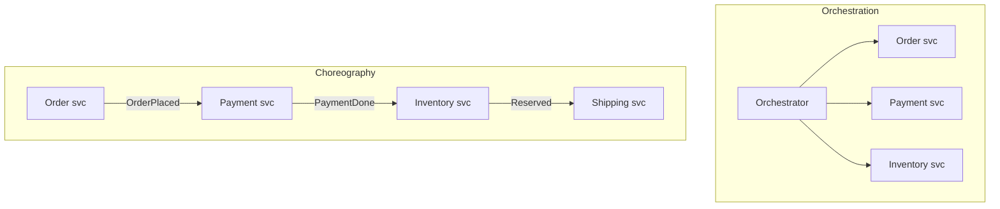
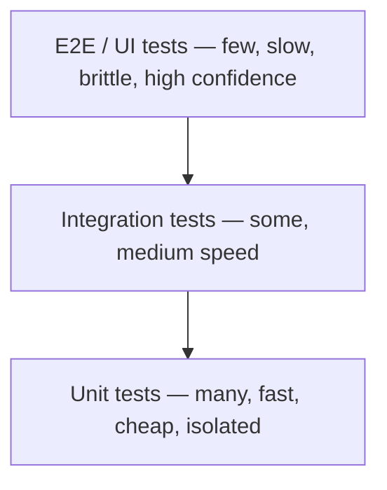

This is the article I wish someone had handed me when I needed to *refresh* software engineering
in a weekend. Not a textbook, not a 600-page tome, but a guided climb that starts with what
engineering even means when the material is invisible, and ends with you reasoning about sagas,
bounded contexts, OWASP, and circuit breakers the way a senior engineer does on a whiteboard.

The order is deliberately bottom-up: we start with the difference between *coding* and
*engineering*, walk the lifecycle, the process models, and the methodologies that organize the
work, then climb through requirements, design, OOP, the principles and disciplines (KISS, SOLID,
TDD, BDD, DDD, SDD), architecture, the data structures and databases underneath, testing,
security, maintenance, configuration management, quality assurance, metrics, project management,
and the delivery machinery that ships it all.

I lean on one recurring trick: **suppose** something concrete, then trace it through the system,
plus the occasional terrible analogy, because abstractions stick better when they are a little
ridiculous. Software engineering makes far more sense when you stop memorizing acronyms and start
asking what problem each one was invented to kill.

> A note on altitude: this piece slides up and down constantly. One section is about naming a
> variable, the next is about consistency across a fleet of services, the next about Big-O. That
> is the point. Software engineering *is* the art of managing complexity across every altitude at
> once, and you only understand it by moving through all of them.

## Table of Contents

- [Coding vs. engineering](#coding-vs-engineering)
- [The software development life cycle](#the-software-development-life-cycle)
- [Process models and maturity (CMMI)](#process-models-and-maturity-cmmi)
- [Agile methodologies](#agile-methodologies)
- [Extreme Programming (XP)](#extreme-programming-xp)
- [Software requirements](#software-requirements)
- [Software design: cohesion, coupling, UML](#software-design-cohesion-coupling-uml)
- [Object-oriented programming](#object-oriented-programming)
- [Design principles: KISS, DRY, YAGNI, SOLID](#design-principles-kiss-dry-yagni-solid)
- [The development disciplines: TDD, BDD, DDD, SDD](#the-development-disciplines-tdd-bdd-ddd-sdd)
- [Architecture styles and quality attributes](#architecture-styles-and-quality-attributes)
- [Synchronous vs. asynchronous](#synchronous-vs-asynchronous)
- [Distributed systems patterns (including SAGA)](#distributed-systems-patterns-including-saga)
- [Design patterns (Gang of Four) and antipatterns](#design-patterns-gang-of-four-and-antipatterns)
- [Data structures and algorithms](#data-structures-and-algorithms)
- [Databases](#databases)
- [Software construction and code quality](#software-construction-and-code-quality)
- [Testing: the pyramid and the zoo](#testing-the-pyramid-and-the-zoo)
- [Software security](#software-security)
- [Software maintenance](#software-maintenance)
- [Configuration management](#configuration-management)
- [Version control with Git](#version-control-with-git)
- [Software quality assurance](#software-quality-assurance)
- [Metrics and estimation](#metrics-and-estimation)
- [Project management](#project-management)
- [Delivery: CI/CD, containers, 12-factor, DORA](#delivery-cicd-containers-12-factor-dora)
- [Decisions and documentation](#decisions-and-documentation)
- [The laws every engineer should know](#the-laws-every-engineer-should-know)
- [Closing thought](#closing-thought)

## Coding vs. engineering

Before any methodology, settle the most important distinction: **coding is making a computer do a
thing; engineering is making it keep doing that thing, correctly, while a team changes it for
years, under deadline, without anyone fully holding it in their head.** Coding is a skill.
Engineering is coding plus *time*, *people*, and *uncertainty*.

| Concern | Coding | Engineering |
|---------|--------|-------------|
| Goal | Make it work | Make it work, last, and change cheaply |
| Time horizon | Now | Years |
| Team size | One head | Many heads, rotating |
| Success metric | "It runs" | "It still runs after the 400th change" |
| Main enemy | Bugs | Complexity and entropy |
| Output | A program | A system other people can safely evolve |

> The analogy: coding is cooking a great meal once. Engineering is running a restaurant kitchen —
> the recipe matters, but so do food safety, training new cooks, surviving the Friday rush, and
> the fact that the head chef quit and nobody wrote anything down. A genius who cannot hand off
> the recipe is a liability, not an asset.

The entire field is, at bottom, **complexity management**. Every principle, pattern, and process
in this article exists to fight one enemy: the moment a system grows past what a single person
can understand, and changes start breaking things in places no one expected.

## The software development life cycle

The **SDLC** is the skeleton under every methodology: the phases work passes through, whether you
do them once in a giant sequence (Waterfall) or a hundred times in tiny loops (Agile).

| Phase | What happens | Failure mode if skipped |
|-------|--------------|-------------------------|
| Requirements | Figure out what to build and why | You build the wrong thing, beautifully |
| Design | Decide how to structure it | You build the right thing as a tangled mess |
| Implementation | Write the code | (this is the part everyone thinks is the whole job) |
| Testing | Verify it does what was asked | You ship bugs to users instead of catching them |
| Deployment | Release it to production | Great code that never reaches anyone |
| Maintenance | Fix, adapt, and evolve | The system rots until it is replaced |

The single most important fact here is the **cost-of-change curve**: a bug caught in requirements
costs roughly a coffee; the same bug caught in production costs a fire drill, a post-mortem, and
possibly a customer. Defects get exponentially more expensive the later you find them, which is
the economic justification for testing early, designing deliberately, and shipping in small
batches.

> **Suppose** a stakeholder says "make the report exportable." Skip requirements and you will
> guess: PDF? CSV? Which columns? Scheduled or on-demand? You will build something plausible, demo
> it, and watch their face fall. The cheapest line of code is the one you did not write because
> you asked a question first.

## Process models and maturity (CMMI)

A *process model* decides how you sequence the SDLC phases. The history is a pendulum swinging
from "plan everything up front" to "plan as little as you can get away with."

| Model | Core idea | Best for | Weakness |
|-------|-----------|----------|----------|
| Waterfall | Each phase fully, in order, once | Fixed, well-understood scope | You learn your mistakes too late |
| V-model | Waterfall with a matching test phase for each design phase | Safety-critical, regulated | Still rigid; change is costly |
| Incremental | Build and deliver in slices, each adding features | Evolving products | Needs good upfront architecture |
| Iterative | Build a rough whole, refine it over passes | Unclear requirements | Can feel like endless polishing |
| Spiral | Iterative + explicit **risk analysis** each loop | Large, high-risk projects | Heavy, complex to manage |
| RUP | Phased, use-case driven, UML-heavy (Inception→Elaboration→Construction→Transition) | Big enterprise efforts | Ceremony overload |
| Agile | Short iterations, embrace change | Most product software | Decays into chaos without discipline |

**Maturity** is a different axis: how *repeatable and measured* your process is, regardless of
which model you use. **CMMI** (Capability Maturity Model Integration) grades organizations on five
levels:

| Level | Name | In one phrase |
|-------|------|---------------|
| 1 | Initial | Chaos; success depends on heroes |
| 2 | Managed | Projects are planned and tracked |
| 3 | Defined | One standard process across the org |
| 4 | Quantitatively Managed | The process is measured with data |
| 5 | Optimizing | The org continuously improves the process itself |

> The analogy: Waterfall is building a house from a blueprint — you do not pour the foundation,
> realize you want a basement, and start over. **Spiral** is the cautious mountaineer who, at each
> camp, stops to check the weather and the map before climbing higher — the whole point is killing
> the biggest risk *first*. And CMMI Level 1 is a kitchen where every dish tastes different
> depending on who cooked; Level 5 is a kitchen that measures, standardizes, and keeps getting
> better — the difference between "we got lucky" and "we are reliable."

## Agile methodologies

**Agile** is not a process; it is a [2001 manifesto](https://agilemanifesto.org/) of four
preferences — individuals over process, working software over documentation, collaboration over
contracts, responding to change over following a plan. **Scrum**, **Kanban**, and **Lean** are
concrete implementations of that spirit.

| Framework | Core idea | Best for | Weakness |
|-----------|-----------|----------|----------|
| Scrum | Time-boxed sprints, fixed roles and ceremonies | Teams needing rhythm and predictability | Ceremony overhead, "Scrum theater" |
| Kanban | Continuous flow, limit work-in-progress (WIP) | Support, ops, steady streams | Less long-range structure |
| Lean | Maximize value, eliminate waste | Startups, efficiency focus | Vague without concrete practices |

Scrum's vocabulary you will hear daily: a **sprint** (a 1–4 week iteration), the **backlog**
(prioritized to-do list), **user stories** ("As a *user*, I want *X* so that *Y*"), **story
points** (relative effort, not hours), the roles (**Product Owner**, **Scrum Master**, **Dev
Team**), and ceremonies — planning, daily **standup**, review, and **retrospective**. Kanban swaps
fixed sprints for a **board** with **WIP limits** that physically stop a team from starting ten
things and finishing none.

> The analogy: Agile is sculpting clay — you keep shaping, step back, and adjust, because you are
> not sure what the statue wants to be until you are halfway in. Most software is clay pretending
> to be concrete. The trap is "Agile theater": doing all the standups and none of the actual
> responding-to-change, which is cargo-culting the rituals while missing the point.

## Extreme Programming (XP)

XP, created by Kent Beck in the late 1990s, is the most *engineering-flavored* Agile method. Where
Scrum mostly organizes the work, XP prescribes how to actually write the code. Many practices the
whole industry now takes for granted — TDD, continuous integration, relentless refactoring — were
popularized by XP. It rests on five values: **communication, simplicity, feedback, courage, and
respect.**

| Practice | What it is | Why it works |
|----------|------------|--------------|
| Pair programming | Two devs, one keyboard, one driving and one navigating | Real-time review; fewer defects; knowledge spreads |
| Test-driven development | Write the failing test first, then the code | Design pressure + a safety net, for free |
| Continuous integration | Merge to mainline many times a day | Integration pain stays small instead of exploding at the end |
| Small releases | Ship tiny increments frequently | Fast feedback from real users |
| Refactoring | Continuously improve structure without changing behavior | Fights entropy before it compounds |
| Collective ownership | Anyone can change any code | No bus-factor-of-one bottlenecks |
| Sustainable pace | No death marches ("40-hour week") | Tired engineers write tomorrow's bugs |

> The name is the joke and the philosophy: take the practices everyone agrees are *good* and turn
> them up to **extreme**. Testing is good? Test before you even write the code. Code review is
> good? Review every line as it is typed, by pairing. Integration is good? Integrate ten times a
> day.

## Software requirements

You cannot build the right thing until you know what the right thing is. **Requirements
engineering** is the discipline of discovering, writing down, and agreeing on that — and it is
where the most expensive mistakes are born or avoided.

The first cut is **functional vs. non-functional**:

| Type | Answers | Examples |
|------|---------|----------|
| Functional | *What* the system does | "Users can reset their password by email" |
| Non-functional (NFRs / "-ilities") | *How well* it does it | "Login responds in <200 ms for 10k concurrent users; 99.9% uptime" |

The lifecycle of a requirement:

| Activity | What it is |
|----------|------------|
| Elicitation | Extracting needs from stakeholders (interviews, workshops, observation, surveys) |
| Analysis | Resolving conflicts, finding gaps, prioritizing (e.g. **MoSCoW**: Must/Should/Could/Won't) |
| Specification | Writing it down — an **SRS** (Software Requirements Specification), use cases, or user stories |
| Validation | Confirming it's the *right* requirement, with the people who asked |
| Traceability | Linking each requirement → design → code → test, so nothing is orphaned or lost |

Two common formats for capturing functional requirements:

- **Use case** — a detailed actor-goal-steps script: *Actor* "Customer", *Goal* "withdraw cash",
  *Main flow* and *alternate flows* (insufficient funds, card retained). Thorough, formal.
- **User story** — a lightweight promise of a conversation: "*As a* customer, *I want* to withdraw
  cash *so that* I have money," plus **acceptance criteria**. Agile-friendly.

> The analogy: requirements are the difference between a tailor and a vending machine. A vending
> machine gives you exactly the button you pressed. A good tailor *asks questions* — what's the
> occasion, how should it fit, do you sit a lot — because the thing you asked for and the thing
> you need are rarely identical. **Non-functional** requirements are the ones that sink projects
> silently: everyone agrees on the features, nobody wrote down "must handle Black Friday," and the
> site melts at the worst possible moment. **Traceability** is the breadcrumb trail that lets you
> answer "why does this code exist?" with a requirement instead of a shrug.

## Software design: cohesion, coupling, UML

If architecture is the city plan, **design** is the floor plan of each building: how you split the
system into modules and how those modules relate. It splits into **high-level design** (modules,
their responsibilities, and interfaces) and **low-level design** (the internals of each module —
classes, data, algorithms).

The two words that decide whether a design ages well:

| Property | Definition | You want |
|----------|------------|----------|
| **Cohesion** | How focused a module is on one job | **High** — a module does one thing well |
| **Coupling** | How dependent modules are on each other | **Low** — modules can change independently |

High cohesion + low coupling is the north star of all design. It is enabled by three classic
ideas: **abstraction** (expose *what*, hide *how*), **modularity** (decompose into swappable
parts), and **information hiding** (a module's internals are nobody else's business).

**UML** (Unified Modeling Language) is the standard notation for sketching designs. You rarely
draw all of it, but a few diagram types earn their keep:

| UML diagram | Shows | When to reach for it |
|-------------|-------|----------------------|
| Class diagram | Classes, attributes, relationships | Modeling a domain or low-level design |
| Sequence diagram | Messages between objects over time | Tracing a flow (e.g. a checkout) |
| Use case diagram | Actors and their goals | Scoping features with stakeholders |
| State diagram | States and transitions | Modeling a lifecycle (order: placed→shipped→delivered) |
| Component/deployment | Modules and where they run | High-level architecture |

```text
# Low coupling in one breath: depend on the interface, not the concrete class
# BAD: OrderService hard-wires MySQL — change the DB, change OrderService
class OrderService { db = new MySQLDatabase() }

# GOOD: OrderService depends on an abstraction; the DB is injected
class OrderService { constructor(db: Database) { this.db = db } }
```

> The analogy: cohesion and coupling are like a well-organized toolbox. **High cohesion** is
> keeping all the screwdrivers in one labeled drawer. **Low coupling** is making sure grabbing a
> screwdriver doesn't yank three wrenches and a hammer out with it. A "ball of mud" codebase is
> the junk drawer in everyone's kitchen — everything is tangled with everything, and finding the
> tape means moving the batteries, the takeout menus, and a mystery key.

## Object-oriented programming

OOP is the dominant paradigm for organizing code around **objects** — bundles of data (state) and
the behavior that operates on it — rather than free-floating functions. It rests on four pillars.

| Pillar | What it means | Everyday example |
|--------|---------------|------------------|
| **Encapsulation** | Bundle data + methods; hide internals behind a public interface | A `BankAccount` exposes `deposit()`, hides the `balance` field |
| **Abstraction** | Expose the essential, hide the complex | You call `car.drive()`, not `car.injectFuel()` |
| **Inheritance** | A subclass reuses and extends a parent | `Dog extends Animal` and gets `eat()` for free |
| **Polymorphism** | One interface, many implementations | `shape.area()` works for `Circle` and `Square` differently |

The supporting cast: **classes** (the blueprint) vs. **objects** (instances of it), **interfaces**
(a contract of methods with no implementation), and **abstract classes** (partial blueprints).

```python
class Animal:
    def speak(self): raise NotImplementedError

class Dog(Animal):
    def speak(self): return "Woof"   # polymorphism: same method, different result

class Cat(Animal):
    def speak(self): return "Meow"

for a in [Dog(), Cat()]:
    print(a.speak())   # Woof / Meow — caller doesn't know or care which class
```

> The one debate that matters: **composition over inheritance.** Inheritance ("a Dog *is an*
> Animal") is seductive but rigid — deep class trees become brittle, and the classic disaster is
> a `Penguin` inheriting from `Bird` and then crashing on `fly()`. Composition ("a Car *has an*
> Engine") assembles behavior from parts you can swap. The rule of thumb: inherit for *identity*,
> compose for *capability*. When in doubt, compose — you can rearrange Lego, but you can't un-bake
> a cake.

## Design principles: KISS, DRY, YAGNI, SOLID

Principles are the rules of thumb you apply *inside* the code, the proverbs you mutter in a code
review. They are not laws; they are tensions to balance.

| Principle | Stands for | The one-liner |
|-----------|-----------|---------------|
| KISS | Keep It Simple, Stupid | Prefer the boring solution; complexity is a cost, not a flex |
| DRY | Don't Repeat Yourself | Every piece of knowledge has one authoritative home |
| YAGNI | You Ain't Gonna Need It | Don't build for an imagined future; build for now |
| SoC | Separation of Concerns | Each module does one job and minds its own business |
| Law of Demeter | "Don't talk to strangers" | An object should only talk to its immediate friends |
| Composition over inheritance | — | Assemble behavior from parts; don't build deep class trees |

**SOLID** is the famous five for object-oriented design:

| Letter | Principle | Plain English |
|--------|-----------|---------------|
| S | Single Responsibility | A class should have one reason to change |
| O | Open/Closed | Open to extension, closed to modification |
| L | Liskov Substitution | A subtype must be usable wherever its parent is, no surprises |
| I | Interface Segregation | Many small interfaces beat one fat one |
| D | Dependency Inversion | Depend on abstractions, not concrete details |

> The crucial nuance, and the most common rookie mistake: these principles **fight each other**,
> and the skill is balancing them, not maximizing one. DRY taken to the extreme fuses two things
> that merely *looked* alike into one premature abstraction (the "wrong abstraction" costs more
> than duplication). YAGNI says don't build the plugin system you imagine; Open/Closed says make it
> extensible. When in doubt, KISS wins — you can always add complexity later, but you can rarely
> remove it.

## The development disciplines: TDD, BDD, DDD, SDD

These four are *disciplines*: opinionated ways to drive the act of building from something other
than "just start typing." They answer different questions, and they stack.

### TDD — Test-Driven Development

TDD inverts the obvious order: write a **failing test first**, then the minimum code to pass it,
then clean up. The rhythm is **red, green, refactor**.

```python
# RED: this fails because add() doesn't exist
def test_add():
    assert add(2, 3) == 5

# GREEN: simplest thing that passes
def add(a, b):
    return a + b

# REFACTOR: improve the design now that a test has your back; keep it green
```

TDD's real payoff is not the tests (though you get a regression suite for free); it is **design
pressure**: code that is hard to test is usually badly coupled, so writing the test first forces
you to design seams you can isolate.

> The analogy: TDD is like building a staircase by first nailing the next step you want to stand
> on, then standing on it. You never reach into the dark — every step is verified before you put
> weight on it.

### BDD — Behavior-Driven Development

BDD is TDD with the focus shifted from "does this function return 5" to "does the *system behave*
the way the business expects," in language a non-programmer can read. The canonical format is
**Given / When / Then**.

```gherkin
Feature: Withdraw cash
  Scenario: Account has enough money
    Given my balance is $100
    When I withdraw $40
    Then my balance should be $60
```

### DDD — Domain-Driven Design

DDD, from Eric Evans, says the structure of your code should mirror the **business domain**,
expressed in a **ubiquitous language** that engineers and domain experts use identically.

| DDD concept | What it means |
|-------------|---------------|
| Ubiquitous language | One shared vocabulary; `Policy` in code means what underwriters mean |
| Bounded context | A boundary where a model is consistent; `Customer` differs in Billing vs. Support |
| Entity | An object with identity that persists over time (a `User`) |
| Value object | Defined only by its values, no identity (a `Money`) |
| Aggregate | A cluster treated as one consistency unit, edited only via its **root** |
| Repository | The abstraction that loads and saves aggregates |
| Domain event | Something meaningful that happened (`OrderPlaced`) |

> The killer insight is **bounded context**. In Sales, a "customer" is a lead with a deal size. In
> Shipping, a "customer" is an address and a doorbell. DDD says stop forcing them into one model:
> draw the boundary, let each side have its own `Customer`, and translate at the border. Good
> fences make good neighbors.

### SDD — Spec-Driven Development

The newest entry, supercharged by AI coding agents. SDD **inverts the source of truth**: the
**specification is the artifact you maintain**, and the code is generated or verified against it.
It is the structured antidote to "vibe coding" — throwing vague prompts at an LLM and praying.

```text
Traditional:  idea → code (the spec lives only in your head, then rots)
Spec-driven:  idea → SPEC → plan → tasks → code (the spec stays the source of truth)
```

Tools like **GitHub Spec Kit**, AWS **Kiro**, and **Tessl** formalize this: you write a precise
spec, the agent produces a plan and tasks, then writes code that satisfies it. Your job shifts
from typing every line to **steering**.

> The analogy: vibe coding is telling a contractor "build me a nice house" and leaving for the
> weekend. SDD is handing them blueprints, a materials list, and inspection checkpoints. AI is an
> extraordinarily fast junior who is also a confident guesser — the spec is how you stop it from
> confidently guessing wrong at 200 lines per second.

## Architecture styles and quality attributes

Architecture is the set of decisions that are expensive to reverse: the big boxes, how they talk,
and where the boundaries are. There is no "best" — only trade-offs against your team size, scale,
and how fast requirements change.

| Style | Idea | Strength | Weakness |
|-------|------|----------|----------|
| Monolith | One deployable unit | Simple to build, test, deploy | Scales as one lump |
| Modular monolith | One deploy, strong internal boundaries | Simplicity + clean seams | Needs discipline |
| Microservices | Many independently deployable services | Independent scaling and teams | Distributed-systems pain |
| Layered (n-tier) | Presentation → business → data | Familiar, organized | Layers leak |
| Hexagonal (ports & adapters) | Core logic isolated behind ports | Swappable tech, testable | Upfront indirection |
| Clean architecture | Dependencies point inward to the domain | Framework-independent core | Ceremony for small apps |
| Event-driven | Components react to events asynchronously | Loose coupling, throughput | Hard to trace |
| CQRS | Separate read and write models | Optimize each independently | Two models to sync |
| Event sourcing | Store the events, not current state | Full audit trail | Querying gets tricky |

**Presentation patterns** organize the UI layer specifically:

| Pattern | Split | Used in |
|---------|-------|---------|
| **MVC** | Model / View / Controller | Rails, Spring MVC, Django |
| **MVVM** | Model / View / ViewModel (data-binding) | WPF, Angular, SwiftUI |
| **MVP** | Model / View / Presenter | Older Android, GWT |

The reason architecture exists at all is to satisfy **quality attributes** — the non-functional
"-ilities":

| Attribute | The question |
|-----------|--------------|
| Scalability | Can it handle 10× the load? (**vertical** = bigger box, **horizontal** = more boxes) |
| Availability | What % of the time is it up? (the "nines") |
| Performance | How fast / how much throughput? |
| Reliability | Does it behave correctly over time? |
| Maintainability | How cheap is it to change? |
| Security | Can it resist attack? |
| Observability | Can you tell *why* it's misbehaving? |

> The eternal debate: **monolith vs. microservices.** The honest answer for almost everyone is
> *start with a (modular) monolith.* Microservices solve **organizational** scaling — letting 50
> teams deploy without coordinating — at the cost of turning every method call into a network call
> that can fail, time out, or arrive twice. Don't pay that tax until the org actually needs it. A
> "distributed monolith" — microservices that must all deploy together — is the worst of both
> worlds.

## Synchronous vs. asynchronous

This one axis quietly shapes everything above it. **Synchronous**: the caller sends a request and
*waits*, blocked, for the response. **Asynchronous**: the caller fires a message and moves on; the
result arrives later, if at all.

| | Synchronous | Asynchronous |
|---|-------------|--------------|
| Mental model | A phone call | An email / a voicemail |
| Caller waits? | Yes, blocked | No, continues |
| Coupling | Tighter (both up *now*) | Looser (receiver can be down) |
| Failure blast radius | Cascades | Contained (queue absorbs the spike) |
| Examples | REST/gRPC call, DB query | Message queue, pub/sub, webhooks |
| Best for | "I need the answer to continue" | "Do this eventually; I don't need to watch" |

Async usually runs over a **broker**: a **message queue** (point-to-point — one producer, *one*
consumer picks up the job; RabbitMQ, SQS) or **publish/subscribe** (fan-out — one event, *every*
subscriber gets a copy, publisher doesn't know who's listening; Kafka, SNS, NATS).

> The analogy: synchronous is a phone call — both people must be present, and if the other puts you
> on hold, *you* are stuck holding too. Asynchronous is texting — you send it, get on with your
> life, and they reply when they can. Async buys resilience and scale, and pays for it with
> **eventual consistency** and the headache of debugging a flow you can't watch end-to-end.

## Distributed systems patterns (including SAGA)

The moment your data lives in more than one service or database, the comforting guarantees of a
single ACID transaction evaporate. These patterns claw back correctness and resilience in a world
of networks that lose, delay, and duplicate messages.

The law that governs the game — **CAP theorem**: under a network **P**artition, you must choose
between **C**onsistency and **A**vailability. Most internet-scale systems pick availability and
embrace **eventual consistency**: the data will agree *soon*, just not this instant.

### SAGA — distributed transactions without distributed locks

You cannot wrap "charge the card, reserve inventory, book shipping" in one database transaction
when each lives in a different service. The **SAGA pattern** replaces one big transaction with a
**sequence of local transactions**, each publishing an event that triggers the next. If a step
fails, the saga runs **compensating transactions** to undo the prior steps.



| | Orchestration | Choreography |
|---|---------------|--------------|
| Control | A central coordinator issues commands | Services react to each other's events |
| Visibility | Easy — the flow lives in one place | Hard — spread across services |
| Coupling | Coupled to the orchestrator | Loosely coupled, event-driven |
| Best for | Complex workflows needing control | Simple, linear flows |

> The analogy: **orchestration** is a conductor in front of an orchestra — one baton, everyone
> follows it, and if the music stops you know who to look at. **Choreography** is a flash mob —
> each dancer takes their cue from the next, gorgeous when it works, but when someone trips there
> is no conductor to ask. Compensating transactions are the part people forget: there is no
> `ROLLBACK`, so *you* must write the "refund the card we already charged" logic by hand.

### The resilience toolkit

| Pattern | Problem it solves | One-liner |
|---------|-------------------|-----------|
| Retry + backoff + jitter | Transient failures | Try again, waiting longer each time, with randomness |
| Circuit breaker | A dependency is *down* | Stop calling a failing service; fail fast; check back later |
| Bulkhead | One overloaded part drowns the rest | Isolate resources so a flood stays in one compartment |
| Timeout | A call hangs forever | Give up after N seconds; never wait indefinitely |
| Idempotency | Retries cause duplicates | Make "do it twice" equal "do it once" (idempotency keys) |
| Outbox | "Save to DB *and* publish event" can half-fail | Write the event in the same transaction, publish later |
| Strangler fig | Replacing a legacy system safely | Wrap the old system; reroute features one by one |

> Two of these are non-negotiable and constantly skipped. **Idempotency**: if a payment times out
> and the client retries, did you charge twice? An idempotency key — a unique ID the server
> remembers — turns a retried request into a no-op. **Circuit breaker** is literal: like the
> breaker in your house that trips before the wiring melts, it detects a failing service and stops
> calling it. **Bulkhead** is named after a ship's watertight compartments — one flooded section
> doesn't sink the vessel.

## Design patterns (Gang of Four) and antipatterns

The 1994 "Gang of Four" book catalogued 23 reusable solutions to recurring OO design problems.
They are a **shared vocabulary** as much as code: "use a Strategy here" conveys a whole design in
two words. Three families:

### Creational — how objects get made

| Pattern | What it does |
|---------|--------------|
| Singleton | Guarantees one instance (use sparingly — global state in a hat) |
| Factory Method | Subclasses decide which concrete class to instantiate |
| Abstract Factory | Creates families of related objects |
| Builder | Constructs a complex object step by step |
| Prototype | Creates new objects by cloning an existing one |

### Structural — how objects are composed

| Pattern | What it does |
|---------|--------------|
| Adapter | Makes two incompatible interfaces work together |
| Decorator | Adds behavior dynamically, without subclassing |
| Facade | A simple front door over a complex subsystem |
| Proxy | A stand-in that controls access to another object |
| Composite | Treats individual objects and groups uniformly (trees) |
| Bridge | Splits abstraction from implementation |
| Flyweight | Shares common state to save memory |

### Behavioral — how objects collaborate

| Pattern | What it does |
|---------|--------------|
| Strategy | Swap an algorithm at runtime behind a common interface |
| Observer | Subscribers get notified when a subject changes (pub/sub's ancestor) |
| Command | Wrap a request as an object (undo, queues, logs) |
| Iterator | Walk a collection without exposing its internals |
| State | Change behavior when internal state changes |
| Template Method | Define a skeleton, let subclasses fill steps |
| Chain of Responsibility | Pass a request along a chain until someone handles it (middleware!) |

**Antipatterns** are the patterns of failure — solutions that look reasonable and reliably hurt:

| Antipattern | What it is |
|-------------|------------|
| God Object | One class that knows and does everything |
| Spaghetti code | Control flow so tangled you can't follow it |
| Big Ball of Mud | No discernible architecture at all |
| Golden Hammer | "I know X, so every problem is an X problem" |
| Premature optimization | Tuning speed before you know where the bottleneck is |
| Copy-paste programming | Duplication instead of abstraction |
| Lava flow | Dead code nobody dares delete |

> Two cautions worth more than the patterns themselves. **Adapter** and **Decorator** are
> everywhere you already work — a payment "adapter" wrapping Stripe's SDK, HTTP "middleware" that
> is literally Chain of Responsibility. And **patternitis** is real: a junior who just read the
> book will wrap a one-line function in an `AbstractStrategyFactoryProvider`. Patterns answer
> *problems you actually have* — reach for them when the problem appears.

## Data structures and algorithms

Beneath every framework sits the question: how do you store data so the operations you do most are
fast? **Big-O notation** describes how cost grows with input size `n` — the language of "will this
still work at scale?"

| Big-O | Name | Example |
|-------|------|---------|
| O(1) | Constant | Hash table lookup, array index |
| O(log n) | Logarithmic | Binary search, balanced-tree lookup |
| O(n) | Linear | Scanning a list |
| O(n log n) | Linearithmic | Good sorts (merge, quick average) |
| O(n²) | Quadratic | Nested loops, bubble sort |
| O(2ⁿ) | Exponential | Naive recursion (brute-force subsets) |

The core data structures and what they're good at:

| Structure | Fast at | Slow at | Classic use |
|-----------|---------|---------|-------------|
| Array | Index access O(1) | Insert/delete in middle | Fixed lists, lookup tables |
| Linked list | Insert/delete at ends | Random access | Queues, adjacency lists |
| Stack (LIFO) | Push/pop | Searching | Undo, call stack, DFS |
| Queue (FIFO) | Enqueue/dequeue | Searching | Task buffers, BFS |
| Hash table | Lookup/insert ~O(1) | Ordered traversal | Caches, dictionaries, sets |
| Tree (BST/balanced) | Ordered ops O(log n) | — | Indexes, sorted data |
| Heap | Min/max O(1), insert O(log n) | Arbitrary search | Priority queues, schedulers |
| Graph | Modeling relationships | Depends on algorithm | Social networks, routing |

Algorithm families: **searching** (linear vs. binary), **sorting** (bubble O(n²) for teaching,
merge/quick O(n log n) for real life), graph traversal (**BFS/DFS**, Dijkstra), and **dynamic
programming** — breaking a problem into overlapping subproblems and caching the answers
(**memoization**) so you solve each once.

```python
# Binary search: O(log n) — halve the haystack every step
def binary_search(arr, target):       # arr must be sorted
    lo, hi = 0, len(arr) - 1
    while lo <= hi:
        mid = (lo + hi) // 2
        if arr[mid] == target: return mid
        if arr[mid] < target:  lo = mid + 1
        else:                  hi = mid - 1
    return -1
```

> The analogy: Big-O is asking "how much worse does this get as the line grows?" An O(1) operation
> is a coat check — one ticket, one coat, no matter how many coats. An O(n) operation is looking
> for your friend by walking past every person. O(n²) is everyone shaking hands with everyone — fine
> at a dinner party, a catastrophe at a stadium. Choosing the right data structure is choosing how
> the line behaves *before* the crowd shows up.

## Databases

Most systems are, deep down, a fancy wrapper around stored data. The first decision is
**relational vs. NoSQL**.

| | Relational (SQL) | NoSQL |
|---|------------------|-------|
| Model | Tables, rows, fixed schema | Documents, key-value, graph, wide-column |
| Query | SQL, powerful joins | Varies; often no joins |
| Consistency | Strong (ACID) | Often eventual (BASE) |
| Scaling | Vertical (mostly) | Horizontal by design |
| Best for | Complex relationships, transactions | Huge scale, flexible/changing schema |
| Examples | PostgreSQL, MySQL | MongoDB, Redis, Cassandra, Neo4j |

**ACID** is what makes a relational transaction trustworthy:

| Letter | Guarantee |
|--------|-----------|
| Atomicity | All of a transaction happens, or none of it |
| Consistency | A transaction moves the DB from one valid state to another |
| Isolation | Concurrent transactions don't corrupt each other |
| Durability | Once committed, it survives a crash |

The craft of relational design and performance:

- **Normalization** — organizing tables to eliminate redundancy (1NF→2NF→3NF), so a fact lives in
  exactly one place. **Denormalization** deliberately reverses this for read speed.
- **Indexing** — a B-tree (or hash) on a column so lookups are O(log n) instead of a full table
  scan. The trade-off: indexes speed reads and slow writes, and cost storage.
- **Query optimization** — reading the `EXPLAIN` plan, avoiding N+1 queries, fetching only the
  columns you need.

```sql
-- An index turns a full-table scan into a fast lookup
CREATE INDEX idx_users_email ON users(email);
SELECT id, name FROM users WHERE email = 'a@b.com';  -- now uses the index
```

> The analogy: an **index** is the index at the back of a book. Without it, finding every mention
> of "mutex" means reading all 600 pages (a full table scan). With it, you flip to the back, find
> the entry, and jump straight to the pages. And like a book index, it costs paper (storage) and
> must be updated every time the book changes (slower writes) — which is why you index the columns
> you *search by*, not every column.

## Software construction and code quality

Construction is the daily act of writing the code well, plus the hygiene that decides whether the
codebase is a joy or a haunted house in two years.

| Concept | What it is |
|---------|------------|
| Clean code | Readable, intention-revealing names; small functions; minimal surprise |
| Defensive programming | Validate inputs, handle the unexpected, fail loudly not silently |
| Debugging | Reproduce → isolate → hypothesize → fix → verify (not "change things and pray") |
| Code smell | A surface symptom of a deeper problem (long method, huge class, duplication) |
| Technical debt | Shortcuts taken for speed that you "pay interest" on later |
| Refactoring | Changing structure *without* changing behavior, in safe small steps |
| Code review | A second pair of eyes before merge — catches bugs and spreads knowledge |
| Boy Scout Rule | Leave the code a little cleaner than you found it |

**Technical debt** is the most useful metaphor in the field, coined by Ward Cunningham. A little
can be *strategic* — borrow speed now, pay it back soon. The danger is *unmanaged* debt: you only
ever pay the interest (every change gets slower) and never the principal, until a one-line feature
takes a week and everyone is afraid to touch the code.

> The analogy: a code smell is that faint funk in the fridge — it doesn't *prove* something has
> gone bad, but investigate before you trust the leftovers. Technical debt is the credit card:
> occasionally the smart move, ruinous if you only ever make minimum payments. Refactoring is
> cleaning the kitchen *as you cook* instead of facing a mountain of dishes at midnight. And
> **defensive programming** is assuming every input is a toddler with a marker — lock the cabinets,
> because eventually someone *will* pass `null` where you swore they wouldn't.

## Testing: the pyramid and the zoo

Testing is how you buy confidence to change code without fear. The guiding shape is the **testing
pyramid**: lots of fast, cheap tests at the bottom, few slow, expensive ones at the top.



A common rule of thumb is roughly **70% unit, 20% integration, 10% end-to-end**. Invert the
pyramid into an **ice-cream cone** (mostly slow E2E tests) and your suite becomes flaky, slow, and
so painful people stop running it — worse than no suite, because it lies about being safe.

Two orthogonal ways to classify tests. By **scope** (how much you test at once) and by
**knowledge** (whether you can see inside):

| By knowledge | Means |
|--------------|-------|
| **Black-box** | Test behavior through the public interface; you don't see the code |
| **White-box** | Test using knowledge of the internals (branches, paths) |
| **Gray-box** | A mix — some internal knowledge, tested from outside |

| By scope / purpose | Question it answers |
|--------------------|---------------------|
| Unit | Does this one function/class behave? |
| Integration | Do these modules work together (DB, API)? |
| System | Does the fully integrated product work? |
| End-to-end (E2E) | Does the whole flow work like a real user? |
| Acceptance | Does it meet the agreed business criteria? |
| Smoke | Is the build even alive? |
| Regression | Did we re-break something we already fixed? |
| Contract | Do two services still agree on the interface? |
| Property-based | Does it hold for *thousands* of generated inputs? |
| Mutation | Are the tests themselves any good? |
| Performance / load | Is it fast enough under N users? |
| Fuzz | Does weird/random input crash it? |

**Coverage** measures how much of the code your tests exercise (line, branch, path). It is a
useful *floor* and a terrible *target* — 100% coverage of weak assertions proves nothing.

### Test doubles: the stunt actors

When a unit test needs a dependency it can't use for real, swap in a **test double**:

| Double | What it does | Analogy |
|--------|--------------|---------|
| Dummy | Passed but never used; fills a slot | An extra in the background |
| Stub | Returns canned answers | A cardboard cutout with one line |
| Spy | A stub that records how it was called | A cutout with a hidden camera |
| Fake | A working but shortcut implementation (in-memory DB) | A stunt car that drives but isn't street-legal |
| Mock | Pre-programmed expectations; verifies behavior | A method actor who fails the scene if you flub your cue |

> The distinction that confuses everyone: **stub vs. mock**. A **stub** answers a question and you
> assert on the resulting *state*. A **mock** verifies an *interaction* ("`chargeCard` was called
> once with $40"). Over-mock and your tests become a brittle mirror of the implementation — they
> break every time you refactor, even when behavior is unchanged.

## Software security

Security is not a feature you bolt on at the end; it is a property you design in. The mindset
shift: stop thinking only about what users *should* do and start thinking about what an attacker
*can* do.

The foundations:

| Concept | What it is |
|---------|------------|
| Authentication (authN) | *Who are you?* (passwords, MFA, OAuth, passkeys) |
| Authorization (authZ) | *What are you allowed to do?* (roles, permissions, RBAC/ABAC) |
| Encryption in transit | TLS — nobody can read it on the wire |
| Encryption at rest | Stored data is encrypted on disk |
| Hashing | One-way; store password *hashes* (bcrypt/argon2), never plaintext |
| Threat modeling | Systematically asking "how could this be attacked?" (e.g. **STRIDE**) |
| Least privilege | Give every component the minimum access it needs |

The **OWASP Top 10** is the industry's canonical list of the most critical web vulnerabilities. A
few you must know cold:

| Vulnerability | What it is | Defense |
|---------------|------------|---------|
| Broken access control | Users reaching things they shouldn't | Enforce authZ server-side, deny by default |
| Injection (SQLi, etc.) | Untrusted input executed as code | Parameterized queries, never string-concat SQL |
| Cryptographic failures | Weak/missing encryption, leaked secrets | Strong algorithms, secrets in a vault |
| Insecure design | Missing security at the design stage | Threat-model early |
| Security misconfiguration | Default passwords, open buckets, verbose errors | Harden defaults, automate config |
| Vulnerable dependencies | A library with a known CVE | Scan dependencies (SCA), patch promptly |

```python
# Injection: the cardinal sin and its fix
# VULNERABLE: user input becomes part of the SQL — ' OR '1'='1 logs anyone in
query = f"SELECT * FROM users WHERE name = '{name}'"

# SAFE: parameterized — the input is data, never code
cursor.execute("SELECT * FROM users WHERE name = %s", (name,))
```

> The analogy: security is the difference between a house with a locked front door and a house
> where you also assumed nobody would try the windows, the chimney, or politely ask the dog to
> hand over the keys. **Injection** is the classic: you built a form that asks "what's your name?"
> and an attacker answers with a sentence that the database mistakes for a command. The fix —
> *parameterized queries* — is simply never letting user input and code share the same sentence.
> **Never roll your own crypto**; you will lose to people who do this for a living.

## Software maintenance

Surprise: maintenance is where most of a system's life and budget goes — often 60–80% of total
cost. The code is written once and *changed* for a decade. There are four flavors, and naming them
helps you plan for them.

| Type | Trigger | Example |
|------|---------|---------|
| **Corrective** | A bug was found | Fix the off-by-one that miscounts the cart |
| **Adaptive** | The environment changed | Port to a new OS, a new tax law, a new API version |
| **Perfective** | Users want it better | Add a feature, speed up a slow page |
| **Preventive** | Head off future trouble | Refactor a fragile module before it breaks |

Supporting practices: **impact analysis** (before changing X, what else might break?),
**reengineering** (systematically restructuring legacy code), and active **technical-debt
management** so the system stays changeable.

> The surprising stat reframes the whole job: you spend far more time *reading and changing* code
> than writing it fresh, which is the entire reason "clear is better than clever" matters. The
> analogy: building software is buying a house; **maintenance is owning it.** The mortgage isn't
> the expensive part — it's the leaky roof, the code that no longer meets code, and the renovation
> for the in-laws (new requirements) you didn't see coming. Perfective and adaptive maintenance,
> not bug-fixing, are usually the biggest slices.

## Configuration management

**Software Configuration Management (SCM)** is the discipline of controlling *change itself* —
tracking every version of every artifact so you can always answer "what exactly is running, and
how did it get there?"

| Concept | What it is |
|---------|------------|
| Version control | Track every change to source (the next section) |
| Baseline | A reviewed, frozen snapshot you build from |
| Change control | A defined process to request, review, and approve changes |
| Build management | Reproducibly turning source into an artifact |
| Release management | Versioning, packaging, and shipping that artifact |
| Dependency management | Pinning the exact libraries you depend on |

**Semantic versioning** (`MAJOR.MINOR.PATCH`) is the lingua franca: bump PATCH for fixes, MINOR
for backward-compatible features, MAJOR for breaking changes. A lockfile (`package-lock.json`,
`go.sum`) pins the exact dependency tree so every machine builds the same bytes.

> The analogy: SCM is the difference between a kitchen where the recipe is "some flour, a bit of
> sugar, bake till done" and one where every measurement, supplier, and oven setting is recorded.
> The second one can reproduce the exact cake a year later — and figure out which change ruined the
> batch. **Dependency management** is the subtle killer: "works on my machine" is almost always an
> unpinned dependency that quietly upgraded itself into a different cake.

## Version control with Git

Git is the universal substrate of modern development: a distributed system for tracking changes,
branching cheaply, and merging the work of many people without chaos.

| Concept | What it is |
|---------|------------|
| Commit | A snapshot of changes with a message and a hash |
| Branch | A cheap, movable pointer for parallel work |
| Merge | Combine branches; may need conflict resolution |
| Pull request (PR/MR) | Propose a merge + code review before it lands |
| Remote | A shared copy (GitHub/GitLab) the team syncs through |
| Conflict | Two branches changed the same lines; a human picks |

The two dominant **branching strategies**:

| Strategy | How it works | Best for |
|----------|--------------|----------|
| **Git Flow** | Long-lived `develop`, `release`, `hotfix`, `feature` branches | Scheduled, versioned releases |
| **Trunk-based** | Everyone commits to one mainline; tiny short-lived branches behind feature flags | Continuous delivery, high-velocity teams |

```bash
git checkout -b feature/login   # branch off
git add . && git commit -m "add login form"
git push origin feature/login   # share it
# open a pull request -> review -> merge to main
```

> The analogy: version control is a time machine with parallel universes. A **branch** is a
> what-if universe where you try something risky; **merge** is folding the good timeline back into
> the main one. A **conflict** is two time-travelers editing the same sentence of history — Git
> can't decide who's right, so it hands *you* the pen. And the modern consensus (backed by DORA
> research) is **trunk-based**: long-lived branches drift so far from reality that merging them
> becomes its own miserable project — "merge hell."

## Software quality assurance

**Quality Assurance (QA)** is about the *process* that prevents defects; **Quality Control (QC)**
is about the *product* and detecting defects. QA asks "is our way of working sound?"; QC asks "is
this specific build good?" Testing is part of QC; defining the testing standard is QA.

| QA (prevention) | QC (detection) |
|-----------------|----------------|
| Process-oriented | Product-oriented |
| Defines standards, reviews, audits | Executes tests, inspects output |
| "Are we building it right?" | "Did we build it right?" |
| Proactive | Reactive |

The toolkit:

- **ISO/IEC 25010** — the international standard model of software quality, naming eight
  characteristics (functional suitability, performance efficiency, compatibility, usability,
  reliability, security, maintainability, portability). It is the formal vocabulary for the
  "-ilities."
- **Inspections and reviews** — structured human examination of artifacts; the formal version is
  the **Fagan inspection**. Reviews catch defects earlier (and cheaper) than any test.
- **Quality metrics** — defect density, escaped-defect rate, mean time to repair.
- **Audits** — independent checks that the process is actually being followed.

> The analogy: QC is the restaurant's taste-tester checking each plate before it leaves the
> kitchen. QA is the health inspector certifying that the *kitchen itself* — the handwashing, the
> fridge temperatures, the training — reliably produces safe food. You need both: a great
> taste-tester can't save a filthy kitchen, and a spotless kitchen still plates the occasional
> bad dish.

## Metrics and estimation

You cannot manage what you cannot see — but you also get exactly the behavior you measure, so
choose carefully.

Common **code and process metrics**:

| Metric | Measures | Caveat |
|--------|----------|--------|
| Lines of code (LOC) | Size | A terrible productivity measure — more code is often worse |
| Cyclomatic complexity | Number of independent paths through a function | High = hard to test and understand |
| Code coverage | % of code exercised by tests | A floor, not a target |
| Defect density | Bugs per KLOC | Depends on how hard you look |
| Cycle time / lead time | Idea → production | The flow metric that matters |

**Estimation** is forecasting effort and cost — famously hard (see Hofstadter's Law). The main
techniques:

| Technique | How it works |
|-----------|--------------|
| Story points + velocity | Estimate relative effort; track how many points a team finishes per sprint |
| Planning poker | The team estimates together with cards to surface disagreement |
| T-shirt sizing | Coarse S/M/L/XL for early, rough planning |
| Function points | Size by counting inputs, outputs, and data — implementation-independent |
| COCOMO | A formula-based model estimating effort from size |

> The analogy: estimation is weather forecasting, not fortune-telling. "70% chance of rain" is
> honest and useful; "it will rain at 3:42 pm" is a lie dressed as precision. **Story points**
> work *because* they're relative — humans are bad at "how many hours" and decent at "this is about
> twice as hard as that." And **Goodhart's Law** is the trap on every metric here: the moment you
> reward developers for lines of code, you get verbose code; reward them for closed tickets, you
> get tickets split into confetti. Measure to *learn*, not to *rank*.

## Project management

Software project management is steering scope, time, cost, people, and risk toward a release — the
human layer wrapped around all the technical ones.

| Area | What it involves |
|------|------------------|
| Scope management | Deciding what's in and (harder) what's out; fighting scope creep |
| Scheduling | Sequencing work; tools like **Gantt charts** and the **critical path** |
| Cost/effort estimation | Forecasting budget and timeline (see the previous section) |
| Risk management | Identify → assess → mitigate → monitor the things that could go wrong |
| Resource allocation | Putting the right people on the right work |
| Stakeholder communication | Keeping everyone informed and expectations aligned |

The classic **triple constraint** (or "iron triangle"): **scope, time, and cost** — pick the
priorities, because you can't max all three. Pull one corner and the others move.

> The analogy: the iron triangle is the contractor's honest sign — "**Good, Fast, Cheap: pick
> two.**" Want it fast and cheap? Quality or scope gives. Want it good and cheap? It won't be
> fast. The single most useful project-management skill is saying *no* to scope creep — every
> "small addition" pulls the triangle out of shape, and the schedule everyone agreed to quietly
> becomes fiction. **Risk management** is just deciding which fires to prevent now versus fight
> later, on purpose instead of by surprise.

## Delivery: CI/CD, containers, 12-factor, DORA

Code that isn't shipped is a museum piece. **DevOps** tore down the wall between the people who
*write* software and the people who *run* it, on the theory that "you build it, you run it"
produces better software.

| Term | Meaning |
|------|---------|
| Continuous Integration (CI) | Merge often; run automated tests on every commit |
| Continuous Delivery (CD) | Every passing build is *deployable* at the push of a button |
| Continuous Deployment | Every passing build *auto-deploys* to production |
| Pipeline | The automated build → test → deploy assembly line |
| Infrastructure as Code (IaC) | Servers/networks defined in version-controlled files (Terraform) |
| Observability | Logs, metrics, traces — knowing *why* prod is sad |
| Feature flag | Ship code dark, toggle it on later, decouple deploy from release |

**Containers** are the unit of modern deployment: **Docker** packages an app with all its
dependencies into a portable image that runs identically everywhere, killing "works on my
machine." **Kubernetes** then orchestrates thousands of those containers — scheduling, scaling,
self-healing, and rolling out updates across a cluster.

The **12-Factor App** is the canonical checklist for cloud-native services — config in the
environment, stateless processes, logs as event streams, dev/prod parity. Follow it and your app
is portable, scalable, and disposable by design.

How do you know if delivery is any good? **DORA metrics**:

| DORA metric | Measures | Elite looks like |
|-------------|----------|------------------|
| Deployment frequency | How often you ship | On-demand, many times a day |
| Lead time for changes | Commit → production | Less than a day |
| Change failure rate | % of deploys causing a problem | 0–15% |
| Time to restore service | How fast you recover | Less than an hour |

> The counterintuitive finding from years of DORA research: **speed and stability rise together,
> not against each other.** Teams that deploy more often also fail *less* and recover *faster*,
> because of batch size. The analogy: it is safer to walk down ten small steps than to jump off
> the top of the staircase once. And **containers** are shipping containers for software — the
> reason a Docker image runs the same on your laptop and in prod is the same reason a steel box
> works on a truck, a train, and a ship: standardize the box, and you stop caring what's inside.

## Decisions and documentation

The code says *what* the system does. It rarely says *why* — why this database, why this
trade-off, why that weird workaround that looks like a bug but is load-bearing. That "why"
evaporates the moment the engineer who knew it leaves.

| Artifact | Purpose |
|----------|---------|
| ADR (Architecture Decision Record) | A short, dated note capturing one decision, its context, and consequences |
| README | How to run, build, and contribute — the front door |
| Runbook | Step-by-step for operating and fixing the system at 3 a.m. |
| API docs / OpenAPI | The contract consumers depend on |
| Diagrams (C4, UML, sequence) | The picture worth a thousand lines of code |

> The cheapest, highest-leverage habit most teams skip is the **ADR**. When you make a real
> decision ("we chose Postgres over Mongo because of X, accepting trade-off Y"), write fifteen
> lines and commit them next to the code. A year later, when someone asks "why on earth is it built
> this way," the answer exists instead of being a shrug. Documentation isn't a novel; it's
> breadcrumbs for the very tired person who maintains this next — often *you*, six months from now,
> having forgotten everything.

## The laws every engineer should know

The field has accumulated a set of wry "laws" that are funny because they are painfully true.

| Law | What it says | Why it bites |
|-----|--------------|--------------|
| **Conway's Law** | Systems mirror the org's communication structure | Four teams will build a four-part compiler |
| **Brooks's Law** | Adding people to a late project makes it later | Onboarding overhead swamps the extra hands |
| **Hofstadter's Law** | It always takes longer than you expect, even accounting for this law | Estimation is recursively optimistic |
| **Murphy's Law** | Anything that can go wrong, will | Design for failure, not the happy path |
| **Postel's Law** | Be conservative in what you send, liberal in what you accept | Robust interfaces tolerate sloppy input |
| **Goodhart's Law** | When a measure becomes a target, it stops being a good measure | Reward "lines of code," get bloat |
| **Pareto Principle** | 80% of effects come from 20% of causes | 20% of the code holds 80% of the bugs |

> **Conway's Law** is the one that quietly runs your career. If you want a modular system, you need
> modular *teams* — architecture and org chart are the same shape whether you like it or not. The
> savvy move, the "Inverse Conway Maneuver," is to design the team structure you want the software
> to have, then let the software follow.

## Closing thought

Software engineering is the discipline of building things that are too big and too long-lived for
any one person to hold in their head. Every acronym in this article — TDD, DDD, SOLID, CQRS, SAGA,
ACID, OWASP, DORA — is a tool for the same job: keeping complexity from winning as a system grows,
ages, and passes through many hands.

If you take one thing from this refresher, make it the meta-skill underneath all the others:
**there are no best practices, only trade-offs in a context.** Microservices are brilliant and
ruinous. DRY is wisdom and a trap. Inheritance is power and a cage. The senior engineer is not the
one who memorized the most patterns; it is the one who knows which one *this* problem is asking
for, and — more often than juniors expect — has the courage to choose the boring, simple option
and move on. Clear is better than clever, here as everywhere. The rest is practice.
