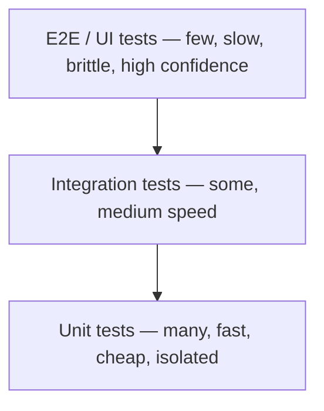
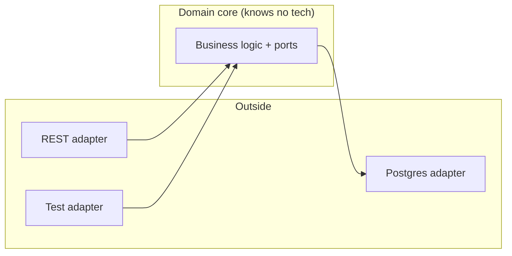
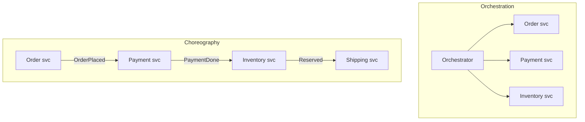

This is the article I wish someone had handed me when I needed to *refresh* software engineering
in a weekend. Not a textbook, not a 600-page tome, but a guided climb that starts with what
engineering even means when the material is invisible, and ends with you reasoning about sagas,
bounded contexts, and circuit breakers the way a senior engineer does on a whiteboard.

The order is deliberately bottom-up: we start with the difference between *coding* and
*engineering*, walk the lifecycle and the methodologies that organize the work, get the design
principles and disciplines straight (KISS, SOLID, TDD, BDD, DDD, and the new spec-driven kid on
the block), then climb into testing, architecture, the sync-versus-async divide, the distributed
patterns that keep systems alive, and the delivery machinery that ships it all.

I lean on one recurring trick: **suppose** something concrete, then trace it through the system,
plus the occasional terrible analogy, because abstractions stick better when they are a little
ridiculous. Software engineering makes far more sense when you stop memorizing acronyms and start
asking what problem each one was invented to kill.

> A note on altitude: this piece slides up and down constantly. One section is about naming a
> variable, the next is about consistency across a fleet of services. That is the point. Software
> engineering *is* the art of managing complexity across every altitude at once, and you only
> understand it by moving through all of them.

## Table of Contents

- [Coding vs. engineering](#coding-vs-engineering)
- [The software development life cycle](#the-software-development-life-cycle)
- [Methodologies: Waterfall to Agile](#methodologies-waterfall-to-agile)
- [Extreme Programming (XP)](#extreme-programming-xp)
- [Design principles: KISS, DRY, YAGNI, SOLID](#design-principles-kiss-dry-yagni-solid)
- [The development disciplines: TDD, BDD, DDD, SDD](#the-development-disciplines-tdd-bdd-ddd-sdd)
- [Testing: the pyramid and the zoo](#testing-the-pyramid-and-the-zoo)
- [Architecture styles](#architecture-styles)
- [Synchronous vs. asynchronous](#synchronous-vs-asynchronous)
- [Distributed systems patterns (including SAGA)](#distributed-systems-patterns-including-saga)
- [Design patterns (Gang of Four)](#design-patterns-gang-of-four)
- [Code quality: smells, debt, refactoring, reviews](#code-quality-smells-debt-refactoring-reviews)
- [Delivery: CI/CD, 12-factor, DevOps, DORA](#delivery-cicd-12-factor-devops-dora)
- [Decisions and documentation](#decisions-and-documentation)
- [The laws every engineer should know](#the-laws-every-engineer-should-know)
- [Closing thought](#closing-thought)

## Coding vs. engineering

Before any methodology, settle the most important distinction: **coding is making a computer do a
thing; engineering is making it keep doing that thing, correctly, while a team changes it for
years, under deadline, without anyone fully holding it in their head.** Coding is a skill.
Engineering is coding plus *time*, *people*, and *uncertainty*.

| Concern | Coding | Engineering |
|---------|--------|-------------|
| Goal | Make it work | Make it work, last, and change cheaply |
| Time horizon | Now | Years |
| Team size | One head | Many heads, rotating |
| Success metric | "It runs" | "It still runs after the 400th change" |
| Main enemy | Bugs | Complexity and entropy |
| Output | A program | A system other people can safely evolve |

> The analogy: coding is cooking a great meal once. Engineering is running a restaurant kitchen —
> the recipe matters, but so do food safety, training new cooks, surviving the Friday rush, and
> the fact that the head chef quit and nobody wrote anything down. A genius who cannot hand off
> the recipe is a liability, not an asset.

The entire field is, at bottom, **complexity management**. Every principle, pattern, and process
in this article exists to fight one enemy: the moment a system grows past what a single person
can understand, and changes start breaking things in places no one expected.

## The software development life cycle

The **SDLC** is the skeleton under every methodology: the phases work passes through, whether you
do them once in a giant sequence (Waterfall) or a hundred times in tiny loops (Agile).

| Phase | What happens | Failure mode if skipped |
|-------|--------------|-------------------------|
| Requirements | Figure out what to build and why | You build the wrong thing, beautifully |
| Design | Decide how to structure it | You build the right thing as a tangled mess |
| Implementation | Write the code | (this is the part everyone thinks is the whole job) |
| Testing | Verify it does what was asked | You ship bugs to users instead of catching them |
| Deployment | Release it to production | Great code that never reaches anyone |
| Maintenance | Fix, adapt, and evolve | The system rots until it is replaced |

The single most important fact about this diagram is the **cost-of-change curve**: a bug caught
in requirements costs roughly a coffee; the same bug caught in production costs a fire drill, a
post-mortem, and possibly a customer. Defects get exponentially more expensive the later you find
them, which is the economic justification for testing early, designing deliberately, and shipping
in small batches.

> **Suppose** a stakeholder says "make the report exportable." Skip requirements and you will
> guess: PDF? CSV? Which columns? Scheduled or on-demand? You will build something plausible, demo
> it, and watch their face fall. The cheapest line of code is the one you did not write because
> you asked a question first.

## Methodologies: Waterfall to Agile

A methodology is how you *sequence and re-sequence* the SDLC phases and who decides what, when.
The history is a pendulum swinging from "plan everything up front" to "plan as little as you can
get away with."

| Methodology | Core idea | Best for | Weakness |
|-------------|-----------|----------|----------|
| Waterfall | Do each phase fully, in order, once | Fixed, well-understood scope (bridges, regulated systems) | Reality changes; you learn too late |
| Agile (umbrella) | Short iterations, working software, embrace change | Most product software | Can decay into chaos without discipline |
| Scrum | Time-boxed sprints, fixed roles and ceremonies | Teams that need rhythm and predictability | Ceremony overhead, "Scrum theater" |
| Kanban | Continuous flow, limit work-in-progress (WIP) | Support, ops, steady streams of work | Less long-range planning structure |
| Lean | Maximize value, eliminate waste | Startups, efficiency-focused orgs | Vague without concrete practices |

**Agile** is not a process; it is a [2001 manifesto](https://agilemanifesto.org/) of four
preferences — individuals over process, working software over documentation, collaboration over
contracts, responding to change over following a plan. **Scrum** and **Kanban** are concrete
implementations of that spirit.

Scrum's vocabulary you will hear daily: a **sprint** (a 1–4 week iteration), the **backlog**
(prioritized to-do list), **user stories** ("As a *user*, I want *X* so that *Y*"), **story
points** (relative effort, not hours), and ceremonies — planning, daily **standup**, review, and
**retrospective**. Kanban swaps fixed sprints for a **board** with **WIP limits** that physically
stop a team from starting ten things and finishing none.

> The analogy: Waterfall is building a house from a blueprint — you do not pour the foundation,
> realize you want a basement, and start over. Agile is sculpting clay — you keep shaping, step
> back, and adjust, because you are not sure what the statue wants to be until you are halfway in.
> Most software is clay pretending to be concrete. The trap is "Agile theater": doing all the
> standups and none of the actual responding-to-change, which is cargo-culting the rituals while
> missing the point.

## Extreme Programming (XP)

XP, created by Kent Beck in the late 1990s, is the most *engineering-flavored* of the Agile
methods. Where Scrum mostly organizes the work, XP prescribes how to actually write the code. Many
practices the whole industry now takes for granted — TDD, continuous integration, relentless
refactoring — were popularized by XP.

It rests on five values: **communication, simplicity, feedback, courage, and respect.** From
those flow the practices:

| Practice | What it is | Why it works |
|----------|------------|--------------|
| Pair programming | Two devs, one keyboard, one driving and one navigating | Real-time review; fewer defects; knowledge spreads |
| Test-driven development | Write the failing test first, then the code | Design pressure + a safety net, for free |
| Continuous integration | Merge to mainline many times a day | Integration pain stays small instead of exploding at the end |
| Small releases | Ship tiny increments frequently | Fast feedback from real users |
| Refactoring | Continuously improve structure without changing behavior | Fights entropy before it compounds |
| Collective ownership | Anyone can change any code | No bus-factor-of-one bottlenecks |
| Sustainable pace | No death marches ("40-hour week") | Tired engineers write tomorrow's bugs |

> The name is the joke and the philosophy: take the practices everyone agrees are *good* and turn
> them up to **extreme**. Testing is good? Test before you even write the code. Code review is
> good? Review every line as it is typed, by pairing. Integration is good? Integrate ten times a
> day. XP's bet is that if a practice is beneficial in moderation, doing it constantly compounds
> the benefit.

## Design principles: KISS, DRY, YAGNI, SOLID

Principles are the rules of thumb you apply *inside* the code, the proverbs you mutter in a code
review. They are not laws; they are tensions to balance.

| Principle | Stands for | The one-liner |
|-----------|-----------|---------------|
| KISS | Keep It Simple, Stupid | Prefer the boring solution; complexity is a cost, not a flex |
| DRY | Don't Repeat Yourself | Every piece of knowledge has one authoritative home |
| YAGNI | You Ain't Gonna Need It | Don't build for an imagined future; build for now |
| SoC | Separation of Concerns | Each module does one job and minds its own business |
| Law of Demeter | "Don't talk to strangers" | An object should only talk to its immediate friends |
| Composition over inheritance | — | Assemble behavior from parts; don't build deep class trees |

**SOLID** is the famous five for object-oriented design:

| Letter | Principle | Plain English |
|--------|-----------|---------------|
| S | Single Responsibility | A class should have one reason to change |
| O | Open/Closed | Open to extension, closed to modification |
| L | Liskov Substitution | A subtype must be usable wherever its parent is, no surprises |
| I | Interface Segregation | Many small interfaces beat one fat one |
| D | Dependency Inversion | Depend on abstractions, not concrete details |

```text
# DRY gone wrong vs. right
# WRONG: the tax rate lives in three files; a law change means a three-file bug hunt
price * 1.07   (checkout.js)
price * 1.07   (invoice.py)
price * 1.07   (report.go)

# RIGHT: one source of truth
TAX_RATE = 0.07   # change it here, it's fixed everywhere
```

> The crucial nuance, and the most common rookie mistake: these principles **fight each other**,
> and the skill is balancing them, not maximizing one. DRY taken to the extreme creates a tangled
> mess of premature abstractions where two things that merely *looked* alike are now fused forever
> (the "wrong abstraction" is more expensive than duplication). YAGNI says don't build the
> plugin system you imagine you'll need; SOLID's Open/Closed says make it extensible. The Go
> proverb captures the resolution perfectly: *"a little copying is better than a little
> dependency."* When in doubt, KISS wins — you can always add complexity later, but you can rarely
> remove it.

## The development disciplines: TDD, BDD, DDD, SDD

These four are *disciplines*: opinionated ways to drive the act of building from something other
than "just start typing." They answer different questions, and they stack.

### TDD — Test-Driven Development

TDD inverts the obvious order: you write a **failing test first**, then the minimum code to pass
it, then clean up. The rhythm is **red, green, refactor**.

```text
1. RED    — write a test for behavior that doesn't exist yet; run it; watch it fail
2. GREEN  — write the simplest code that makes the test pass (even if it's ugly)
3. REFACTOR — improve the design now that a test has your back; keep it green
   ↺ repeat in tiny loops
```

```python
# RED: this fails because add() doesn't exist
def test_add():
    assert add(2, 3) == 5

# GREEN: simplest thing that passes
def add(a, b):
    return a + b

# REFACTOR: nothing to clean here yet — but now you can, safely
```

TDD's real payoff is not the tests (though you get a regression suite for free). It is **design
pressure**: code that is hard to test is usually badly coupled, so writing the test first forces
you to design seams and dependencies you can actually isolate.

> The analogy: TDD is like building a staircase by first nailing the next step you want to stand
> on, then standing on it. You never reach into the dark — every step is verified before you put
> weight on it. The discipline feels slow for ten minutes and saves you for ten months.

### BDD — Behavior-Driven Development

BDD is TDD with the focus shifted from "does this function return 5" to "does the *system behave*
the way the business expects," written in language a non-programmer can read. The canonical format
is **Given / When / Then**.

```gherkin
Feature: Withdraw cash
  Scenario: Account has enough money
    Given my balance is $100
    When I withdraw $40
    Then my balance should be $60
    And I should receive $40
```

BDD's gift is a **shared language** between developers, QA, and product. The Gherkin scenarios are
executable *and* readable by the person who asked for the feature, which closes the "that's not
what I meant" gap.

### DDD — Domain-Driven Design

DDD, from Eric Evans, says the structure of your code should mirror the structure of the
**business domain**, expressed in a **ubiquitous language** that everyone — engineers and domain
experts — uses identically in conversation, documentation, and code. No translation layer between
"what the business calls it" and "what the variable is named."

| DDD concept | What it means |
|-------------|---------------|
| Ubiquitous language | One shared vocabulary; `Policy` in code means exactly what underwriters mean |
| Bounded context | A boundary where a model is consistent; `Customer` means different things in Billing vs. Support |
| Entity | An object with identity that persists over time (a `User`) |
| Value object | Defined only by its values, no identity (a `Money` or `Address`) |
| Aggregate | A cluster of objects treated as one consistency unit, edited only via its **root** |
| Repository | The abstraction that loads and saves aggregates |
| Domain event | Something meaningful that happened (`OrderPlaced`) |

> The killer insight is **bounded context**. The same word means different things to different
> parts of a business, and pretending otherwise is how you get a `Customer` class with 80 fields
> that no team fully owns. In Sales, a "customer" is a lead with a deal size. In Shipping, a
> "customer" is an address and a doorbell. DDD says: stop forcing them into one model. Draw the
> boundary, let each side have its own `Customer`, and translate at the border. It is the
> organizational version of good fences making good neighbors.

### SDD — Spec-Driven Development

The newest entry, supercharged by AI coding agents. SDD **inverts the source of truth**: instead
of code being primary and docs being an afterthought, the **specification is the artifact you
maintain**, and the code is generated or verified against it. It is the structured antidote to
"vibe coding" — throwing vague prompts at an LLM and praying.

```text
Traditional:  idea → code (the spec lives only in your head, then rots)
Spec-driven:  idea → SPEC → plan → tasks → code (the spec stays the source of truth)
```

Tools like **GitHub Spec Kit**, AWS **Kiro**, and **Tessl** formalize this: you write a precise
spec (requirements, constraints, acceptance criteria), the agent produces a plan and a task
breakdown, and *then* it writes code that satisfies the spec. Your job shifts from typing every
line to **steering** and reviewing.

> The analogy: vibe coding is telling a contractor "build me a nice house" and leaving for the
> weekend. SDD is handing them blueprints, a materials list, and inspection checkpoints. AI is an
> extraordinarily fast junior who is also a confident guesser — the spec is how you stop it from
> confidently guessing wrong at 200 lines per second. Note that "spec as source of truth" is an
> old idea (Specification by Example, contract-first APIs); the AI era just made it urgent again.

## Testing: the pyramid and the zoo

Testing is how you buy confidence to change code without fear. The guiding shape is the **testing
pyramid**: lots of fast, cheap tests at the bottom, few slow, expensive ones at the top.



A common rule of thumb is roughly **70% unit, 20% integration, 10% end-to-end**, though the exact
mix depends on the system. Invert the pyramid into an **ice-cream cone** (mostly slow E2E tests)
and your suite becomes flaky, slow, and so painful that people stop running it — which is worse
than no suite, because it lies about being safe.

### The zoo of test types

| Test type | Question it answers | Scope |
|-----------|---------------------|-------|
| Unit | Does this one function/class behave? | Tiny, isolated |
| Integration | Do these modules work together (DB, API)? | A few components |
| End-to-end (E2E) | Does the whole flow work like a real user? | The entire system |
| Smoke | Is the build even alive? (sanity check) | Critical paths only |
| Regression | Did we re-break something we already fixed? | Wherever the old bug was |
| Acceptance | Does it meet the agreed business criteria? | Feature-level |
| Contract | Do two services still agree on the interface? | Service boundary |
| Property-based | Does it hold for *thousands* of generated inputs? | A function's invariants |
| Mutation | Are the tests themselves any good? | The test suite |
| Performance / load | Is it fast enough under N users? | System under stress |
| Fuzz | Does weird/random input crash it? | Input handling |
| Snapshot | Did the output change unexpectedly? | Rendered output |

Two deserve a spotlight. **Property-based testing** (QuickCheck, Hypothesis) doesn't check one
example; it generates hundreds of random inputs and asserts a *property* always holds — like
"reversing a list twice gives the original" — then shrinks any failure to the smallest case.
**Mutation testing** (Stryker, mutmut) tests your *tests*: it deliberately introduces bugs
("mutants") into your code and checks whether your suite catches them. If a mutant survives, your
test gave you false confidence.

### Test doubles: the stunt actors

When a unit test needs a dependency it cannot use for real (a payment gateway, a database), you
swap in a **test double** — Gerard Meszaros's term, popularized by Martin Fowler.

| Double | What it does | Analogy |
|--------|--------------|---------|
| Dummy | Passed but never used; fills a parameter slot | An extra in the background of a scene |
| Stub | Returns canned answers to calls | A cardboard cutout that always says one line |
| Spy | A stub that also records how it was called | A cutout wearing a hidden camera |
| Fake | A real, working, but shortcut implementation (in-memory DB) | A stunt car that drives but isn't street-legal |
| Mock | Pre-programmed with expectations; verifies behavior | A method actor who fails the scene if you flub your cue |

> The distinction that confuses everyone: **stub vs. mock**. A **stub** answers a question and you
> assert on the resulting *state* ("after this, the balance is 60"). A **mock** verifies an
> *interaction* ("the `chargeCard` method was called exactly once with $40"). Stubs test what came
> out; mocks test what happened. Over-mock and your tests become a brittle mirror of the
> implementation — they break every time you refactor, even when behavior is unchanged.

## Architecture styles

Architecture is the set of decisions that are expensive to reverse: the big boxes, how they talk,
and where the boundaries are. There is no "best" — only trade-offs against your team size, scale,
and how fast requirements change.

| Style | Idea | Strength | Weakness |
|-------|------|----------|----------|
| Monolith | One deployable unit | Simple to build, test, deploy, reason about | Scales as one lump; one bug can sink all of it |
| Modular monolith | One deploy, strong internal module boundaries | Monolith simplicity + clean seams | Requires discipline to keep modules honest |
| Microservices | Many small, independently deployable services | Independent scaling and teams | Distributed-systems pain: network, consistency, ops |
| Layered (n-tier) | Presentation → business → data layers | Familiar, organized | Layers can leak; "fat" middle |
| Hexagonal (ports & adapters) | Core logic isolated behind ports | Swappable tech, highly testable | More upfront indirection |
| Clean architecture | Dependencies point inward to the domain | Framework-independent core | Ceremony for small apps |
| Event-driven | Components react to events asynchronously | Loose coupling, high throughput | Hard to trace; eventual consistency |
| CQRS | Separate read and write models | Optimize reads and writes independently | Two models to keep in sync |
| Event sourcing | Store the events, not the current state | Full audit trail; rebuild any past state | Querying and schema evolution get tricky |

**Hexagonal architecture** (ports and adapters) is worth internalizing: your business logic sits
in the center and knows *nothing* about the database, the web framework, or the message bus. It
exposes **ports** (interfaces), and the outside world plugs in **adapters** (a Postgres adapter, a
REST adapter, a test adapter). Swapping Postgres for DynamoDB, or the real DB for an in-memory
fake in tests, touches zero business code.



> The eternal debate: **monolith vs. microservices.** The honest answer for almost everyone is
> *start with a (modular) monolith.* Microservices solve **organizational** scaling — letting 50
> teams deploy without coordinating — at the cost of turning every method call into a network call
> that can fail, time out, or arrive twice. As the saying goes, microservices let you turn a
> function call into a *distributed* function call, complete with latency, partial failure, and a
> 3 a.m. page. Don't pay that tax until the org actually needs it. A "distributed monolith" —
> microservices that must all deploy together — is the worst of both worlds.

## Synchronous vs. asynchronous

This one axis quietly shapes everything above it. **Synchronous**: the caller sends a request and
*waits*, blocked, for the response. **Asynchronous**: the caller fires a message and moves on; the
result arrives later, if at all.

| | Synchronous | Asynchronous |
|---|-------------|--------------|
| Mental model | A phone call | An email / a voicemail |
| Caller waits? | Yes, blocked | No, continues |
| Coupling | Tighter (both must be up *now*) | Looser (receiver can be down) |
| Latency feel | Immediate | Deferred |
| Failure blast radius | Cascades (one slow service stalls the chain) | Contained (queue absorbs the spike) |
| Examples | REST/gRPC call, DB query | Message queue, pub/sub, webhooks, background jobs |
| Best for | "I need the answer to continue" | "Do this eventually; I don't need to watch" |

Async usually runs over a **broker**. Two flavors:

- **Message queue** (point-to-point): a producer drops a job on a queue, *one* consumer picks it
  up. Great for work distribution — sending emails, processing uploads. (RabbitMQ, SQS.)
- **Publish/subscribe** (fan-out): a publisher emits an event, *every* interested subscriber gets
  a copy, and the publisher doesn't know or care who is listening. Great for decoupling — when an
  order is placed, billing, shipping, and analytics all react independently. (Kafka, SNS, NATS.)

> The analogy: synchronous is a phone call — both people must be present and attentive, and if the
> other person puts you on hold, *you* are stuck holding too. Asynchronous is texting — you send
> it, get on with your life, and they reply when they can. Synchronous is simpler to reason about
> (you get an answer or an error right now), but it is also how one slow service takes down five
> healthy ones in a cascade. Async buys resilience and scale, and pays for it with **eventual
> consistency** and the headache of debugging a flow you can't watch end-to-end.

## Distributed systems patterns (including SAGA)

The moment your data lives in more than one service or database, the comforting guarantees of a
single ACID transaction evaporate. These patterns are how you claw back correctness and
resilience in a world of networks that lose, delay, and duplicate messages.

First, the law that governs the whole game — **CAP theorem**: in the presence of a network
**P**artition, you must choose between **C**onsistency and **A**vailability. You cannot have all
three. Most internet-scale systems pick availability and embrace **eventual consistency**: the
data will agree *soon*, just not this instant.

### SAGA — distributed transactions without distributed locks

You cannot wrap "charge the card, reserve inventory, book shipping" in one database transaction
when each lives in a different service. The **SAGA pattern** replaces one big transaction with a
**sequence of local transactions**, each publishing an event that triggers the next. If a step
fails, the saga runs **compensating transactions** to undo the prior steps — the business-logic
equivalent of a rollback.

There are two ways to coordinate a saga:



| | Orchestration | Choreography |
|---|---------------|--------------|
| Control | A central coordinator issues commands | Services react to each other's events |
| Visibility | Easy — the flow lives in one place | Hard — the flow is spread across services |
| Coupling | Coupled to the orchestrator | Loosely coupled, fully event-driven |
| Best for | Complex workflows needing control | Simple, linear flows |
| Risk | Orchestrator becomes a god object | "Where did this flow break?" archaeology |

> The analogy: **orchestration** is a conductor in front of an orchestra — one baton, everyone
> follows it, and if the music stops you know exactly who to look at. **Choreography** is a flash
> mob — each dancer knows their cue from the dancer next to them, gorgeous when it works, but when
> someone trips there is no conductor to ask what went wrong, just confused dancers and a phone
> full of "who started this?" Compensating transactions are the part people forget: there is no
> `ROLLBACK`, so *you* must write the "refund the card we already charged" logic by hand.

### The resilience toolkit

| Pattern | Problem it solves | One-liner |
|---------|-------------------|-----------|
| Retry + backoff + jitter | Transient failures (a blip) | Try again, but wait longer each time, with randomness |
| Circuit breaker | A dependency is *down*, not blipping | Stop calling a failing service; fail fast; check back later |
| Bulkhead | One overloaded part drowns the rest | Isolate resources so a flood stays in one compartment |
| Timeout | A call hangs forever | Give up after N seconds; never wait indefinitely |
| Idempotency | Retries cause duplicates | Make "do it twice" equal "do it once" (idempotency keys) |
| Outbox | "Save to DB *and* publish event" can half-fail | Write the event to the DB in the same transaction, publish later |
| Strangler fig | Replacing a legacy system safely | Wrap the old system; reroute features one by one until it's gone |

> Two of these are non-negotiable and constantly skipped. **Idempotency**: if a payment request
> times out and the client retries, did you charge the customer twice? An idempotency key — a
> unique ID the server remembers — turns a retried request into a no-op. **Circuit breaker**: the
> name is literal. Like the breaker in your house that trips before the wiring melts, it detects a
> service failing and *stops calling it*, so you fail fast instead of piling up thousands of
> requests waiting on a corpse. The **bulkhead** is named after a ship's watertight compartments —
> one flooded section doesn't sink the whole vessel; one overloaded thread pool doesn't take down
> every endpoint.

## Design patterns (Gang of Four)

The 1994 "Gang of Four" book catalogued 23 reusable solutions to recurring object-oriented design
problems. They are a **shared vocabulary** as much as code: saying "use a Strategy here" conveys a
whole design in two words. They come in three families.

### Creational — how objects get made

| Pattern | What it does |
|---------|--------------|
| Singleton | Guarantees one instance (use sparingly — it's global state in a hat) |
| Factory Method | Subclasses decide which concrete class to instantiate |
| Abstract Factory | Creates families of related objects |
| Builder | Constructs a complex object step by step |
| Prototype | Creates new objects by cloning an existing one |

### Structural — how objects are composed

| Pattern | What it does |
|---------|--------------|
| Adapter | Makes two incompatible interfaces work together |
| Decorator | Adds behavior to an object dynamically, without subclassing |
| Facade | A simple front door over a complex subsystem |
| Proxy | A stand-in that controls access to another object |
| Composite | Treats individual objects and groups uniformly (trees) |
| Bridge | Splits abstraction from implementation so both vary freely |
| Flyweight | Shares common state to save memory |

### Behavioral — how objects collaborate

| Pattern | What it does |
|---------|--------------|
| Strategy | Swap an algorithm at runtime behind a common interface |
| Observer | Subscribers get notified when a subject changes (pub/sub's ancestor) |
| Command | Wrap a request as an object (undo, queues, logs) |
| Iterator | Walk a collection without exposing its internals |
| State | Change behavior when internal state changes |
| Template Method | Define a skeleton, let subclasses fill steps |
| Chain of Responsibility | Pass a request along a chain until someone handles it (middleware!) |

```text
# Strategy in one breath: same interface, swappable behavior
sorter.set_strategy(QuickSort())   # or MergeSort(), or BubbleSort()
sorter.sort(data)                  # caller doesn't know or care which
```

> Two cautions worth more than the patterns themselves. First, **Adapter** and **Decorator** are
> everywhere you already work — a payment "adapter" wrapping Stripe's SDK, HTTP "middleware" that
> is literally Chain of Responsibility, an Observer hiding inside every event listener. You've been
> using these without the names. Second, **patternitis** is real: a junior who just read the book
> will wrap a one-line function in an AbstractStrategyFactoryProvider. Patterns are answers to
> *problems you actually have* — reach for them when the problem appears, not to decorate code that
> was fine.

## Code quality: smells, debt, refactoring, reviews

Architecture is the big bones; this is the daily hygiene that decides whether the codebase is a
joy or a haunted house in two years.

| Concept | What it is |
|---------|------------|
| Code smell | A surface symptom of a deeper problem (long method, huge class, duplicated code) |
| Technical debt | Shortcuts taken for speed that you "pay interest" on later |
| Refactoring | Changing structure *without* changing behavior, in safe small steps |
| Code review | A second pair of eyes before merge — catches bugs and spreads knowledge |
| Pair / mob programming | Review in real time, as the code is written |
| Boy Scout Rule | Leave the code a little cleaner than you found it |

**Technical debt** is the most useful metaphor in the field, coined by Ward Cunningham. Like
financial debt, a little can be *strategic* — borrow speed now to hit a deadline, pay it back
soon. The danger is *unmanaged* debt: you only ever pay the interest (every change gets slower)
and never the principal, until the codebase is so brittle that a one-line feature takes a week and
everyone is afraid to touch it.

> The analogy: a code smell is that faint funk in the fridge. It doesn't *prove* something has
> gone bad, but it's worth investigating before you trust the leftovers. Technical debt is the
> credit card: occasionally the smart move (buy the flight now, pay next month), ruinous if you
> only ever make minimum payments. And refactoring is cleaning the kitchen *as you cook* instead of
> facing a mountain of dishes at midnight — which is exactly why the Boy Scout Rule beats the
> heroic month-long "refactoring project" that management never approves.

## Delivery: CI/CD, 12-factor, DevOps, DORA

Code that isn't shipped is a museum piece. **DevOps** tore down the wall between the people who
*write* software and the people who *run* it, on the theory that "you build it, you run it"
produces better software than throwing a release over a fence.

| Term | Meaning |
|------|---------|
| Continuous Integration (CI) | Merge to mainline often; run automated tests on every commit |
| Continuous Delivery (CD) | Every passing build is *deployable* at the push of a button |
| Continuous Deployment | Every passing build *auto-deploys* to production |
| Infrastructure as Code (IaC) | Servers/networks defined in version-controlled files (Terraform) |
| Observability | Logs, metrics, traces — knowing *why* prod is sad, not just *that* it is |
| Trunk-based development | Everyone commits to one short-lived mainline; tiny branches |
| Feature flag | Ship code dark, toggle it on later, decouple deploy from release |

The **12-Factor App** is the canonical checklist for cloud-native services — config in the
environment (not in code), stateless processes, treat logs as event streams, dev/prod parity, and
so on. Follow it and your app is portable, scalable, and disposable by design.

How do you know if your delivery is any good? **DORA metrics**, the research-backed four:

| DORA metric | Measures | Elite looks like |
|-------------|----------|------------------|
| Deployment frequency | How often you ship | On-demand, many times a day |
| Lead time for changes | Commit → production | Less than a day (often hours) |
| Change failure rate | % of deploys causing a problem | 0–15% |
| Time to restore service | How fast you recover from incidents | Less than an hour |

> The counterintuitive finding from years of DORA research: **speed and stability are not a
> trade-off — they rise together.** Teams that deploy more often also fail *less* and recover
> *faster*. The reason is batch size. Shipping a tiny change daily means if it breaks, the culprit
> is obvious and the rollback is trivial. Shipping a giant quarterly release means a failure is a
> needle in a haystack of 400 changes. The analogy: it is safer to walk down ten small steps than
> to jump off the top of the staircase once.

## Decisions and documentation

The code says *what* the system does. It rarely says *why* — why this database, why this
trade-off, why that weird workaround that looks like a bug but is load-bearing. That "why"
evaporates the moment the engineer who knew it leaves.

| Artifact | Purpose |
|----------|---------|
| ADR (Architecture Decision Record) | A short, dated note capturing one decision, its context, and its consequences |
| README | How to run, build, and contribute — the front door |
| Runbook | Step-by-step for operating and fixing the system at 3 a.m. |
| API docs / OpenAPI | The contract consumers depend on |
| Diagrams (C4, sequence) | The picture worth a thousand lines of code |

> The cheapest, highest-leverage habit most teams skip: the **ADR**. When you make a real decision
> ("we chose Postgres over Mongo because of X, accepting trade-off Y"), write fifteen lines and
> commit them next to the code. A year later, when someone asks "why on earth is it built this
> way," the answer exists instead of being a shrug and a guess. Documentation isn't about writing
> a novel; it's about leaving a trail of breadcrumbs for the very tired person who maintains this
> next — and that person is often *you*, six months from now, having forgotten everything.

## The laws every engineer should know

The field has accumulated a set of wry "laws" that are funny because they are painfully true.
Knowing them is a shortcut to wisdom you'd otherwise earn the hard way.

| Law | What it says | Why it bites |
|-----|--------------|--------------|
| **Conway's Law** | Systems mirror the communication structure of the org that built them | Four teams will build a four-part compiler whether or not that's the right design |
| **Brooks's Law** | Adding people to a late project makes it later | Onboarding and communication overhead swamp the extra hands |
| **Hofstadter's Law** | It always takes longer than you expect, even accounting for Hofstadter's Law | Estimation is recursively optimistic |
| **Murphy's Law** | Anything that can go wrong, will | So design for failure, not for the happy path |
| **Postel's Law** | Be conservative in what you send, liberal in what you accept | Robust interfaces tolerate sloppy inputs |
| **Goodhart's Law** | When a measure becomes a target, it stops being a good measure | Reward "lines of code" and you'll get bloated code |
| **The Pareto Principle** | 80% of effects come from 20% of causes | 20% of the code holds 80% of the bugs (and value) |

> **Conway's Law** is the one that quietly runs your career. If you want a modular system, you need
> modular *teams* — architecture and org chart are the same shape whether you like it or not. The
> savvy move, the "Inverse Conway Maneuver," is to **design the team structure you want the
> software to have**, then let the software follow. You cannot draw a clean microservices diagram
> on top of one giant team that talks about everything in one channel; the boxes will leak because
> the conversations do.

## Closing thought

Software engineering is the discipline of building things that are too big and too long-lived for
any one person to hold in their head. Every acronym in this article — TDD, DDD, SOLID, CQRS, SAGA
— is a tool for the same job: keeping complexity from winning as a system grows, ages, and passes
through many hands.

If you take one thing from this refresher, make it the meta-skill underneath all the others:
**there are no best practices, only trade-offs in a context.** Microservices are brilliant and
ruinous. DRY is wisdom and a trap. The senior engineer is not the one who memorized the most
patterns; it is the one who knows which one *this* problem is asking for, and — more often than
juniors expect — has the courage to choose the boring, simple option and move on. Clear is better
than clever, here as everywhere. The rest is practice.
