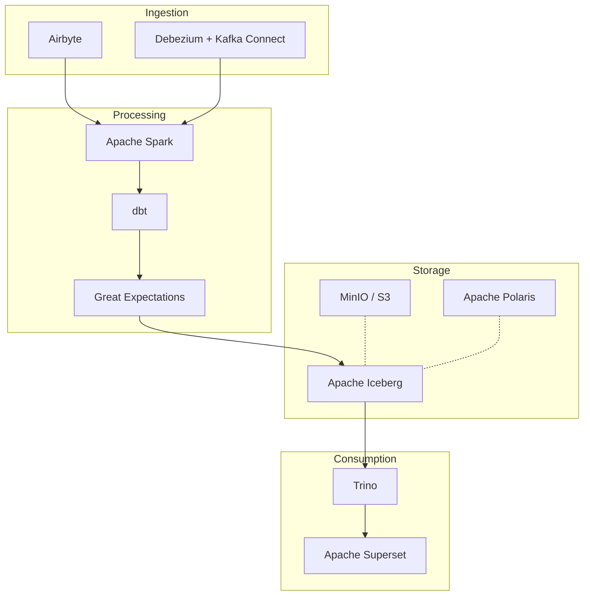
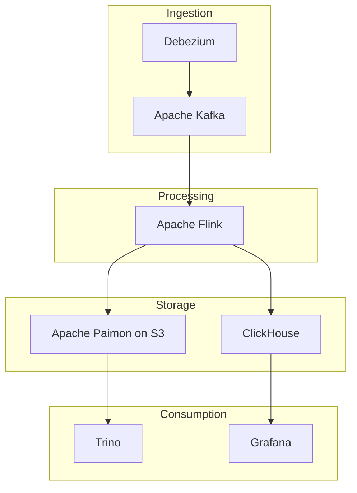
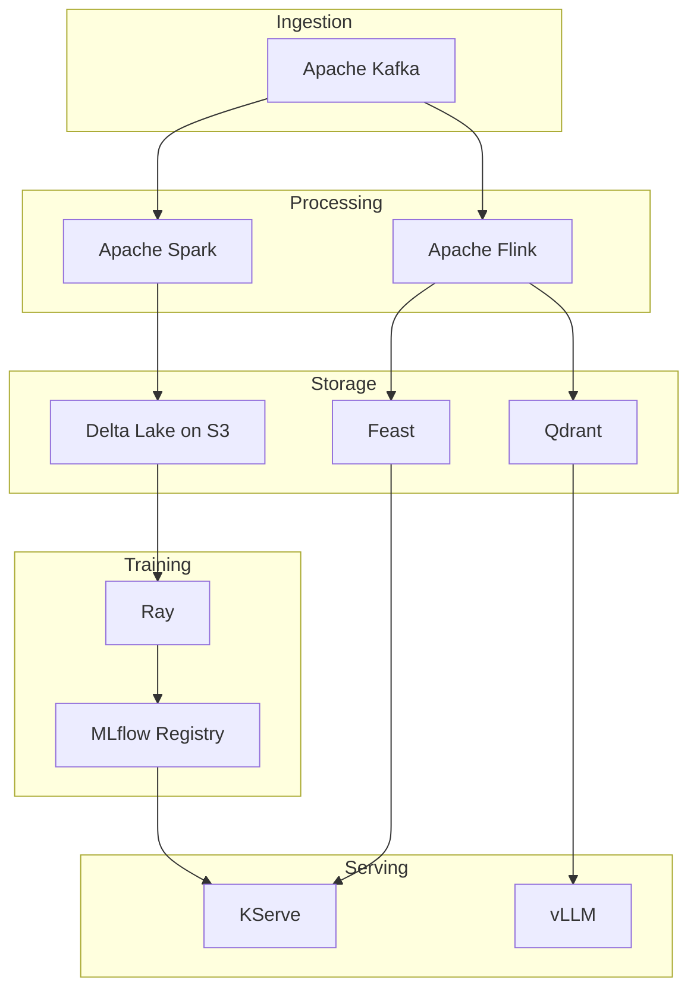

| Category | Tools / Technologies | Primary Use |
|---|---|---|
| **Machine Learning** | MLflow, Kubeflow, Feast, Ray, TensorFlow, PyTorch, Scikit-learn, XGBoost, LightGBM | Training, tracking, serving, feature store and MLOps |
| **Data Science / Analytics** | Python, Jupyter, Pandas, Polars, NumPy, SciPy, R, Apache Arrow | Data exploration, statistical analysis and data preparation |
| **BI / Analytics** | Apache Superset, Metabase, Grafana, Power BI, Tableau | Dashboards, data exploration and visualization |
| **Data Engineering** | Apache Spark, Apache Flink, Apache Beam, Apache Kafka, dbt | Data processing, pipelines and transformations |
| **Data Ingestion / CDC** | Apache Kafka, Debezium, Kafka Connect, Apache NiFi, Airbyte, Fivetran | Data ingestion, CDC and data integration |
| **Workflow Orchestration** | Apache Airflow, Dagster, Prefect, Argo Workflows | Pipeline and workflow orchestration |
| **Data Transformation** | dbt, Apache Spark, SQLMesh, Dataform | Data transformation, modeling and ELT |
| **Data Quality** | Great Expectations, Soda, dbt Tests, Deequ | Data validation and quality checks |
| **Data Catalog / Governance** | OpenMetadata, DataHub, Apache Atlas, Amundsen, OpenLineage | Data catalog, lineage and governance |
| **Data Lake Storage** | Amazon S3, MinIO, Google Cloud Storage, Azure Data Lake Storage | Object storage and data lake |
| **File Formats** | Apache Parquet, Apache ORC, Apache Avro, Apache Arrow | Data storage and interchange formats |
| **Open Table Formats** | Apache Iceberg, Apache Hudi, Delta Lake, Apache Paimon | ACID tables, schema evolution, snapshots and time travel |
| **Lakehouse Catalog** | Apache Polaris, Project Nessie, AWS Glue Catalog, Hive Metastore | Table catalog and metadata management |
| **Query Engines** | Trino, Presto, DuckDB, ClickHouse, Apache Doris, StarRocks | SQL analytics and OLAP |
| **Lakehouse Platforms** | Databricks, Dremio, Starburst, Snowflake | Data lakehouse and analytics platforms |
| **Feature Store** | Feast, Hopsworks, Tecton | ML feature management and serving |
| **ML Pipelines** | Kubeflow Pipelines, MLflow, Airflow, Metaflow, Flyte | Machine learning pipelines |
| **Model Serving** | KServe, Seldon, NVIDIA Triton, Ray Serve, BentoML, vLLM | Model inference and serving |
| **Experiment Tracking** | MLflow, Weights & Biases, Neptune, Comet | Experiment tracking and metrics |
| **Model Registry** | MLflow, Kubeflow, Vertex AI, SageMaker, Azure ML | Model versioning and lifecycle management |
| **Vector Databases** | Qdrant, Milvus, Weaviate, pgvector, Pinecone | Embeddings, semantic search and RAG |
| **Streaming / Event Processing** | Apache Kafka, Apache Flink, Redpanda, Apache Pulsar | Real-time data processing |
| **Data Warehouse** | Snowflake, BigQuery, Redshift, ClickHouse, DuckDB | Structured analytics and OLAP |
| **Data Observability** | OpenTelemetry, Grafana, Prometheus, OpenLineage, Marquez | Data and pipeline observability |

## Reference architectures

Three ways to wire the tools above into a working stack. All of them have the
same three layers, ingestion, processing and storage, plus whatever consumes
the result.

### 1. Batch lakehouse

Nightly and hourly ELT. The default when latency is measured in hours.

Apache Airflow sits outside the picture, triggering every arrow above.

### 2. Streaming

Seconds instead of hours. Two branches out of one job: the table for history,
the OLAP store for the dashboard.

Airflow is still needed here, not to schedule the job but to run the compaction
and snapshot expiration the table needs because the job never stops writing.

### 3. ML and inference

Features written by the same pipeline that feeds training, and a model served
out of a registry.

## Official repositories

- [Airbyte](https://github.com/airbytehq/airbyte): Connector-based ELT for loading data into a warehouse or lake.
- [Amundsen](https://github.com/amundsen-io/amundsen): Data discovery and metadata search for analysts.
- [Apache Airflow](https://github.com/apache/airflow): Schedules and monitors pipelines written as Python DAGs.
- [Apache Arrow](https://github.com/apache/arrow): In-memory columnar format shared between engines and languages.
- [Apache Atlas](https://github.com/apache/atlas): Metadata and lineage governance for the Hadoop ecosystem.
- [Apache Avro](https://github.com/apache/avro): Row-oriented serialization format that carries its schema.
- [Apache Beam](https://github.com/apache/beam): One pipeline model that runs on several batch and streaming engines.
- [Apache Doris](https://github.com/apache/doris): MPP analytical database aimed at real-time reporting.
- [Apache Flink](https://github.com/apache/flink): Stateful stream processing with event time and exactly-once.
- [Apache Hudi](https://github.com/apache/hudi): Lake table format with upserts and incremental reads.
- [Apache Iceberg](https://github.com/apache/iceberg): Open table format with ACID commits, schema evolution and time travel.
- [Apache Kafka](https://github.com/apache/kafka): Distributed log for publishing and consuming event streams.
- [Apache NiFi](https://github.com/apache/nifi): Flow-based routing and transformation with a visual editor.
- [Apache ORC](https://github.com/apache/orc): Columnar file format built for large Hive-style reads.
- [Apache Paimon](https://github.com/apache/paimon): Lake table format designed to be written continuously by Flink.
- [Apache Parquet](https://github.com/apache/parquet-format): The columnar file format most of the lake is stored in.
- [Apache Polaris](https://github.com/apache/polaris): Open catalog so several engines see the same Iceberg tables.
- [Apache Pulsar](https://github.com/apache/pulsar): Messaging and streaming with storage separated from serving.
- [Apache Spark](https://github.com/apache/spark): General engine for batch, SQL and ML over large datasets.
- [Apache Superset](https://github.com/apache/superset): Web BI with dashboards and SQL exploration.
- [Argo Workflows](https://github.com/argoproj/argo-workflows): Runs container-native workflows as Kubernetes objects.
- [BentoML](https://github.com/bentoml/BentoML): Packages a model and its dependencies into a service.
- [ClickHouse](https://github.com/ClickHouse/ClickHouse): Column store for fast analytical queries at scale.
- [Dagster](https://github.com/dagster-io/dagster): Orchestrator built around data assets rather than tasks.
- [Dataform](https://github.com/dataform-co/dataform): SQL transformation workflows with dependency management.
- [DataHub](https://github.com/datahub-project/datahub): Metadata platform for catalog, lineage and ownership.
- [dbt](https://github.com/dbt-labs/dbt-core): Turns SQL selects into tested, documented and versioned models.
- [Debezium](https://github.com/debezium/debezium): Reads database change logs and publishes them as events.
- [Deequ](https://github.com/awslabs/deequ): Data quality checks expressed as Spark jobs.
- [Delta Lake](https://github.com/delta-io/delta): Transactional storage layer over Parquet files.
- [Dremio](https://github.com/dremio/dremio-oss): Query engine and semantic layer over lake storage.
- [DuckDB](https://github.com/duckdb/duckdb): Analytical database that runs inside your process, no server.
- [Feast](https://github.com/feast-dev/feast): Feature store serving the same features to training and inference.
- [Flyte](https://github.com/flyteorg/flyte): Typed, versioned workflows for data and ML on Kubernetes.
- [Grafana](https://github.com/grafana/grafana): Dashboards over metrics, logs and traces.
- [Great Expectations](https://github.com/fivetran/great_expectations): Declares expectations about data and validates them.
- [Hive Metastore](https://github.com/apache/hive): The table and partition catalog many engines still read from.
- [Hopsworks](https://github.com/logicalclocks/hopsworks): Feature store and ML platform.
- [Jupyter](https://github.com/jupyter/notebook): Notebooks for interactive analysis.
- [KServe](https://github.com/kserve/kserve): Serves models on Kubernetes with autoscaling and canaries.
- [Kubeflow](https://github.com/kubeflow/kubeflow): ML platform assembled from Kubernetes components.
- [Kubeflow Pipelines](https://github.com/kubeflow/pipelines): Composes and runs ML pipelines as containers.
- [LightGBM](https://github.com/lightgbm-org/LightGBM): Gradient boosting tuned for speed on large tabular data.
- [Marquez](https://github.com/MarquezProject/marquez): Reference server that collects and stores OpenLineage events.
- [Metabase](https://github.com/metabase/metabase): BI that lets non-engineers ask questions of the database.
- [Metaflow](https://github.com/Netflix/metaflow): Python workflows for data science, from Netflix.
- [Milvus](https://github.com/milvus-io/milvus): Vector database for similarity search at scale.
- [MinIO](https://github.com/minio/minio): S3-compatible object storage you run yourself.
- [MLflow](https://github.com/mlflow/mlflow): Tracks experiments, packages models and holds the registry.
- [NumPy](https://github.com/numpy/numpy): Arrays and numerical computing, the base of the Python stack.
- [NVIDIA Triton](https://github.com/triton-inference-server/server): Inference server for models on GPU and CPU.
- [OpenLineage](https://github.com/OpenLineage/OpenLineage): Open standard for pipelines to report what they read and wrote.
- [OpenMetadata](https://github.com/open-metadata/OpenMetadata): Catalog, lineage, quality and governance in one place.
- [OpenTelemetry](https://github.com/open-telemetry/opentelemetry-specification): Vendor-neutral standard for traces, metrics and logs.
- [Pandas](https://github.com/pandas-dev/pandas): DataFrames for data manipulation in Python.
- [pgvector](https://github.com/pgvector/pgvector): Vector types and indexes inside PostgreSQL.
- [Polars](https://github.com/pola-rs/polars): Fast DataFrames written in Rust, with a lazy query engine.
- [Prefect](https://github.com/PrefectHQ/prefect): Orchestration for Python workflows, built for dynamic runs.
- [Presto](https://github.com/prestodb/presto): Distributed SQL engine that queries data where it lives.
- [Project Nessie](https://github.com/projectnessie/nessie): Git-like branches and commits for lake tables.
- [Prometheus](https://github.com/prometheus/prometheus): Time series database and alerting for metrics.
- [Python](https://github.com/python/cpython): The language most of this stack is written and driven in.
- [PyTorch](https://github.com/pytorch/pytorch): Deep learning framework with dynamic graphs.
- [Qdrant](https://github.com/qdrant/qdrant): Vector search engine with filtering, written in Rust.
- [R](https://github.com/r-devel/r-svn): Language and environment for statistics.
- [Ray](https://github.com/ray-project/ray): Distributed Python runtime for training, tuning and serving.
- [Redpanda](https://github.com/redpanda-data/redpanda): Kafka-compatible broker with no JVM and no ZooKeeper.
- [Scikit-learn](https://github.com/scikit-learn/scikit-learn): Classical machine learning algorithms in Python.
- [SciPy](https://github.com/scipy/scipy): Scientific computing built on NumPy.
- [Seldon](https://github.com/SeldonIO/seldon-core): Deploys and monitors models on Kubernetes.
- [Soda](https://github.com/sodadata/soda-core): Data quality checks written as readable rules.
- [SQLMesh](https://github.com/SQLMesh/sqlmesh): Transformations with column-level lineage and virtual environments.
- [StarRocks](https://github.com/StarRocks/starrocks): MPP OLAP database for sub-second queries over the lake.
- [TensorFlow](https://github.com/tensorflow/tensorflow): Deep learning framework with a production toolchain.
- [Trino](https://github.com/trinodb/trino): Distributed SQL that federates queries across many sources.
- [vLLM](https://github.com/vllm-project/vllm): High-throughput serving for large language models.
- [Weaviate](https://github.com/weaviate/weaviate): Vector database with built-in embedding modules.
- [XGBoost](https://github.com/dmlc/xgboost): Gradient boosting library, the workhorse for tabular data.

Kafka Connect ships inside apache/kafka, dbt Tests inside dbt-core and Ray Serve inside ray-project/ray, so they share the repositories above.

No public repository, these are proprietary or managed services: Power BI, Tableau, Fivetran, Amazon S3, Google Cloud Storage, Azure Data Lake Storage, AWS Glue Catalog, Databricks, Starburst, Snowflake, BigQuery, Redshift, Tecton, Pinecone, Weights & Biases, Neptune, Comet, Vertex AI, SageMaker and Azure ML.
