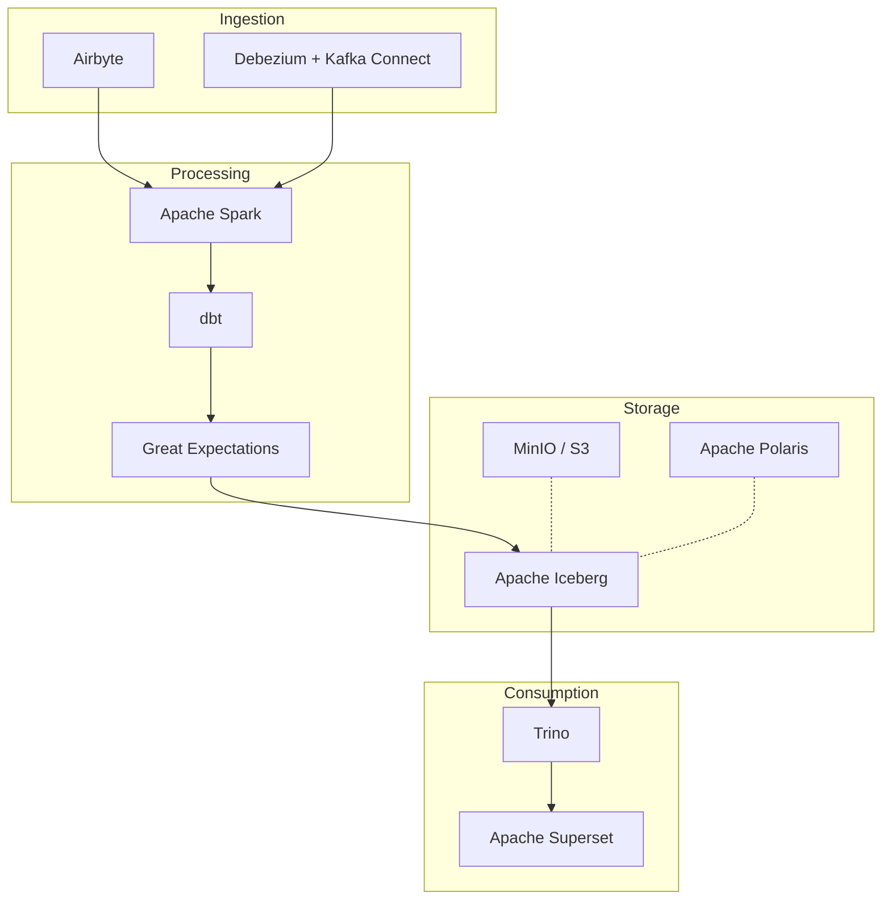
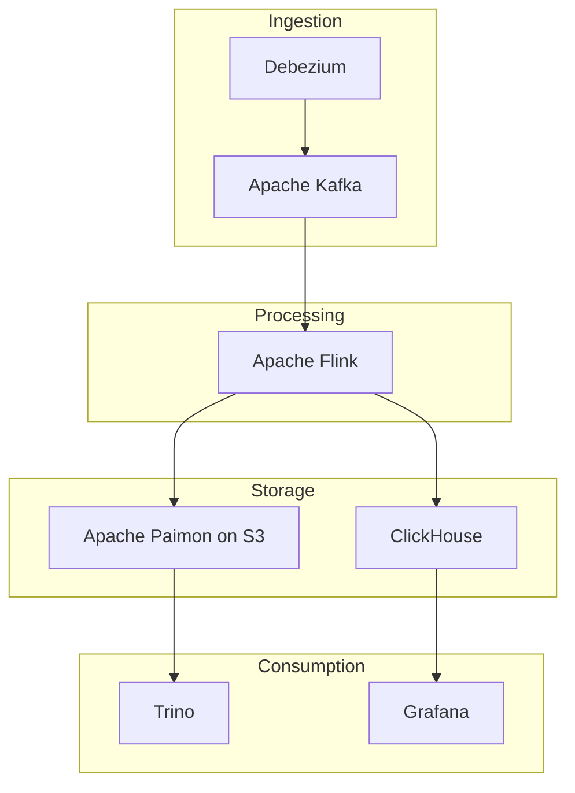
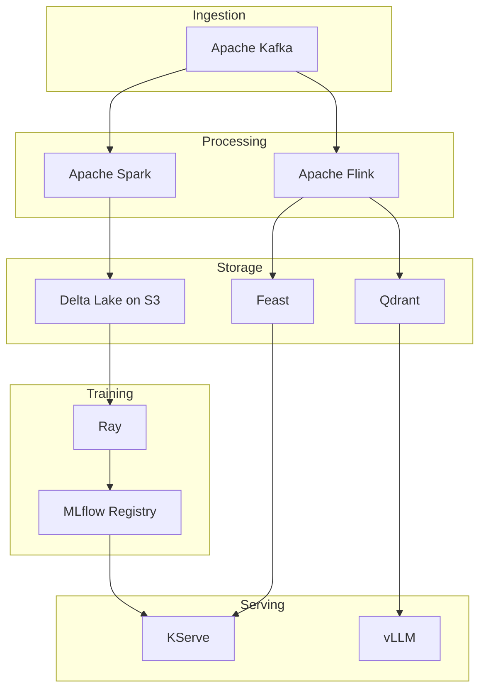

| Category | Tools / Technologies | Primary Use |
|---|---|---|
| **Machine Learning** | MLflow, Kubeflow, Feast, Ray, TensorFlow, PyTorch, Scikit-learn, XGBoost, LightGBM | Training, tracking, serving, feature store and MLOps |
| **Data Science / Analytics** | Python, Jupyter, Pandas, Polars, NumPy, SciPy, R, Apache Arrow | Data exploration, statistical analysis and data preparation |
| **BI / Analytics** | Apache Superset, Metabase, Grafana, Power BI, Tableau | Dashboards, data exploration and visualization |
| **Data Engineering** | Apache Spark, Apache Flink, Apache Beam, Apache Kafka, dbt | Data processing, pipelines and transformations |
| **Data Ingestion / CDC** | Apache Kafka, Debezium, Kafka Connect, Apache NiFi, Airbyte, Fivetran | Data ingestion, CDC and data integration |
| **Workflow Orchestration** | Apache Airflow, Dagster, Prefect, Argo Workflows | Pipeline and workflow orchestration |
| **Data Transformation** | dbt, Apache Spark, SQLMesh, Dataform | Data transformation, modeling and ELT |
| **Data Quality** | Great Expectations, Soda, dbt Tests, Deequ | Data validation and quality checks |
| **Data Catalog / Governance** | OpenMetadata, DataHub, Apache Atlas, Amundsen, OpenLineage | Data catalog, lineage and governance |
| **Data Lake Storage** | Amazon S3, MinIO, Google Cloud Storage, Azure Data Lake Storage | Object storage and data lake |
| **File Formats** | Apache Parquet, Apache ORC, Apache Avro, Apache Arrow | Data storage and interchange formats |
| **Open Table Formats** | Apache Iceberg, Apache Hudi, Delta Lake, Apache Paimon | ACID tables, schema evolution, snapshots and time travel |
| **Lakehouse Catalog** | Apache Polaris, Project Nessie, AWS Glue Catalog, Hive Metastore | Table catalog and metadata management |
| **Query Engines** | Trino, Presto, DuckDB, ClickHouse, Apache Doris, StarRocks | SQL analytics and OLAP |
| **Lakehouse Platforms** | Databricks, Dremio, Starburst, Snowflake | Data lakehouse and analytics platforms |
| **Feature Store** | Feast, Hopsworks, Tecton | ML feature management and serving |
| **ML Pipelines** | Kubeflow Pipelines, MLflow, Airflow, Metaflow, Flyte | Machine learning pipelines |
| **Model Serving** | KServe, Seldon, NVIDIA Triton, Ray Serve, BentoML, vLLM | Model inference and serving |
| **Experiment Tracking** | MLflow, Weights & Biases, Neptune, Comet | Experiment tracking and metrics |
| **Model Registry** | MLflow, Kubeflow, Vertex AI, SageMaker, Azure ML | Model versioning and lifecycle management |
| **Vector Databases** | Qdrant, Milvus, Weaviate, pgvector, Pinecone | Embeddings, semantic search and RAG |
| **Streaming / Event Processing** | Apache Kafka, Apache Flink, Redpanda, Apache Pulsar | Real-time data processing |
| **Data Warehouse** | Snowflake, BigQuery, Redshift, ClickHouse, DuckDB | Structured analytics and OLAP |
| **Data Observability** | OpenTelemetry, Grafana, Prometheus, OpenLineage, Marquez | Data and pipeline observability |

## Reference architectures

Three ways to wire the tools above into a working stack. All of them have the
same three layers, ingestion, processing and storage, plus whatever consumes
the result.

### 1. Batch lakehouse

Nightly and hourly ELT. The default when latency is measured in hours.

Apache Airflow sits outside the picture, triggering every arrow above.

### 2. Streaming

Seconds instead of hours. Two branches out of one job: the table for history,
the OLAP store for the dashboard.

Airflow is still needed here, not to schedule the job but to run the compaction
and snapshot expiration the table needs because the job never stops writing.

### 3. ML and inference

Features written by the same pipeline that feeds training, and a model served
out of a registry.

## Official repositories

- [Airbyte](https://github.com/airbytehq/airbyte)
- [Amundsen](https://github.com/amundsen-io/amundsen)
- [Apache Airflow](https://github.com/apache/airflow)
- [Apache Arrow](https://github.com/apache/arrow)
- [Apache Atlas](https://github.com/apache/atlas)
- [Apache Avro](https://github.com/apache/avro)
- [Apache Beam](https://github.com/apache/beam)
- [Apache Doris](https://github.com/apache/doris)
- [Apache Flink](https://github.com/apache/flink)
- [Apache Hudi](https://github.com/apache/hudi)
- [Apache Iceberg](https://github.com/apache/iceberg)
- [Apache Kafka](https://github.com/apache/kafka)
- [Apache NiFi](https://github.com/apache/nifi)
- [Apache ORC](https://github.com/apache/orc)
- [Apache Paimon](https://github.com/apache/paimon)
- [Apache Parquet](https://github.com/apache/parquet-format)
- [Apache Polaris](https://github.com/apache/polaris)
- [Apache Pulsar](https://github.com/apache/pulsar)
- [Apache Spark](https://github.com/apache/spark)
- [Apache Superset](https://github.com/apache/superset)
- [Argo Workflows](https://github.com/argoproj/argo-workflows)
- [BentoML](https://github.com/bentoml/BentoML)
- [ClickHouse](https://github.com/ClickHouse/ClickHouse)
- [Dagster](https://github.com/dagster-io/dagster)
- [Dataform](https://github.com/dataform-co/dataform)
- [DataHub](https://github.com/datahub-project/datahub)
- [dbt](https://github.com/dbt-labs/dbt-core)
- [Debezium](https://github.com/debezium/debezium)
- [Deequ](https://github.com/awslabs/deequ)
- [Delta Lake](https://github.com/delta-io/delta)
- [Dremio](https://github.com/dremio/dremio-oss)
- [DuckDB](https://github.com/duckdb/duckdb)
- [Feast](https://github.com/feast-dev/feast)
- [Flyte](https://github.com/flyteorg/flyte)
- [Grafana](https://github.com/grafana/grafana)
- [Great Expectations](https://github.com/fivetran/great_expectations)
- [Hive Metastore](https://github.com/apache/hive)
- [Hopsworks](https://github.com/logicalclocks/hopsworks)
- [Jupyter](https://github.com/jupyter/notebook)
- [KServe](https://github.com/kserve/kserve)
- [Kubeflow](https://github.com/kubeflow/kubeflow)
- [Kubeflow Pipelines](https://github.com/kubeflow/pipelines)
- [LightGBM](https://github.com/lightgbm-org/LightGBM)
- [Marquez](https://github.com/MarquezProject/marquez)
- [Metabase](https://github.com/metabase/metabase)
- [Metaflow](https://github.com/Netflix/metaflow)
- [Milvus](https://github.com/milvus-io/milvus)
- [MinIO](https://github.com/minio/minio)
- [MLflow](https://github.com/mlflow/mlflow)
- [NumPy](https://github.com/numpy/numpy)
- [NVIDIA Triton](https://github.com/triton-inference-server/server)
- [OpenLineage](https://github.com/OpenLineage/OpenLineage)
- [OpenMetadata](https://github.com/open-metadata/OpenMetadata)
- [OpenTelemetry](https://github.com/open-telemetry/opentelemetry-specification)
- [Pandas](https://github.com/pandas-dev/pandas)
- [pgvector](https://github.com/pgvector/pgvector)
- [Polars](https://github.com/pola-rs/polars)
- [Prefect](https://github.com/PrefectHQ/prefect)
- [Presto](https://github.com/prestodb/presto)
- [Project Nessie](https://github.com/projectnessie/nessie)
- [Prometheus](https://github.com/prometheus/prometheus)
- [Python](https://github.com/python/cpython)
- [PyTorch](https://github.com/pytorch/pytorch)
- [Qdrant](https://github.com/qdrant/qdrant)
- [R](https://github.com/r-devel/r-svn)
- [Ray](https://github.com/ray-project/ray)
- [Redpanda](https://github.com/redpanda-data/redpanda)
- [Scikit-learn](https://github.com/scikit-learn/scikit-learn)
- [SciPy](https://github.com/scipy/scipy)
- [Seldon](https://github.com/SeldonIO/seldon-core)
- [Soda](https://github.com/sodadata/soda-core)
- [SQLMesh](https://github.com/SQLMesh/sqlmesh)
- [StarRocks](https://github.com/StarRocks/starrocks)
- [TensorFlow](https://github.com/tensorflow/tensorflow)
- [Trino](https://github.com/trinodb/trino)
- [vLLM](https://github.com/vllm-project/vllm)
- [Weaviate](https://github.com/weaviate/weaviate)
- [XGBoost](https://github.com/dmlc/xgboost)

Kafka Connect ships inside apache/kafka, dbt Tests inside dbt-core and Ray Serve inside ray-project/ray, so they share the repositories above.

No public repository, these are proprietary or managed services: Power BI, Tableau, Fivetran, Amazon S3, Google Cloud Storage, Azure Data Lake Storage, AWS Glue Catalog, Databricks, Starburst, Snowflake, BigQuery, Redshift, Tecton, Pinecone, Weights & Biases, Neptune, Comet, Vertex AI, SageMaker and Azure ML.
