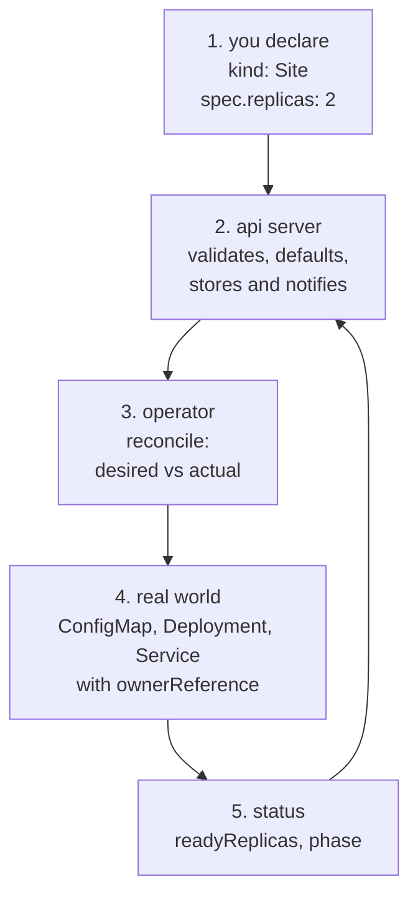

## Índice

- [Índice](#índice)
- [Introdução](#introdução)
- [Antes de tudo: o que é a API do Kubernetes](#antes-de-tudo-o-que-é-a-api-do-kubernetes)
- [Subindo o lab](#subindo-o-lab)
- [O cenário que escolhi](#o-cenário-que-escolhi)
- [Parte 1: o CRD, ou como criar uma gaveta nova no cartório](#parte-1-o-crd-ou-como-criar-uma-gaveta-nova-no-cartório)
- [O CRD sozinho não faz absolutamente nada](#o-crd-sozinho-não-faz-absolutamente-nada)
- [Parte 2: o controller, ou o termostato](#parte-2-o-controller-ou-o-termostato)
- [Um operator em bash](#um-operator-em-bash)
- [Testando: drift, escala e garbage collection](#testando-drift-escala-e-garbage-collection)
- [O watch cru, sem cliente nenhum no meio](#o-watch-cru-sem-cliente-nenhum-no-meio)
- [Parte 3: reescrevendo em Go com controller-runtime](#parte-3-reescrevendo-em-go-com-controller-runtime)
- [Parte 4: empacotando e rodando dentro do cluster](#parte-4-empacotando-e-rodando-dentro-do-cluster)
- [As dificuldades, que é a parte que ninguém conta](#as-dificuldades-que-é-a-parte-que-ninguém-conta)
- [Validação com CEL, sem webhook nenhum](#validação-com-cel-sem-webhook-nenhum)
- [O que eu deixei de fora de propósito](#o-que-eu-deixei-de-fora-de-propósito)
- [Quando não escrever um operator](#quando-não-escrever-um-operator)
- [Como isso aparece no mundo real](#como-isso-aparece-no-mundo-real)
- [Teardown](#teardown)
- [O que ficou](#o-que-ficou)

## Introdução

Eu uso operator há anos sem ter escrito um. Instalo cert-manager, instalo prometheus-operator, aplico um `Certificate`, aplico um `ServiceMonitor`, funciona. Em algum momento isso começa a incomodar: eu sei usar, mas não sei o que acontece entre o `kubectl apply` e a coisa existindo. E "operator" virou uma daquelas palavras que todo mundo fala e quase ninguém desmonta.

Então passei um tempo montando um do zero, num kind local, com o objetivo explícito de não usar scaffold no começo. Nada de `kubebuilder init`, nada de gerador de código, nada de framework. Primeiro na mão, em bash, pra ver o loop acontecendo. Depois em Go, com controller-runtime, pra ver o que o framework realmente resolve. E por último empacotado e rodando dentro do cluster, com RBAC, que é onde a maioria dos tutoriais para.

Tudo aqui foi rodado de verdade. Os outputs são colados da minha sessão, inclusive os erros.

O ciclo inteiro, que é o que o post desmonta pedaço por pedaço:



## Antes de tudo: o que é a API do Kubernetes

Essa é a parte que destrava o resto, e é a que costuma ser pulada.

O Kubernetes não é um orquestrador com uma API pendurada do lado. Ele é uma API com um banco de dados atrás, e um monte de programinhas que ficam olhando pra esse banco. É isso. Pod, Deployment, Service, ConfigMap: tudo é linha de tabela, exposta via HTTP, guardada no etcd.

Dá pra provar. Roda qualquer `kubectl` com `-v=6` e ele te mostra a requisição HTTP que fez:

```sh
kubectl get pods -n kube-system -v=6 2>&1 | grep GET
```

```
"Response" verb="GET" url="https://127.0.0.1:41879/api/v1/namespaces/kube-system/pods?limit=500" status="200 OK" milliseconds=3
```

O `kubectl` é só um cliente HTTP com formatação bonita. Dá pra falar direto com a API e receber o JSON cru:

```sh
kubectl get --raw /api/v1/namespaces/kube-system/pods | jq -r '.kind, .apiVersion, (.items|length)'
```

```
PodList
v1
8
```

E a API se descreve sozinha. Perguntando pra raiz, ela lista os caminhos que atende:

```sh
kubectl get --raw / | jq -r '.paths[]'
```

```
/api
/api/v1
/apis
/apis/apiextensions.k8s.io/v1
/apis/apps
/apis/apps/v1
/apis/batch/v1
...
```

E cada grupo lista os recursos dele, com os verbos que aceita:

```sh
kubectl get --raw /apis/apps/v1 | jq '.resources[] | select(.name=="deployments")'
```

```json
{
  "name": "deployments",
  "singularName": "deployment",
  "namespaced": true,
  "kind": "Deployment",
  "verbs": ["create","delete","deletecollection","get","list","patch","update","watch"],
  "shortNames": ["deploy"],
  "categories": ["all"],
  "storageVersionHash": "8aSe+NMegvE="
}
```

A analogia que funcionou pra mim: o api server é o balcão de um cartório. Ele recebe documento, confere se o formulário está preenchido direito, carimba e arquiva. Ele não executa nada. Quem faz o trabalho são os funcionários, cada um responsável por um tipo de documento, que ficam de olho no arquivo esperando aparecer papel novo pra eles.

Esses funcionários são os controllers. O deployment controller olha Deployment e cria ReplicaSet. O replicaset controller olha ReplicaSet e cria Pod. O scheduler olha Pod sem nó e escolhe um nó. O kubelet olha Pod atribuído ao nó dele e sobe container. Ninguém manda em ninguém, cada um reage ao que aparece no arquivo.

Sabendo disso, as duas palavras do título ficam simples:

* **CRD** (CustomResourceDefinition): uma gaveta nova no cartório. Um tipo de documento que a API passa a aceitar, validar e arquivar.
* **Operator**: um funcionário novo, que fica olhando essa gaveta e fazendo alguma coisa acontecer no mundo real.

Operator não é uma tecnologia. É um padrão: CRD mais controller. O resto é detalhe de implementação.

## Subindo o lab

Cluster com kind, um nó só, porque não preciso de mais que isso.

```sh
cat > kind.yaml <<'EOF'
kind: Cluster
apiVersion: kind.x-k8s.io/v1alpha4
name: lab-operators
nodes:
  - role: control-plane
EOF

kind create cluster --config kind.yaml
```

```
Creating cluster "lab-operators" ...
 ✓ Ensuring node image (kindest/node:v1.36.1) 🖼
 ✓ Preparing nodes 📦
 ✓ Writing configuration 📜
 ✓ Starting control-plane 🕹️
 ✓ Installing CNI 🔌
 ✓ Installing StorageClass 💾
Set kubectl context to "kind-lab-operators"

real	0m9,979s
```

Dez segundos com a imagem já em cache. Kind é isso: cada nó é um container, o control plane inteiro roda ali dentro. Pra estudar API e controller é perfeito, porque você quebra e recria à vontade.

Cluster novo, `kubectl api-resources --no-headers | wc -l` me deu **67** tipos de recurso. É o vocabulário que o cartório entende hoje. Meu objetivo é fazer virar 68.

## O cenário que escolhi

Queria algo que qualquer pessoa entendesse em dez segundos, e que ainda assim tivesse todos os problemas reais de um operator de verdade.

Um recurso chamado `Site`. Você declara:

```yaml
apiVersion: lab.apolzek.io/v1alpha1
kind: Site
metadata:
  name: blog
spec:
  title: "meu site declarado como recurso"
  replicas: 2
```

E o operator cria, sozinho, um ConfigMap com o HTML, um Deployment de nginx servindo esse HTML e um Service na frente. Se alguém apagar o Deployment, ele volta. Se você mudar `replicas`, ele acompanha. Se você apagar o `Site`, tudo some junto.

É pequeno, mas tem tudo: spec e status, recursos filhos, drift, ciclo de vida, validação, permissão. A diferença entre isso e um operator de banco de dados é quantidade de casos de borda, não natureza do problema.

## Parte 1: o CRD, ou como criar uma gaveta nova no cartório

O CRD é um YAML. Ele não tem código nenhum, é só a descrição da gaveta: qual o nome do documento, em que grupo ele vive, quais campos ele aceita, quais são obrigatórios e o que aparece quando alguém dá `kubectl get`.

```yaml
apiVersion: apiextensions.k8s.io/v1
kind: CustomResourceDefinition
metadata:
  name: sites.lab.apolzek.io          # must be exactly plural.group
spec:
  group: lab.apolzek.io
  names:
    kind: Site
    plural: sites
    singular: site
    shortNames: [st]
    categories: [lab]
  scope: Namespaced
  versions:
    - name: v1alpha1
      served: true                     # the API answers on this version
      storage: true                    # and stores it in etcd on this one
      subresources:
        status: {}                     # spec and status become separate endpoints
      schema:
        openAPIV3Schema:
          type: object
          properties:
            spec:
              type: object
              required: [title]
              properties:
                title:
                  type: string
                  maxLength: 60
                  description: Text rendered as the page headline.
                message:
                  type: string
                  default: "running on a Site custom resource"
                replicas:
                  type: integer
                  minimum: 1
                  maximum: 5
                  default: 1
            status:
              type: object
              properties:
                readyReplicas: { type: integer }
                url:           { type: string }
                phase:         { type: string }
      additionalPrinterColumns:
        - { name: Title, type: string,  jsonPath: .spec.title }
        - { name: Want,  type: integer, jsonPath: .spec.replicas }
        - { name: Ready, type: integer, jsonPath: .status.readyReplicas }
        - { name: Phase, type: string,  jsonPath: .status.phase }
        - { name: Age,   type: date,    jsonPath: .metadata.creationTimestamp }
```

```sh
kubectl apply -f crd-site.yaml
```

```
customresourcedefinition.apiextensions.k8s.io/sites.lab.apolzek.io created
```

Pronto. A partir daqui a API do cluster mudou. Apareceu caminho novo:

```sh
kubectl get --raw / | jq -r '.paths[]' | grep lab.apolzek
```

```
/apis/lab.apolzek.io
/apis/lab.apolzek.io/v1alpha1
```

Apareceu tipo novo na lista de recursos:

```sh
kubectl api-resources | grep lab.apolzek
```

```
sites   st   lab.apolzek.io/v1alpha1   true   Site
```

E, o que mais me impressionou, apareceu documentação:

```sh
kubectl explain site.spec
```

```
GROUP:      lab.apolzek.io
KIND:       Site
VERSION:    v1alpha1

FIELD: spec <Object>

FIELDS:
  message	<string>
  replicas	<integer>
  title	<string> -required-
    Text rendered as the page headline.
```

Aquele `description` que escrevi no schema virou help de linha de comando. Não escrevi uma linha de código pra isso.

Agora a parte boa: validação. O schema não é decoração, o api server aplica ele antes de gravar.

```sh
# replicas above the maximum
kubectl apply -f - <<'EOF'
apiVersion: lab.apolzek.io/v1alpha1
kind: Site
metadata: { name: quebrado }
spec: { title: "teste", replicas: 9 }
EOF
```

```
The Site "quebrado" is invalid: spec.replicas: Invalid value: 9: spec.replicas in body should be less than or equal to 5
```

```sh
# missing the required field
The Site "quebrado" is invalid: spec.title: Required value
```

```sh
# field that does not exist, a typo in "replicas"
Error from server (BadRequest): Site in version "v1alpha1" cannot be handled as a Site:
strict decoding error: unknown field "spec.replcias"
```

Esse último merece atenção, porque o `kubectl apply` te salvou por usar decodificação estrita. Se a requisição chegar sem isso, o comportamento é outro e bem mais traiçoeiro: o campo desconhecido é **apagado em silêncio**. Chama-se pruning. Dá pra ver mandando o JSON direto pra API:

```sh
kubectl create --raw /apis/lab.apolzek.io/v1alpha1/namespaces/default/sites -f prune.json | jq '.spec'
```

```
Warning: unknown field "spec.replcias"
{
  "message": "running on a Site custom resource",
  "replicas": 1,
  "title": "teste"
}
```

Duas coisas aconteceram aí. O `replcias` sumiu, como se eu nunca tivesse mandado. E `message` e `replicas` apareceram do nada, preenchidos com os `default` do schema. Ou seja: o que você manda e o que fica gravado não são a mesma coisa. Isso é a primeira armadilha do dia, e ela morde muita gente em CI, onde um typo em YAML passa batido e o recurso sobe "funcionando" com o default.

Vamos criar o `Site` de verdade agora:

```sh
kubectl apply -f site-blog.yaml
kubectl get site blog -o yaml
```

```yaml
apiVersion: lab.apolzek.io/v1alpha1
kind: Site
metadata:
  creationTimestamp: "2026-09-11T14:59:42Z"
  generation: 1
  name: blog
  namespace: default
  resourceVersion: "555"
  uid: c491975f-b230-454f-a539-87326e65f29b
spec:
  message: running on a Site custom resource
  replicas: 2
  title: meu site declarado como recurso
```

Repara nos três campos que o cartório carimbou sozinho, porque eles vão importar mais pra frente:

* `uid`: identidade única desse objeto nesse cluster. É por ela que o garbage collector vai reconhecer os filhos.
* `resourceVersion`: a versão da linha. Muda a cada escrita. É o mecanismo de concorrência otimista.
* `generation`: o contador do `spec`. Só incrementa quando o desejo muda, não quando o status muda.

## O CRD sozinho não faz absolutamente nada

Essa é a lição mais importante do post, e a que eu só internalizei fazendo.

```sh
kubectl get site
```

```
NAME   TITLE                             WANT   READY   PHASE   AGE
blog   meu site declarado como recurso   2                      6s
```

```sh
kubectl get all
```

```
NAME                 TYPE        CLUSTER-IP   EXTERNAL-IP   PORT(S)   AGE
service/kubernetes   ClusterIP   10.96.0.1    <none>        443/TCP   75s
```

Nada. Nenhum pod, nenhum deployment. As colunas `READY` e `PHASE` estão vazias porque ninguém preencheu.

Eu declarei que quero um site com duas réplicas e o cluster respondeu, em essência, "anotado". O CRD é uma gaveta de arquivo. Ele aceita o papel, valida o formulário, guarda, devolve quando você pede. Ele não tem braço. Um CRD sem controller é um `.json` bem validado dentro do etcd, e nada mais.

Todo o valor de um operator está na segunda metade.

## Parte 2: o controller, ou o termostato

A analogia que finalmente colou pra mim foi essa.

Um controller não é um gatilho. Não é "quando alguém criar um Site, faça X". Isso seria edge-triggered, orientado ao evento, e quebra no primeiro evento perdido: se o processo estava reiniciando na hora que o evento passou, aquele Site fica órfão pra sempre.

Controller é um termostato. O termostato não reage ao ato de você girar o botão. Ele fica, para sempre, comparando duas coisas: a temperatura que você pediu e a temperatura que o sensor está lendo. Se estão iguais, ele não faz nada. Se estão diferentes, ele liga o aquecedor. Não importa como ficaram diferentes: você girou o botão, alguém abriu a janela, faltou luz e ele reiniciou. O que importa é o estado agora.

Isso se chama level-triggered, e é o modelo do Kubernetes inteiro. Na prática significa que a função central de um operator tem essa assinatura mental:

```
reconcile(object_name):
    desired = read the object from the API   # spec
    actual  = read the real world            # the children that should exist
    if different: write the difference
    record what was observed                 # status
```

E daí saem as duas regras que valem mais que qualquer framework:

1. **Reconcile recebe um nome, não um evento.** Ele nunca pode assumir "o que mudou". Ele lê tudo de novo e decide do zero.
2. **Reconcile precisa ser idempotente.** Rodar dez vezes seguidas tem que dar o mesmo resultado que rodar uma. Ele vai rodar dez vezes seguidas, garantido.

A outra divisão que confunde todo mundo no começo é spec contra status:

* `spec` é o desejo, e pertence a quem escreveu o objeto. Operator não escreve em spec. Se o seu operator escreve em spec, ele está brigando com o usuário.
* `status` é a observação, e pertence ao operator. Usuário não escreve em status.

O `subresources: { status: {} }` do CRD existe pra impor isso: spec e status viram dois endereços HTTP diferentes, com permissões diferentes, e escrever num não conta como escrever no outro.

## Um operator em bash

Antes de pegar Go, quis ver o loop com os olhos. Um operator é um processo que fala HTTP com a API. `kubectl` fala HTTP com a API. Logo, dá pra escrever um operator em bash. Ele é ruim, mas é honesto, e cabe na cabeça.

```bash
#!/usr/bin/env bash
# A Site operator in ~60 lines of bash. Same loop a real controller runs,
# only without the cache, the workqueue and the exponential backoff.
set -euo pipefail

reconcile() {
  local site="$1"
  local name ns uid title message replicas
  name=$(jq -r '.metadata.name'      <<<"$site")
  ns=$(jq   -r '.metadata.namespace' <<<"$site")
  uid=$(jq  -r '.metadata.uid'       <<<"$site")
  title=$(jq   -r '.spec.title'      <<<"$site")
  message=$(jq -r '.spec.message'    <<<"$site")
  replicas=$(jq -r '.spec.replicas'  <<<"$site")

  # desired state: one ConfigMap, one Deployment, one Service,
  # all owned by the Site so the garbage collector cleans up for us.
  kubectl apply -f - >/dev/null <<EOF
apiVersion: v1
kind: ConfigMap
metadata:
  name: site-$name
  namespace: $ns
  ownerReferences:
    - apiVersion: lab.apolzek.io/v1alpha1
      kind: Site
      name: $name
      uid: $uid
      controller: true
data:
  index.html: |
    <html><body style="font-family: monospace; background:#111; color:#eee">
    <h1>$title</h1><p>$message</p>
    </body></html>
---
apiVersion: apps/v1
kind: Deployment
metadata:
  name: site-$name
  namespace: $ns
  ownerReferences:
    - apiVersion: lab.apolzek.io/v1alpha1
      kind: Site
      name: $name
      uid: $uid
      controller: true
spec:
  replicas: $replicas
  selector:
    matchLabels: { app: site-$name }
  template:
    metadata:
      labels: { app: site-$name }
    spec:
      containers:
        - name: nginx
          image: nginx:1.29-alpine
          ports: [{ containerPort: 80 }]
          volumeMounts:
            - name: html
              mountPath: /usr/share/nginx/html
      volumes:
        - name: html
          configMap: { name: site-$name }
---
apiVersion: v1
kind: Service
metadata:
  name: site-$name
  namespace: $ns
  ownerReferences:
    - apiVersion: lab.apolzek.io/v1alpha1
      kind: Site
      name: $name
      uid: $uid
      controller: true
spec:
  selector: { app: site-$name }
  ports: [{ port: 80, targetPort: 80 }]
EOF

  # observed state goes back into status, never into spec.
  local ready
  ready=$(kubectl get deploy "site-$name" -n "$ns" -o jsonpath='{.status.readyReplicas}' 2>/dev/null || true)
  ready=${ready:-0}
  local phase="Pending"
  [[ "$ready" == "$replicas" ]] && phase="Ready"
  kubectl patch site "$name" -n "$ns" --subresource=status --type=merge \
    -p "{\"status\":{\"readyReplicas\":$ready,\"phase\":\"$phase\",\"url\":\"http://site-$name.$ns.svc.cluster.local\"}}" >/dev/null
  echo "$(date +%T) reconciled site/$name ns=$ns want=$replicas ready=$ready phase=$phase"
}

echo "watching sites..."
while true; do
  kubectl get sites -A -o json | jq -c '.items[]' | while read -r site; do
    reconcile "$site"
  done
  sleep 5
done
```

Três detalhes desse script valem mais que o resto:

* Ele usa `kubectl apply`, não `create`. Idempotência de graça: rodar de novo com o mesmo conteúdo não muda nada.
* Todo filho carrega `ownerReferences` apontando pro `Site`, com o `uid`. É isso, e só isso, que faz a limpeza funcionar depois.
* O status vai por `--subresource=status`. Escrever status pelo caminho normal seria escrever no objeto inteiro, e aí eu estaria pisando no spec do usuário.

Rodando:

```sh
./operator.sh
```

```
watching sites...
12:00:09 reconciled site/blog ns=default want=2 ready=0 phase=Pending
12:00:15 reconciled site/blog ns=default want=2 ready=0 phase=Pending
12:00:20 reconciled site/blog ns=default want=2 ready=2 phase=Ready
12:00:25 reconciled site/blog ns=default want=2 ready=2 phase=Ready
```

E o cluster, que estava vazio:

```
NAME                             READY   STATUS    RESTARTS   AGE
pod/site-blog-55d64b56fc-94zpv   1/1     Running   0          20s
pod/site-blog-55d64b56fc-xpw5z   1/1     Running   0          20s

NAME                TYPE        CLUSTER-IP    PORT(S)   AGE
service/site-blog   ClusterIP   10.96.205.8   80/TCP    20s

NAME                        READY   UP-TO-DATE   AVAILABLE   AGE
deployment.apps/site-blog   2/2     2            2           20s

NAME                  DATA   AGE
configmap/site-blog   1      20s
```

As colunas do `kubectl get site` também preencheram, porque agora tem alguém escrevendo status:

```
NAME   TITLE                             WANT   READY   PHASE   AGE
blog   meu site declarado como recurso   2      2       Ready   53s
```

Servindo de verdade, de dentro do cluster:

```sh
kubectl run curl --rm -i --restart=Never --image=curlimages/curl:8.11.1 \
  -- -s http://site-blog.default.svc.cluster.local
```

```html
<html><body style="font-family: monospace; background:#111; color:#eee">
<h1>meu site declarado como recurso</h1><p>running on a Site custom resource</p>
</body></html>
```

## Testando: drift, escala e garbage collection

Aqui é onde o padrão mostra pra que veio.

**Drift.** Apaguei o Deployment na mão, como se alguém tivesse feito besteira às três da manhã:

```sh
12:00:46  kubectl delete deploy site-blog
deployment.apps "site-blog" deleted

# twelve seconds later
NAME        READY   UP-TO-DATE   AVAILABLE   AGE
site-blog   2/2     2            2           12s
```

O log conta a história:

```
12:00:41 reconciled site/blog want=2 ready=2 phase=Ready
12:00:46 reconciled site/blog want=2 ready=0 phase=Pending    <- noticed it was gone
12:00:52 reconciled site/blog want=2 ready=2 phase=Ready      <- recreated it
```

Eu não escrevi nenhum tratamento de "deployment foi apagado". Não existe esse caso no código. O reconcile só recalcula o desejado e aplica, e por isso recriar é a mesma operação que criar. É o termostato de novo: ele não sabe que a janela abriu, ele só sabe que está frio.

**Escala.** Mudei o desejo:

```sh
kubectl patch site blog --type=merge -p '{"spec":{"replicas":4}}'
```

```
12:01:02 reconciled site/blog want=4 ready=2 phase=Pending
12:01:08 reconciled site/blog want=4 ready=4 phase=Ready
```

**Garbage collection.** Essa é a que mais me agradou. Apaguei só o `Site`:

```sh
kubectl delete site blog
```

```
Error from server (NotFound): deployments.apps "site-blog" not found
Error from server (NotFound): configmaps "site-blog" not found
Error from server (NotFound): services "site-blog" not found
No resources found in default namespace.
```

O meu operator não tem uma linha de código de deleção. Quem limpou foi o garbage collector do próprio Kubernetes, seguindo o `ownerReferences` que eu carimbei nos filhos:

```sh
kubectl get deploy site-blog -o jsonpath='{.metadata.ownerReferences}' | jq
```

```json
[
  {
    "apiVersion": "lab.apolzek.io/v1alpha1",
    "controller": true,
    "kind": "Site",
    "name": "blog",
    "uid": "c491975f-b230-454f-a539-87326e65f29b"
  }
]
```

O `uid` ali não é enfeite. Se você apagar o `Site` e criar outro com o mesmo nome, o `uid` é novo, e os filhos velhos viram órfãos e são coletados. É o que evita o operator adotar restos de uma encarnação anterior do objeto.

## O watch cru, sem cliente nenhum no meio

Meu operator em bash pergunta de cinco em cinco segundos. Um operator de verdade não faz isso, ele abre uma conexão HTTP que fica pendurada e recebe eventos. Também dá pra ver isso na mão:

```sh
kubectl get --raw '/apis/lab.apolzek.io/v1alpha1/sites?watch=true' \
  | jq -c '{type: .type, name: .object.metadata.name, rv: .object.metadata.resourceVersion, replicas: .object.spec.replicas}'
```

Com essa conexão aberta, criei um Site e mudei ele:

```
{"type":"ADDED","name":"blog","rv":"908","replicas":2}
{"type":"MODIFIED","name":"blog","rv":"935","replicas":2}
{"type":"MODIFIED","name":"blog","rv":"936","replicas":3}
{"type":"MODIFIED","name":"blog","rv":"974","replicas":3}
```

É um `Transfer-Encoding: chunked` que nunca fecha, cuspindo JSON por linha. Sem gRPC, sem fila, sem broker. É só HTTP pendurado.

E olha o que já aparece aqui, na terceira linha de um lab de brinquedo: das quatro notificações, **duas não foram causadas por mim**. Os eventos de `rv` 935 e 974 são o meu próprio operator escrevendo status. O operator escreve, o api server notifica, o operator acorda, lê, escreve de novo. Se a escrita de status não for idempotente, isso não é um loop de reconciliação, é um loop infinito consumindo CPU do control plane. Guarda essa, porque ela volta.

## Parte 3: reescrevendo em Go com controller-runtime

O bash funciona, mas ele pergunta o cluster inteiro a cada cinco segundos, não tem fila, não tem retry decente, e se eu tiver mil Sites ele faz mil requisições em série. É hora de ver o que um framework de verdade resolve.

`controller-runtime` é a biblioteca que está por baixo do kubebuilder e do operator-sdk, e por baixo de praticamente todo operator sério que você já instalou. Escrevi a mesma coisa com ela, de propósito sem gerar tipo Go nenhum, usando `unstructured` pra ler o meu CRD. Fica em 129 linhas.

O coração:

```go
// Reconcile is called with a name, never with an event payload. It reads the
// world, computes the desired state and writes the difference. Nothing else.
func (r *SiteReconciler) Reconcile(ctx context.Context, req ctrl.Request) (ctrl.Result, error) {
	log := ctrl.LoggerFrom(ctx)

	site := &unstructured.Unstructured{}
	site.SetGroupVersionKind(siteGVK)
	if err := r.Get(ctx, req.NamespacedName, site); err != nil {
		// gone: the garbage collector already removed the children
		return ctrl.Result{}, client.IgnoreNotFound(err)
	}

	title, _, _ := unstructured.NestedString(site.Object, "spec", "title")
	message, _, _ := unstructured.NestedString(site.Object, "spec", "message")
	replicas, _, _ := unstructured.NestedInt64(site.Object, "spec", "replicas")
	name := "site-" + site.GetName()
	ns := site.GetNamespace()

	cm := &corev1.ConfigMap{ObjectMeta: metav1.ObjectMeta{Name: name, Namespace: ns}}
	if _, err := controllerutil.CreateOrUpdate(ctx, r.Client, cm, func() error {
		cm.Data = map[string]string{"index.html": html}
		return controllerutil.SetControllerReference(site, cm, r.Scheme())
	}); err != nil {
		return ctrl.Result{}, err
	}

	// ... same thing for the Deployment and the Service ...

	phase := "Pending"
	if dep.Status.ReadyReplicas == int32(replicas) {
		phase = "Ready"
	}
	patch := []byte(fmt.Sprintf(
		`{"status":{"readyReplicas":%d,"phase":%q,"url":"http://%s.%s.svc.cluster.local"}}`,
		dep.Status.ReadyReplicas, phase, name, ns))
	if err := r.Status().Patch(ctx, site, client.RawPatch(client.Merge.Type(), patch)); err != nil {
		return ctrl.Result{}, err
	}

	log.Info("reconciled", "want", replicas, "ready", dep.Status.ReadyReplicas, "phase", phase)
	return ctrl.Result{}, nil
}
```

E o registro, que é onde mora a mágica:

```go
func main() {
	ctrl.SetLogger(zap.New(zap.UseDevMode(true)))

	mgr, err := ctrl.NewManager(ctrl.GetConfigOrDie(), ctrl.Options{})
	if err != nil {
		panic(err)
	}

	site := &unstructured.Unstructured{}
	site.SetGroupVersionKind(siteGVK)

	if err := ctrl.NewControllerManagedBy(mgr).
		For(site).                        // reconcile when the Site changes
		Owns(&appsv1.Deployment{}).       // and also when a child of mine changes
		Owns(&corev1.ConfigMap{}).
		Owns(&corev1.Service{}).
		Complete(&SiteReconciler{Client: mgr.GetClient()}); err != nil {
		panic(err)
	}

	if err := mgr.Start(ctrl.SetupSignalHandler()); err != nil {
		panic(err)
	}
}
```

Cinco linhas que valem muito:

* `For(site)`: o recurso principal. Mudou, reconcilia.
* `Owns(...)`: aqui está a diferença real pro bash. O controller passa a observar Deployment, ConfigMap e Service também, e quando um deles muda ele olha o `ownerReferences`, descobre de qual `Site` aquilo é filho e enfileira **o nome do pai**. É o que faz drift ser detectado na hora em vez de no próximo poll.
* `CreateOrUpdate`: o `kubectl apply` do bash, em Go, com a leitura vindo do cache.
* `client.IgnoreNotFound`: objeto sumiu, não é erro, é só não ter nada pra fazer.
* `r.Scheme()` dentro do `SetControllerReference`: é ele que descobre o GVK pra montar o `ownerReferences` certo.

Subindo, dá pra ver o que o manager monta antes de começar:

```
INFO	Starting EventSource	{"controller": "site", "source": "kind source: *v1.Service"}
INFO	Starting EventSource	{"controller": "site", "source": "kind source: *v1.Deployment"}
INFO	Starting EventSource	{"controller": "site", "source": "kind source: *v1.ConfigMap"}
INFO	Starting EventSource	{"controller": "site", "source": "kind source: *unstructured.Unstructured[lab.apolzek.io/v1alpha1 Site]"}
INFO	Starting Controller	{"controller": "site"}
INFO	Starting workers	{"controller": "site", "worker count": 1}
```

Quatro informers, cada um com um watch e um cache local. É por isso que `r.Get` num controller é barato: ele lê da memória, não da API.

O mesmo teste de drift, agora cronometrado:

```
12:04:07.804  kubectl delete deploy site-blog
12:04:08      INFO reconciled {"want": 2, "ready": 1, "phase": "Pending"}
12:04:08      INFO reconciled {"want": 2, "ready": 2, "phase": "Ready"}

NAME        READY   UP-TO-DATE   AVAILABLE   AGE
site-blog   2/2     2            2           3s
```

Menos de um segundo, contra seis do poll em bash. E não é que o Go seja mais rápido, é que ele foi avisado em vez de ter perguntado.

Melhor ainda, o comportamento em repouso:

```sh
A=$(kubectl logs deploy/site-operator | grep -c reconciled)   # 10
sleep 30
B=$(kubectl logs deploy/site-operator | grep -c reconciled)   # 10
```

Trinta segundos com o cluster parado, **zero** reconciles. O loop de status que eu mostrei no watch cru não vira loop infinito porque o patch de status é idempotente: escrever `{"phase":"Ready"}` num objeto que já está `Ready` é um no-op, o `resourceVersion` não muda, ninguém é notificado, e o ciclo morre sozinho. Se eu tivesse colocado um timestamp no status, cada reconcile geraria uma escrita diferente, e aí seria um moedor de CPU. Já vi isso em produção e o sintoma é o api server com latência alta sem motivo aparente.

## Parte 4: empacotando e rodando dentro do cluster

Rodar o operator do laptop apontando pro cluster é ótimo pra desenvolver e não é operator nenhum. Operator mora dentro do cluster, com identidade própria e permissão limitada. Essa etapa é curta e é onde quase todo mundo apanha.

Primeiro, o binário estático e a imagem, que fica minúscula porque não tem sistema operacional dentro:

```sh
CGO_ENABLED=0 go build -o sitectl .
```

```dockerfile
FROM gcr.io/distroless/static:nonroot
COPY sitectl /sitectl
USER 65532:65532
ENTRYPOINT ["/sitectl"]
```

```sh
docker build -t site-operator:0.1.0 .
kind load docker-image site-operator:0.1.0 --name lab-operators
```

```
Image: "site-operator:0.1.0" not yet present on node "lab-operators-control-plane", loading...
```

Esse `kind load` é um detalhe que economiza meia hora de confusão: o nó do kind é um container com um containerd próprio, ele não enxerga as imagens do seu Docker local. Sem isso você fica olhando pra um `ErrImagePull` de uma imagem que está bem ali na sua máquina.

Agora a parte que dói. A ServiceAccount nasce podendo nada:

```sh
kubectl create sa site-operator
kubectl get sites --as=system:serviceaccount:default:site-operator
```

```
Error from server (Forbidden): sites.lab.apolzek.io is forbidden:
User "system:serviceaccount:default:site-operator" cannot list resource "sites"
in API group "lab.apolzek.io" in the namespace "default"
```

Esse erro é o mais comum na vida de quem escreve operator, e a dica que vale ouro é: dá pra testar a permissão sem subir nada, fingindo ser a ServiceAccount.

```sh
kubectl auth can-i list sites --as=system:serviceaccount:default:site-operator
# no
```

O ClusterRole precisa listar, item por item, tudo que o controller toca. Repara que `sites` e `sites/status` são recursos **separados**, exatamente por causa do subresource que configurei lá no CRD:

```yaml
rules:
  - apiGroups: ["lab.apolzek.io"]
    resources: ["sites"]
    verbs: ["get", "list", "watch", "update", "patch"]
  - apiGroups: ["lab.apolzek.io"]
    resources: ["sites/status"]
    verbs: ["get", "update", "patch"]
  - apiGroups: ["apps"]
    resources: ["deployments"]
    verbs: ["get", "list", "watch", "create", "update", "patch", "delete"]
  - apiGroups: [""]
    resources: ["configmaps", "services"]
    verbs: ["get", "list", "watch", "create", "update", "patch", "delete"]
  - apiGroups: [""]
    resources: ["events"]
    verbs: ["create", "patch"]
```

O `watch` e o `list` não são opcionais: sem eles o informer não consegue montar o cache e o processo morre no startup com um erro que parece de rede.

Depois de aplicar:

```sh
kubectl auth can-i list sites          --as=system:serviceaccount:default:site-operator   # yes
kubectl auth can-i update sites/status --as=system:serviceaccount:default:site-operator   # yes
kubectl auth can-i delete nodes        --as=system:serviceaccount:default:site-operator   # no
```

Matei o operator local, subi o Deployment com essa SA, e ele assumiu o trabalho sem perceber a troca:

```sh
kubectl logs deploy/site-operator --tail=3
```

```
INFO Starting Controller {"controller": "site"}
INFO Starting workers   {"controller": "site", "worker count": 1}
INFO reconciled {"Site": {"name":"blog"}, "want": 2, "ready": 2, "phase": "Ready"}
```

Prova final, criando um segundo Site com o operator já rodando dentro do cluster:

```yaml
apiVersion: lab.apolzek.io/v1alpha1
kind: Site
metadata:
  name: docs
spec:
  title: "segundo site, mesmo operator"
  message: "criado sem eu escrever um unico Deployment"
  replicas: 3
```

```
NAME   TITLE                             WANT   READY   PHASE   AGE
blog   meu site declarado como recurso   2      2       Ready   98s
docs   segundo site, mesmo operator      3      3       Ready   12s
```

E no navegador, via `kubectl port-forward svc/site-docs 18080:80`:


Um HTML bobo, mas ninguém escreveu Deployment, Service ou ConfigMap pra ele existir. Escreveram dezoito linhas de desejo.

## As dificuldades, que é a parte que ninguém conta

Até aqui pareceu fácil. Foi, porque o cenário é de brinquedo. Essas são as pedras que apareceram, e as que eu sei que apareceriam num operator sério.

**Conflito de escrita, o famoso 409.** Toda escrita carrega o `resourceVersion` que você leu. Se alguém escreveu no meio do caminho, a sua escrita é recusada. Forcei isso na mão:

```sh
kubectl get site blog -o json > site-old.json     # rv 1007
kubectl patch site blog --type=merge -p '{"spec":{"message":"alguem escreveu antes de mim"}}'
                                                  # rv is now 1025
kubectl replace --raw /apis/lab.apolzek.io/v1alpha1/namespaces/default/sites/blog -f site-old.json
```

```
Error from server (Conflict): Operation cannot be fulfilled on sites.lab.apolzek.io "blog":
the object has been modified; please apply your changes to the latest version and try again
```

Num operator isso acontece o tempo todo, porque você e o usuário e outros controllers escrevem no mesmo objeto. A resposta certa **não** é tentar de novo em loop dentro do reconcile. É devolver o erro e deixar o framework reenfileirar com backoff, que é exatamente o que o `return ctrl.Result{}, err` faz. O reconcile seguinte lê o objeto novo e recalcula. Idempotência salvando a vida de novo.

**Finalizers, ou o objeto que não morre.** Se o seu operator cria coisa fora do cluster (um bucket, um registro DNS, uma zona no provedor), o garbage collector não vai limpar. Você precisa de um finalizer: um marcador que impede o objeto de ser apagado até que você tire o marcador. Simulei:

```sh
kubectl patch site blog --type=merge -p '{"metadata":{"finalizers":["lab.apolzek.io/drain-cdn"]}}'
kubectl delete site blog          # hangs here, forever
```

```sh
kubectl get site blog -o jsonpath='{.metadata.name} deletionTimestamp={.metadata.deletionTimestamp} finalizers={.metadata.finalizers}'
```

```
blog  deletionTimestamp=2026-09-11T15:02:16Z  finalizers=["lab.apolzek.io/drain-cdn"]
```

O objeto não foi apagado, ele ganhou um `deletionTimestamp` e ficou em estado terminal esperando alguém liberar. Como o meu operator não trata finalizer, ele fica assim eternamente. A saída de emergência, que você provavelmente já usou sem entender:

```sh
kubectl patch site blog --type=json -p '[{"op":"remove","path":"/metadata/finalizers"}]'
```

É por isso que namespace fica preso em `Terminating`. Não é bug do Kubernetes, é um controller que morreu devendo, ou que nunca existiu. E vale dizer o lado feio: se você remover o finalizer na marra, o recurso externo vaza. O bucket continua lá, pago, sem dono.

**Spec contra status, e o loop quente.** Já mostrei acontecendo. A regra prática é: escreva status só quando o valor mudou, e nunca coloque nada que muda sozinho (timestamp de última verificação, contador, uuid) sem antes pensar duas vezes.

**Versionamento.** O meu CRD tem uma versão só, `v1alpha1`, e é ótimo enquanto dura. O dia que eu quiser `v1beta1` com um campo renomeado, os objetos gravados no etcd continuam na versão velha:

```sh
kubectl get crd sites.lab.apolzek.io -o jsonpath='{.status.storedVersions}'
# ["v1alpha1"]
```

Servir duas versões ao mesmo tempo exige um conversion webhook, que é um servidor HTTPS que você mantém, com certificado, que o api server chama a cada leitura e escrita. É a parte mais chata de operator, de longe, e a que mais empurra gente a nunca mais mexer no schema depois que subiu.

**RBAC.** Já mostrei. É chato, é fácil de errar, e o erro só aparece em runtime. `kubectl auth can-i --as=...` é o melhor amigo aqui.

**Leader election.** Se você subir duas réplicas do operator sem isso, os dois reconciliam o mesmo objeto ao mesmo tempo e brigam. O controller-runtime resolve com `LeaderElection: true` nas opções do manager, usando um `Lease` como cadeado. Não coloquei no lab pra manter o código legível, mas em produção é obrigatório.

**Ordem e dependência.** Reconcile não pode assumir que o mundo está pronto. O Deployment pode existir e ter zero pods prontos. O ConfigMap pode ter sido criado mas ainda não montado. A resposta não é dormir dentro do reconcile, é retornar `ctrl.Result{RequeueAfter: ...}` e ser chamado de novo depois.

## Validação com CEL, sem webhook nenhum

Essa foi a descoberta mais útil do lab, porque muita gente escreve validating webhook sem precisar.

Desde o Kubernetes 1.25, e estável no 1.29, dá pra colocar regras em CEL direto no schema do CRD. Sem servidor, sem certificado, sem nada pra manter. Adicionei duas:

```yaml
spec:
  type: object
  required: [title]
  x-kubernetes-validations:
    - rule: "self.replicas >= oldSelf.replicas"
      message: "replicas can only grow, scaling down needs a new Site"
    - rule: "!self.title.startsWith('prod-') || self.replicas >= 2"
      message: "a prod- site needs at least 2 replicas"
```

O `oldSelf` é o pulo do gato: é uma regra de transição, ela compara com o valor anterior. Testando:

```sh
kubectl patch site docs --type=merge -p '{"spec":{"replicas":1}}'
```

```
The Site "docs" is invalid: spec: Invalid value: replicas can only grow, scaling down needs a new Site
```

```sh
kubectl apply -f prod-loja.yaml     # title: prod-loja, replicas: 1
```

```
The Site "prod-loja" is invalid: spec: Invalid value: a prod- site needs at least 2 replicas
```

```sh
kubectl patch site docs --type=merge -p '{"spec":{"replicas":4}}'
```

```
site.lab.apolzek.io/docs patched
```

Regra de negócio, com mensagem de erro decente, aplicada pelo api server, escrita em YAML. Imutabilidade de campo, campo obrigatório dependendo de outro, limite que só vale em produção: tudo isso cabe em CEL hoje. Webhook ficou pro que realmente precisa chamar alguma coisa externa pra decidir.

## O que eu deixei de fora de propósito

Pra ser honesto sobre o que separa esse lab de um operator publicável:

* **Conditions no status.** Eu usei um campo `phase`, que é justamente o padrão que a comunidade abandonou. O jeito certo é uma lista de `conditions` com `type`, `status`, `reason`, `message` e `lastTransitionTime`, porque um objeto pode estar pronto e degradado ao mesmo tempo, e um enum não expressa isso.
* **observedGeneration.** Sem ele, o usuário não tem como saber se o status que está vendo é sobre o spec que ele acabou de aplicar ou sobre o anterior. É uma linha de código e muda tudo na hora de debugar.
* **Events.** `kubectl describe site blog` mostra `Events: <none>`. Operator bom conta o que está fazendo ali, é o primeiro lugar onde as pessoas olham.
* **Métricas.** O controller-runtime já expõe `/metrics` com duração e taxa de erro por controller, e eu nem espiei.
* **Testes.** O `envtest` sobe um api server e um etcd de verdade pro teste, sem cluster. É o jeito sério de testar reconcile.
* **Finalizer implementado.** Mostrei o problema, não a solução.

Também não usei kubebuilder, de propósito. Ele gera essa estrutura inteira com um comando, mais o Makefile, o RBAC anotado no código, os tipos Go, o deepcopy e o manifesto do CRD a partir das structs. Depois de ter feito na mão, olhar o scaffold dele deixou de ser mágica e virou uma lista de coisas que eu agora sei pra que servem.

## Quando não escrever um operator

Um operator é software que roda pra sempre, com permissão alta, no caminho crítico. Custa manutenção. Vale a pena quando existe conhecimento operacional que não cabe em YAML estático: como fazer failover desse banco, como rotacionar esse certificado antes de vencer, como fazer upgrade desse cluster sem perder quorum. Operator é jeito de codificar um runbook.

Se o que você quer é só empacotar YAML com variável, isso é Helm ou Kustomize, e você vai dormir melhor. Se é só reagir a um evento uma vez, um Job resolve. A pergunta que uso: existe alguma decisão contínua aqui, que hoje uma pessoa tomaria olhando o estado do sistema? Se não existe, não é operator.

## Como isso aparece no mundo real

Pra fechar a régua, baixei o manifesto de CRDs do cert-manager, que é um operator que muita gente tem instalado sem pensar:

```sh
curl -sL -o cm-crds.yaml https://github.com/cert-manager/cert-manager/releases/latest/download/cert-manager.crds.yaml
wc -l cm-crds.yaml                                  # 12774
grep -c '^kind: CustomResourceDefinition' cm-crds.yaml   # 6
```

Seis CRDs, quase treze mil linhas de YAML só de schema, antes de uma única linha de controller. `Certificate`, `CertificateRequest`, `Issuer`, `ClusterIssuer`, `Order`, `Challenge`.

E olhando com o que aprendi hoje, aquilo deixa de ser uma parede de YAML: `Certificate` é o desejo que você escreve, `CertificateRequest`, `Order` e `Challenge` são objetos intermediários que o controller cria pra si mesmo com `ownerReferences`, exatamente como o meu Deployment. O ACME inteiro virou uma máquina de estados feita de recursos observáveis. Dá pra dar `kubectl get challenge` no meio de uma emissão travada e ver onde parou, e isso é uma decisão de design, não um acaso.

Meu lab inteiro, pra comparação:

```
  99 operator.sh
 129 goctl/main.go
  69 crd-site.yaml
  33 rbac.yaml
 330 total
```

## Teardown

```sh
kind delete cluster --name lab-operators
```

Uma das melhores coisas do kind: o lab inteiro era um container, e agora não é mais nada.

## O que ficou

Três coisas que eu achava que sabia e não sabia.

A primeira é que o Kubernetes é muito mais simples e muito mais estranho do que parece. Simples porque é uma API REST com validação e notificação, e nada além disso. Estranho porque todo o comportamento emerge de programinhas independentes reagindo a um banco de dados compartilhado, sem ninguém coordenando. Não existe o "Kubernetes" que decide as coisas. Existem controllers olhando gaveta.

A segunda é que a parte difícil de um operator não é criar recurso. Criar é fácil, é `kubectl apply` com outro nome. O difícil é tudo em volta: ser idempotente, sobreviver a conflito, não entrar em loop quente, limpar o que criou fora do cluster, evoluir o schema sem quebrar quem já usa. O framework te dá cache, fila e backoff. O resto é desenho seu.

A terceira é que CRD sem controller é só YAML validado, e isso mudou a forma como eu leio a documentação de qualquer ferramenta que instalo. Quando alguém diz "instale esse operator", agora eu ouço: vou colocar um processo com permissão de escrita no meu cluster, que fica acordado pra sempre olhando uns objetos e agindo por conta própria. Vale a pena, quase sempre. Mas é bom saber o que é.

Próximo passo aqui é refazer isso com kubebuilder, implementar finalizer de verdade com um recurso externo e escrever teste com `envtest`. Quando eu tiver apanhado o suficiente, escrevo a parte 2.
