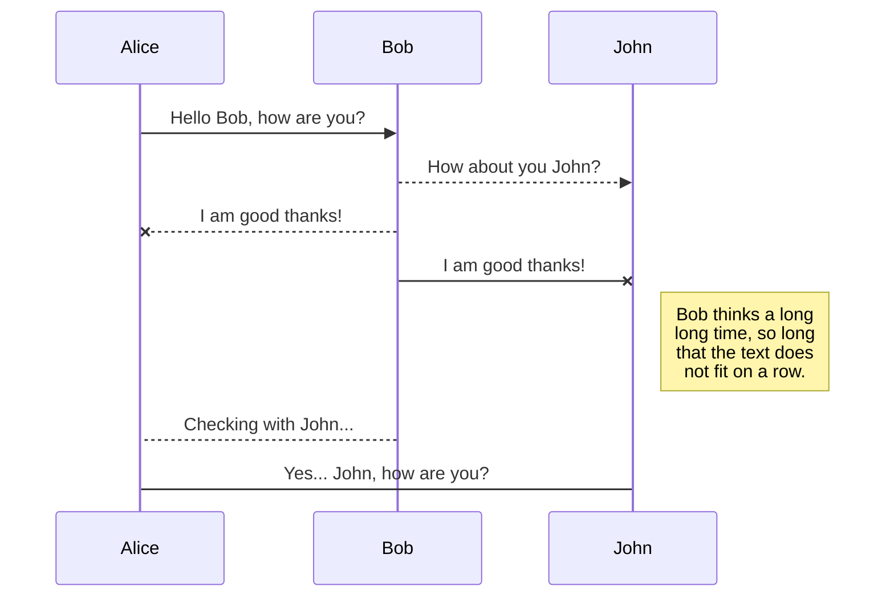

# WebSocket

WebSocket is a computer communications protocol, providing **full-duplex** communication channels over a **single TCP connection**. The WebSocket protocol was standardized by the IETF as **RFC 6455** in 2011, and the WebSocket API in Web IDL is being standardized by the W3C. WebSocket is distinct from HTTP. Both protocols are located at layer 7 in the OSI model and depend on TCP at layer 4. Although they are different, RFC 6455 states that WebSocket "is designed to work over HTTP ports 443 and 80 as well as to support HTTP proxies and intermediaries," thus making it compatible with the HTTP protocol. To achieve compatibility, the WebSocket handshake uses the HTTP Upgrade header to change from the HTTP protocol to the WebSocket protocol.

The WebSocket protocol specification defines ws (WebSocket) and wss (WebSocket Secure) as two new uniform resource identifier (URI) schemes that are used for unencrypted and encrypted connections, respectively.

[RFC6455](https://tools.ietf.org/html/rfc6455)
# Files


## Protocol handshake

To establish a WebSocket connection, the client sends a WebSocket handshake request, for which the server returns a WebSocket handshake response, as shown in the example below.

Client request (just like in HTTP, each line ends with \r\n and there must be an extra blank line at the end):
```
GET /chat HTTP/1.1
Host: server.example.com
Upgrade: websocket
Connection: Upgrade
Sec-WebSocket-Key: x3JJHMbDL1EzLkh9GBhXDw==
Sec-WebSocket-Protocol: chat, superchat
Sec-WebSocket-Version: 13
Origin: http://example.com
Server response:
```

```
HTTP/1.1 101 Switching Protocols
Upgrade: websocket
Connection: ​Upgrade
Sec-WebSocket-Accept: ​HSmrc0sMlYUkAGmm5OPpG2HaGWk=
Sec-WebSocket-Protocol: ​ch
```

The handshake starts with an HTTP request/response, allowing servers to handle HTTP connections as well as WebSocket connections on the same port. Once the connection is established, communication switches to a bidirectional binary protocol which does not conform to the HTTP protocol.

In addition to Upgrade headers, the client sends a Sec-WebSocket-Key header containing base64-encoded random bytes, and the server replies with a hash of the key in the Sec-WebSocket-Accept header. This is intended to prevent a caching proxy from re-sending a previous WebSocket conversation, and does not provide any authentication, privacy, or integrity. The hashing function appends the fixed string 258EAFA5-E914-47DA-95CA-C5AB0DC85B11 (a UUID) to the value from Sec-WebSocket-Key header (which is not decoded from base64), applies the SHA-1 hashing function, and encodes the result using base64.

Once the connection is established, the client and server can send WebSocket data or text frames back and forth in full-duplex mode. The data is minimally framed, with a small header followed by payload. WebSocket transmissions are described as "messages", where a single message can optionally be split across several data frames. This can allow for sending of messages where initial data is available but the complete length of the message is unknown (it sends one data frame after another until the end is reached and marked with the FIN bit). With extensions to the protocol, this can also be used for multiplexing several streams simultaneously (for instance to avoid monopolizing use of a socket for a single large payload).

## Proxy Servers

Each new technology has a new set of problems. In the case of WebSocket, it is compatible with proxy servers that mediate HTTP connections in most corporate networks. The WebSocket protocol uses the HTTP update system (which is normally used for HTTP / SSL) to "update" an HTTP connection to a WebSocket connection. Some proxy servers don't like this and will abandon the connection. Thus, even if a particular customer uses the WebSocket protocol, it may not be possible to establish a connection. This makes the next section even more important.

## Use cases
Use WebSocket whenever you need an almost real-time, low-latency connection between the client and the server. Keep in mind that this may involve overhauling the way you create server applications with a new focus on technologies like event queues. Some examples of use cases:

- Multiplayer online games
- Chat apps
- Live Sports Links
- Real-time update of social networks

## Security considerations

Unlike regular cross-domain HTTP requests, WebSocket requests are not restricted by the Same-origin policy. Therefore WebSocket servers must validate the "Origin" header against the expected origins during connection establishment, to avoid Cross-Site WebSocket Hijacking attacks (similar to Cross-site request forgery), which might be possible when the connection is authenticated with Cookies or HTTP authentication. It is better to use tokens or similar protection mechanisms to authenticate the WebSocket connection when sensitive (private) data is being transferred over the WebSocket.A live example of vulnerability was seen in 2020 in the form of Cable Haunt.


## Proxy traversal

WebSocket protocol client implementations try to detect if the user agent is configured to use a proxy when connecting to destination host and port and, if it is, uses HTTP CONNECT method to set up a persistent tunnel.

While the WebSocket protocol itself is unaware of proxy servers and firewalls, it features an HTTP-compatible handshake thus allowing HTTP servers to share their default HTTP and HTTPS ports (443 and 80) with a WebSocket gateway or server. The WebSocket protocol defines a ws:// and wss:// prefix to indicate a WebSocket and a WebSocket Secure connection, respectively. Both schemes use an HTTP upgrade mechanism to upgrade to the WebSocket protocol. Some proxy servers are transparent and work fine with WebSocket; others will prevent WebSocket from working correctly, causing the connection to fail. In some cases, additional proxy server configuration may be required, and certain proxy servers may need to be upgraded to support WebSocket.

If unencrypted WebSocket traffic flows through an explicit or a transparent proxy server without WebSockets support, the connection will likely fail.

If an encrypted WebSocket connection is used, then the use of Transport Layer Security (TLS) in the WebSocket Secure connection ensures that an HTTP CONNECT command is issued when the browser is configured to use an explicit proxy server. This sets up a tunnel, which provides low-level end-to-end TCP communication through the HTTP proxy, between the WebSocket Secure client and the WebSocket server. In the case of transparent proxy servers, the browser is unaware of the proxy server, so no HTTP CONNECT is sent. However, since the wire traffic is encrypted, intermediate transparent proxy servers may simply allow the encrypted traffic through, so there is a much better chance that the WebSocket connection will succeed if WebSocket Secure is used. Using encryption is not free of resource cost, but often provides the highest success rate since it would be travelling through a secure tunnel.

A mid-2010 draft (version hixie-76) broke compatibility with reverse proxies and gateways by including eight bytes of key data after the headers, but not advertising that data in a Content-Length: 8 header. This data was not forwarded by all intermediates, which could lead to protocol failure. More recent drafts (e.g., hybi-09) put the key data in a Sec-WebSocket-Key header, solving this problem.


- The workspace synchronization will sync all your files, folders and settings automatically. This will allow you to fetch your workspace on any other device.
	> To start syncing your workspace, just sign in with Google in the menu.


> **Note:** The **Synchronize now** button is disabled if you have no file to synchronize.

## Manage file synchronization

Since one file can be synced with multiple locations, you can list and manage synchronized locations by clicking **File synchronization** in the **Synchronize** sub-menu. This allows you to list and remove synchronized locations that are linked to your file.


# Publication

Publishing in StackEdit makes it simple for you to publish online your files. Once you're happy with a file, you can publish it to different hosting platforms like **Blogger**, **Dropbox**, **Gist**, **GitHub**, **Google Drive**, **WordPress** and **Zendesk**. With [Handlebars templates](http://handlebarsjs.com/), you have full control over what you export.

> Before starting to publish, you must link an account in the **Publish** sub-menu.


## SmartyPants

SmartyPants converts ASCII punctuation characters into "smart" typographic punctuation HTML entities. For example:

|                |ASCII                          |HTML                         |
|----------------|-------------------------------|-----------------------------|
|Single backticks|`'Isn't this fun?'`            |'Isn't this fun?'            |
|Quotes          |`"Isn't this fun?"`            |"Isn't this fun?"            |
|Dashes          |`-- is en-dash, --- is em-dash`|-- is en-dash, --- is em-dash|


## KaTeX

You can render LaTeX mathematical expressions using [KaTeX](https://khan.github.io/KaTeX/):

The *Gamma function* satisfying $\Gamma(n) = (n-1)!\quad\forall n\in\mathbb N$ is via the Euler integral

$$
\Gamma(z) = \int_0^\infty t^{z-1}e^{-t}dt\,.
$$

> You can find more information about **LaTeX** mathematical expressions [here](http://meta.math.stackexchange.com/questions/5020/mathjax-basic-tutorial-and-quick-reference).


## UML diagrams

You can render UML diagrams using [Mermaid](https://mermaidjs.github.io/). For example, this will produce a sequence diagram:



And this will produce a flow chart:

```mermaid
graph LR
A[Square Rect] -- Link text --> B((Circle))
A --> C(Round Rect)
B --> D{Rhombus}
C --> D


## UML diagrams

You can render UML diagrams using [Mermaid](https://mermaidjs.github.io/). For example, this will produce a sequence diagram:

```mermaid
sequenceDiagram
Alice ->> Bob: Hello Bob, how are you?
Bob-->>John: How about you John?
Bob--x Alice: I am good thanks!
Bob-x John: I am good thanks!
Note right of John: Bob thinks a long<br/>long time, so long<br/>that the text does<br/>not fit on a row.

Bob-->Alice: Checking with John...
Alice->John: Yes... John, how are you?
```
```


```
curl --include \
     --no-buffer \
     --header "Connection: Upgrade" \
     --header "Upgrade: websocket" \
     --header "Host: localhost:8080" \
     --header "Origin: http://localhost:8080" \
     --header "Sec-WebSocket-Key: SGVsbG8sIHdvcmxkIQ==" \
     --header "Sec-WebSocket-Version: 13" \
     "ws://localhost:8080"
```